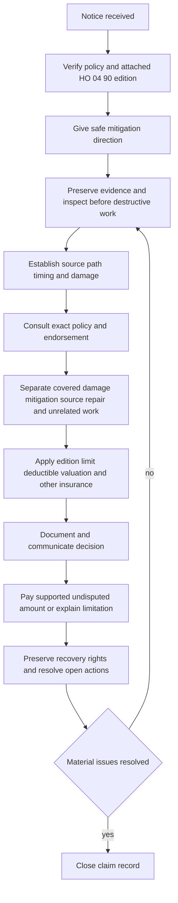

# Water Loss Handling

## Purpose and boundary

This page is **internal handling guidance**. It organizes claim work but cannot create, expand, restrict, or waive coverage. Coverage questions must be answered from the policy actually attached to the loss and the exact endorsement edition, with applicable law and approved authority review. Keep internal handling instructions separate from contract coverage: cite the guidance for workflow and controls, and cite the policy or endorsement separately for duties, notice, limits, deductibles, exclusions, and settlement.

An inspection, mitigation authorization, estimate, reserve, reservation of rights, or partial payment is not acceptance of the entire claim. An estimate measures claimed work; it does not decide coverage ([Property Claims Handling Manual 1.A and 1.F–1.J](repo://manuals/claims/manual.md#L13-L19), [repo://manuals/claims/manual.md#L45-L73]).

## Edition gate: identify before applying terms

At intake, preserve the declarations, policy period, attached endorsement schedule, and complete endorsement text. Confirm the line is HO-3 and identify the edition printed on the attached HO 04 90. Do **not** apply 2026-01 terms to a policy carrying 2010-10 or 2027-01.

| Attached edition | Operationally material terms to verify in that edition |
|---|---|
| **2010-10** | Covers direct physical loss to covered property caused by water backup or sump discharge or overflow. Its stated limit is $5,000 and its separate deductible is $500. It requires prompt notice, reasonable protection, preservation of damaged property, records, cooperation, and preservation of recovery rights ([HO 04 90 2010-10 W.1](repo://forms/HO/MS/HO-04-90/2010-10.md#L35-L105), [W.2](repo://forms/HO/MS/HO-04-90/2010-10.md#L107-L155), [W.3](repo://forms/HO/MS/HO-04-90/2010-10.md#L157-L209)). |
| **2026-01** | Replaces 2010-10 for policies written on or after 2026-01-01. It covers direct physical loss to Coverage A, B, and C property from sewer or drain backup or sump discharge or overflow, including mechanical breakdown. The endorsement limit is $10,000 per policy period unless the Declarations show higher; it is part of, not in addition to, the Coverage A/B/C limits. A separate $1,000 deductible applies to each endorsement loss, replacing the Section I deductible for that loss ([HO 04 90 2026-01](repo://forms/HO/MS/HO-04-90/2026-01.md#L1-L23)). |
| **2027-01** | This is a different edition and must be applied only when attached. It includes edition-specific definitions, sudden-or-gradual treatment, maintenance and backflow-prevention requirements, a $10,000 limit, and a $1,000 deductible; its Coverage C settlement rule is actual cash value unless the Declarations say otherwise ([HO 04 90 2027-01 W.1](repo://forms/HO/MS/HO-04-90/2027-01.md#L62-L117), [W.2](repo://forms/HO/MS/HO-04-90/2027-01.md#L254-L321), [W.3](repo://forms/HO/MS/HO-04-90/2027-01.md#L391-L435)). |

The 2026-01 backflow-prevention requirement is expressly new in that edition and did not appear in 2010-10: where the residence has finished below-grade area, coverage applies only if a backwater valve or equivalent device was installed and operable at loss ([HO 04 90 2026-01 W.6](repo://forms/HO/MS/HO-04-90/2026-01.md#L42-L47)). Treat that as a contract condition for a 2026-01 attachment, not as a universal handling rule.

## End-to-end workflow

*Figure 1. Internal water-loss handling lifecycle; it is not a coverage decision tree.*

### 1. Intake, notice, and protection

Open a claim file and record the report as received: policy and parties, loss location, reported source, discovery and loss dates, affected property, contacts, and unverified facts. Verify policy status before giving coverage guidance or authorizing payment ([Property Claims Handling Manual 1.B–1.E](repo://manuals/claims/manual.md#L21-L49)). Use the notice requirement in the attached contract. For example, 2026-01 requires prompt notice with reasonably available cause and extent information; it does not create a universal numerical notice period ([HO 04 90 2026-01 W.24](repo://forms/HO/MS/HO-04-90/2026-01.md#L152-L158)).

Give safe direction to stop or limit additional damage, retain damaged materials where reasonably possible, and document emergency work already done. Internal guidance may require prompt mitigation or a vendor response, but that operational control is not a coverage grant and cannot replace the endorsement’s duties. Do not direct unsafe entry or work; use qualified resources for sewage, contamination, structural instability, electrical hazards, or unsafe occupancy ([Property Claims Handling Manual 3.A–3.S](repo://manuals/claims/manual.md#L709-L823)).

### 2. Establish cause and damage connection

Investigate rather than adopt a vendor label. Establish:

- source: plumbing, appliance, fixture, roof, drain, sewer, sump, surface water, groundwater, or another source;
- path: where water first appeared and how it traveled;
- timing: sudden, gradual, repeated, prior, or recurring conditions; and
- connection: direct physical damage, resulting damage, source-component repair, pre-existing damage, maintenance, betterment, and avoidable additional damage.

For sewer, drain, or sump allegations, inspect the relevant drain, cleanout, sump, pump, alarm, discharge path, power, blockage, backflow device, and external drainage as facts require. Water near a drain or sump does not itself establish backup. For a 2026-01 attachment, specifically document the below-grade finished-area and backwater-device facts because W.6 makes an operable device a condition of coverage ([HO 04 90 2026-01 W.6](repo://forms/HO/MS/HO-04-90/2026-01.md#L42-L47)).

Under the base HO-3, accidental discharge or overflow may be covered, while continuous or repeated seepage is excluded and the failed system or appliance is not covered; sewer, drain, and sump backup is excluded unless the applicable endorsement is attached ([HO-3 2024-03 P.29–P.33](repo://forms/HO/MS/HO-3/2024-03.md#L523-L533), [X.7–X.11](repo://forms/HO/MS/HO-3/2024-03.md#L593-L601)). Apply those terms only with the attached policy and endorsement together.

### 3. Evidence, mitigation, and scope controls

Preserve notice and chronology, statements, photographs showing context and water lines, failed components, plumber or engineer findings, moisture readings, drying logs, equipment records, invoices, estimates, ownership, mortgagee, other-insurance, salvage, and responsible-party information. Protect the inspection opportunity; if emergency safety work requires removal or disposal, record what changed and why ([Property Claims Handling Manual 1.K–1.M](repo://manuals/claims/manual.md#L75-L91)).

Keep emergency stabilization, extraction, drying, containment, cleaning, temporary protection, access, permanent repair, replacement, and remediation as separate estimate categories. Test each charge for necessity, reasonableness, connection to the event, authorized scope, and support. Mitigation approval is not approval of permanent repairs, source replacement, or the whole claim.

For 2026-01, reasonable mitigation and water removal are still subject to the endorsement limit; the endorsement does not make routine maintenance or preventive service covered ([HO 04 90 2026-01 W.2](repo://forms/HO/MS/HO-04-90/2026-01.md#L13-L18), [2026-01](repo://forms/HO/MS/HO-04-90/2026-01.md#L49-L56)). Separate flood, surface water, waves, tidal water, storm surge, below-ground seepage or pressure, and other excluded pathways from sewer or drain backup ([HO 04 90 2026-01 W.4](repo://forms/HO/MS/HO-04-90/2026-01.md#L25-L33)).

### 4. Coverage consultation and payment

Before a position, record the line, loss date, exact edition, declarations, attachment, definitions, grant, exclusions, conditions, limit, deductible, valuation, and relevant state requirements. Explain a limitation or denial using the relied-on policy language and known facts. Keep coverage analysis and valuation in separate file entries; an estimate does not establish coverage ([Property Claims Handling Manual 1.F–1.J](repo://manuals/claims/manual.md#L45-L73)).

For the 2026-01 edition, calculate only after covered damage is established: the $10,000 policy-period endorsement sublimit (unless a higher Declarations limit applies), the separate $1,000 deductible for each endorsement loss, and the fact that the sublimit is not additional insurance. Apply Coverage A/B/C settlement terms from the attached HO-3, subject to the endorsement’s terms; do not import the 2027-01 Coverage C actual-cash-value rule into 2026-01 ([HO 04 90 2026-01 W.2–W.3](repo://forms/HO/MS/HO-04-90/2026-01.md#L13-L23), [HO 04 90 2026-01 W.7](repo://forms/HO/MS/HO-04-90/2026-01.md#L49-L56)).

Confirm authority, prior payments, limit consumption, deductible, payees and interested parties, other insurance, salvage, and recovery before payment. Issue a supported undisputed covered amount without waiting for an unrelated disputed item, and explain any partial denial in writing ([Property Claims Handling Manual 1.Q–1.Z](repo://manuals/claims/manual.md#L111-L169)). Investigation and payment do not waive policy terms ([HO-3 2024-03 AGR.9](repo://forms/HO/MS/HO-3/2024-03.md#L29-L33)).

## Escalation, recovery, and closure

Escalate before commitment when causation, duration, the water path, edition, backflow-device condition, scope, exclusion, valuation, contamination, unsafe occupancy, fraud indicators, litigation, recovery, or authority remains materially unresolved; also follow the manual’s assigned authority and monetary thresholds. A referral does not stop mitigation, communication, evidence preservation, or documented investigation.

Preserve failed components and records and do not release a responsible party or impair subrogation, contribution, salvage, or other recovery rights without approval. Close only when source and duration, evidence limitations, mitigation and scope, exact policy consultation, decision, valuation, limit and deductible treatment, payments, communications, approvals, recovery, and remaining issues are documented. Reopen when credible new information could affect cause, scope, coverage, payment, or recovery ([Property Claims Handling Manual 1.AC–1.AD](repo://manuals/claims/manual.md#L183-L193), [1.AT–1.AU](repo://manuals/claims/manual.md#L285-L295)).

## Source map

- [Water Loss Claim Handling Guidance](repo://guidelines/claims/water-loss-handling.md)
- [Property Claims Handling Manual](repo://manuals/claims/manual.md)
- [HO 04 90 2010-10](repo://forms/HO/MS/HO-04-90/2010-10.md)
- [HO 04 90 2026-01](repo://forms/HO/MS/HO-04-90/2026-01.md)
- [HO 04 90 2027-01](repo://forms/HO/MS/HO-04-90/2027-01.md)
- [HO-3 2024-03](repo://forms/HO/MS/HO-3/2024-03.md)
