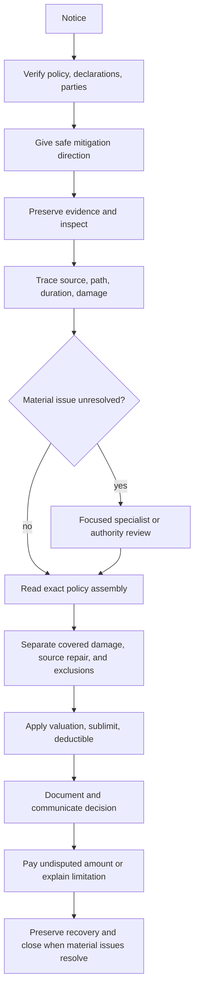

# Water Loss Claim Handling

## Purpose and governing boundary

This page is internal claims guidance, not contract language. Use it to organize work from notice through closure; decide coverage only from the issued policy, declarations, attached endorsement edition, and applicable law. The underlying guidance expressly says it does not create, expand, restrict, or waive coverage ([Water Loss Claim Handling Guidance H.0.1–H.0.2](repo://guidelines/claims/water-loss-handling.md#L13-L17)). The claims manual supplies handling and authority controls, not coverage ([Manual 1.A and 1.F–1.G](repo://manuals/claims/manual.md#L15-L19), [Manual 1.F–1.G](repo://manuals/claims/manual.md#L45-L55)).

Keep five questions separate:

1. **Cause:** where water began, its path, timing, and mechanism.
2. **Damage and mitigation:** what covered property was physically damaged and what emergency work was reasonable.
3. **Contract:** whether the exact base form and endorsement grant coverage and what exclusions or conditions apply.
4. **Adjustment:** covered scope, valuation, sublimit, deductible, and other insurance.
5. **Disposition:** payment, explanation, recovery, and closure.

An inspection, estimate, mitigation authorization, reserve, reservation of rights, or partial payment does not accept the entire claim ([Manual 1.I–1.J](repo://manuals/claims/manual.md#L63-L73)).

## Lifecycle

## Intake, safety, and evidence

Open a claim when the report may involve covered property, mitigation, or a coverage question. Record the reporter, location, policy and parties, reported source, discovery date, known facts, unknowns, contacts, and next action ([Manual 1.B–1.E](repo://manuals/claims/manual.md#L21-L49)). Give safe protection and mitigation directions; the internal water guidance calls for reasonable mitigation to begin within three days after discovery, but that is an operational control rather than a policy coverage grant ([Water guidance H.6.8–H.6.10](repo://guidelines/claims/water-loss-handling.md#L495-L499)). Do not direct unsafe entry or work; sewage, contamination, instability, and unsafe occupancy require qualified review ([Manual 3.R–3.S](repo://manuals/claims/manual.md#L813-L823)).

Before destructive work where conditions permit, inspect and preserve photographs, water lines, moisture readings, failed pipes, hoses, valves, pumps and appliances, plumber or engineer findings, service and maintenance records, mitigation logs, estimates, invoices, ownership, and other-insurance information. Record anything removed or unavailable and why ([Manual 1.K–1.M](repo://manuals/claims/manual.md#L75-L91), [Manual 3.E](repo://manuals/claims/manual.md#L735-L739)). Separate emergency stabilization, extraction, drying, cleaning, access, permanent repair, replacement, remediation, upgrades, and unrelated maintenance; mitigation approval is not approval of permanent work ([Manual 3.V–3.Z](repo://manuals/claims/manual.md#L837-L865)).

## Cause and damage investigation

Establish the source, path, duration or recurrence, and cause-to-damage connection. A visible wet area, drain proximity, or claimant label does not establish backup. For sewer, drain, or sump allegations, inspect the drain and cleanouts, sump, pump, alarm, discharge route, power, blockage, external drainage, and backflow device as facts require ([Manual 3.J–3.M](repo://manuals/claims/manual.md#L765-L787)). Classify source repair, resulting physical damage, pre-existing or recurring damage, maintenance, betterment, and delayed additional damage separately.

A prior loss is an investigation lead, not proof of exclusion. Compare location, source, chronology, repairs, and pre-loss condition; refer when allocation remains uncertain ([Water guidance H.5.1–H.5.8](repo://guidelines/claims/water-loss-handling.md#L395-L409)). Refer hidden damage, microbial conditions, structural or safety issues, uncertain causation or duration, and material competing evidence rather than deciding from a vendor label ([Manual 3.B–3.I](repo://manuals/claims/manual.md#L717-L763)).

## Contract consultation: HO 04 90 (2026-01)

Verify the issued endorsement edition and attachment for the loss date. HO 04 90 (2026-01) attaches to HO-3 and modifies Section I exclusions; it replaces the 2010-10 edition for policies written on or after 2026-01-01 ([HO 04 90 2026-01, opening](repo://forms/HO/MS/HO-04-90/2026-01.md#L1-L4)). Also record the base form, declarations, Coverage A/B/C limits, loss date, and all endorsements. A base-form reference to a water-backup limit is not itself a grant; the attachment and its wording control ([HO-3 2024-03 X.7–X.11](repo://forms/HO/MS/HO-3/2024-03.md#L593-L601)).

When attached, W.1 covers direct physical loss to property described in Coverage A, Coverage B, and Coverage C caused by water backing up through sewers or drains, or overflowing or discharging from a sump, sump pump, or related equipment, including where mechanical breakdown causes the discharge ([HO 04 90 W.1](repo://forms/HO/MS/HO-04-90/2026-01.md#L6-L11)). Apply the base policy and all W.4–W.7 boundaries together:

- **Flood and surface water:** W.4 excludes flood, surface water, waves, tidal water, storm surge, and body-of-water overflow; Section I exclusions A.1 and A.2 continue to apply, including below-surface water and seepage through a building or foundation ([HO 04 90 W.4](repo://forms/HO/MS/HO-04-90/2026-01.md#L25-L33)). Trace the actual path rather than relabeling external water as backup.
- **Known maintenance failure:** W.5 excludes loss when the backup, overflow, or discharge resulted from the insured’s failure to maintain the serving sewer line, drain, sump, or pump, where the insured knew of the failure before loss and a reasonable person would have remedied it ([HO 04 90 W.5](repo://forms/HO/MS/HO-04-90/2026-01.md#L35-L40)). Obtain maintenance history and evidence of knowledge; do not infer this condition from an old component alone.
- **Below-grade backflow prevention:** If the residence has a finished area below grade, W.6 requires a backwater valve or equivalent device installed and operable on the serving sewer line at the time of loss ([HO 04 90 W.6](repo://forms/HO/MS/HO-04-90/2026-01.md#L42-L47)). Verify whether a finished below-grade area exists, identify the serving line and device, document installation and operability at loss, and escalate disputed or unavailable evidence. Do not treat the requirement as proof that installing a new device after loss creates coverage.
- **Failed equipment versus damage:** Separate the resulting physical damage from the cost to repair or replace the failed sewer, drain, sump, pump, or related equipment. W.1 describes the covered water event; it does not make every source-repair cost covered. Apply the base policy and any other applicable exclusion to the source repair.

## Sublimit, deductible, and valuation

Apply these amounts only after determining covered property and covered scope:

- **Sublimit:** W.2 caps all loss under the endorsement in one policy period at **$10,000**, unless the Declarations show a higher endorsement limit. The sublimit is part of, not in addition to, the limits applying to Coverage A, B, and C ([HO 04 90 W.2](repo://forms/HO/MS/HO-04-90/2026-01.md#L13-L18)). Check the Declarations and track payments against the applicable policy-period aggregate.
- **Separate deductible:** W.3 applies a separate **$1,000 deductible** to each loss under the endorsement; the Section I deductible shown in the Declarations does not apply to this loss ([HO 04 90 W.3](repo://forms/HO/MS/HO-04-90/2026-01.md#L20-L23)). Do not stack the Section I deductible or allocate the endorsement deductible separately to Coverage A, B, and C categories from the same loss.
- **Coverage A and B:** W.7 uses the settlement basis stated in the attaching policy for property covered under Coverage A and B ([HO 04 90 W.7](repo://forms/HO/MS/HO-04-90/2026-01.md#L49-L54)). Apply the base policy’s repair, replacement-cost, depreciation, and completion conditions only after covered scope is established.
- **Coverage C:** W.7 settles property covered under Coverage C at **actual cash value**, regardless of a replacement-cost personal-property endorsement, unless the Declarations state otherwise for HO 04 90 ([HO 04 90 W.7](repo://forms/HO/MS/HO-04-90/2026-01.md#L49-L54)). Inventory and value covered contents using the applicable actual-cash-value method; do not promise replacement cost based solely on the base policy’s personal-property endorsement.

Keep source repair, mitigation, Coverage A/B damage, Coverage C contents, excluded work, deductible, sublimit consumption, other insurance, payees, and recovery in separate estimate and payment lines. The manual requires credible scope and pricing and consideration of repairability, betterment, depreciation, and prior damage ([Manual 1.S–1.U](repo://manuals/claims/manual.md#L123-L139)).

## Decision, authority, and recovery

Document the policy assembly, facts, evidence limitations, coverage analysis, valuation, deductible, sublimit consumption, and undisputed amount. Issue supported undisputed covered amounts without waiting for an unrelated disputed item; explain any limitation or denial using the relied-on policy language and known facts ([Manual 1.Q–1.Z](repo://manuals/claims/manual.md#L111-L169)). Refer before commitment when exposure exceeds **$25,000**, or when causation, duration, maintenance, backflow-device operability, scope, valuation, contamination, fraud, litigation, or recovery remains materially unresolved ([Water guidance H.5.9–H.5.36](repo://guidelines/claims/water-loss-handling.md#L411-L465)). Do not divide activity to evade authority limits ([Manual 1.V–1.W](repo://manuals/claims/manual.md#L141-L151)).

Preserve failed components, records, photographs, and responsible-party information. Do not release a responsible party or impair subrogation, contribution, salvage, or other recovery rights without approval ([Manual 1.AC–1.AD](repo://manuals/claims/manual.md#L183-L193)).

## Closure

Close only after the file records source and duration, inspection limitations, mitigation, covered and excluded scope, exact policy and endorsement, valuation, Coverage C treatment, deductible and sublimit, payment or denial, communications, authority approvals, recovery status, and retained evidence. Reopen when credible new information may affect cause, scope, coverage, payment, or recovery ([Manual 1.AT–1.AU](repo://manuals/claims/manual.md#L285-L295), [Water guidance H.6.43–H.6.54](repo://guidelines/claims/water-loss-handling.md#L565-L587)).

## Source map

- [Water Loss Claim Handling Guidance](repo://guidelines/claims/water-loss-handling.md)
- [Property Claims Handling Manual](repo://manuals/claims/manual.md)
- [HO 04 90 Water Backup and Sump Discharge or Overflow, 2026-01](repo://forms/HO/MS/HO-04-90/2026-01.md)
- [HO-3, 2024-03](repo://forms/HO/MS/HO-3/2024-03.md)
