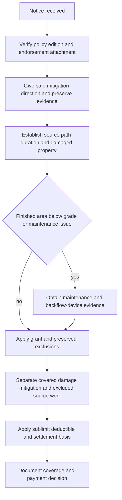

# Water Loss Claims Handling

## Governing boundary

This page is **claims guidance**, not contract language. The policy, declarations, attached endorsement, loss date, and applicable law control coverage. Do not turn an inspection, mitigation authorization, estimate, reserve, reservation of rights, or partial payment into acceptance of the whole claim. The handling manual likewise governs internal authority and workflow, not coverage ([repo://manuals/claims/manual.md#L15-L19](repo://manuals/claims/manual.md#L15-L19); [repo://manuals/claims/manual.md#L63-L73](repo://manuals/claims/manual.md#L63-L73)).

For this page, the controlling form is **HO 04 90 Water Backup and Sump Discharge or Overflow (2026-01)**. It attaches to HO-3 and modifies Section I—Exclusions A.3 for policies written on or after 2026-01-01 ([repo://forms/HO/MS/HO-04-90/2026-01.md#L1-L4](repo://forms/HO/MS/HO-04-90/2026-01.md#L1-L4)). Confirm that this exact edition is attached for the loss date; do not apply its terms to another edition or treat a base-form reference to a limit as a coverage grant.

## Handling flow

*Figure 1. Claims-guidance flow for verifying and adjusting an HO 04 90 (2026-01) water-backup claim.*

## 1. Intake and immediate protection

Open a claim file and record the reporter, policy and insured information, loss location, discovery date, reported source, affected property, first appearance of water, and facts still unverified. Acknowledge the report, explain the handler’s role, request material information, and document each contact and next action. Internal guidance calls for reasonable mitigation to begin within three days after discovery; that is an operational handling rule, not an HO 04 90 coverage term ([repo://manuals/claims/manual.md#L21-L49](repo://manuals/claims/manual.md#L21-L49); [repo://manuals/claims/manual.md#L709-L727](repo://manuals/claims/manual.md#L709-L727)).

Give safe instructions to stop an active source, protect property, remove standing water, and begin drying when reasonable. Do not direct unsafe entry or work. Sewage, contamination, structural instability, unsafe occupancy, or specialized remediation requires qualified review. Preserve damaged materials and failed components when practical; if emergency or safety needs require removal, record what was removed, when, by whom, and why ([repo://manuals/claims/manual.md#L735-L739](repo://manuals/claims/manual.md#L735-L739); [repo://manuals/claims/manual.md#L813-L823](repo://manuals/claims/manual.md#L813-L823)).

## 2. Establish the water path and evidence

Investigate facts rather than adopting the label “flood,” “backup,” or “sump failure.” Establish:

- whether water backed up through a sewer or drain, or overflowed or discharged from a sump, sump pump, or related equipment;
- where water first appeared and how it traveled through floors, walls, cavities, drains, and adjacent areas;
- whether the event was sudden, gradual, repeated, or continuous, and whether prior leakage, corrosion, decay, blockage, or repairs exist; and
- which property suffered direct physical loss, distinguishing resulting damage from the failed source, maintenance, improvement, and unrelated work.

Photograph the source and context before demolition where conditions permit. Retain plumber or engineer findings, moisture readings, drying logs, equipment records, invoices, estimates, service and maintenance records, pump and alarm information, power status, and failed pipes, valves, pumps, or other components. Standing water near a drain or sump does not itself establish backup; the source and path must be supported ([repo://manuals/claims/manual.md#L717-L787](repo://manuals/claims/manual.md#L717-L787); [repo://training/water-losses-101.md#L61-L103](repo://training/water-losses-101.md#L61-L103)).

### Maintenance and backflow-device evidence

The 2026-01 endorsement has two distinct controls that must be investigated separately:

1. **Known maintenance failure.** HO 04 90 does not cover loss if the backup, overflow, or discharge resulted from the insured’s failure to maintain the sewer line, drain, sump, or sump pump serving the residence premises, where the failure was known before the loss and a reasonable person would have remedied it. Request dated maintenance records, prior service calls, notices of blockage or malfunction, repair recommendations, and evidence of when the insured knew of the condition ([repo://forms/HO/MS/HO-04-90/2026-01.md#L35-L40](repo://forms/HO/MS/HO-04-90/2026-01.md#L35-L40)).
2. **Below-grade backflow prevention.** Where the residence premises has a finished area below grade, coverage applies only if a backwater valve or equivalent backflow-prevention device was installed and operable on the sewer line serving the premises at the time of loss. Confirm the below-grade finished area, device identity and location, installation, service history, operability at the loss, and any obstruction or bypass. The requirement is expressly new in this edition ([repo://forms/HO/MS/HO-04-90/2026-01.md#L42-L47](repo://forms/HO/MS/HO-04-90/2026-01.md#L42-L47)).

Do not infer either condition from a contractor’s conclusory invoice. If evidence is incomplete or conflicting, document the limitation and obtain focused technical or coverage review before applying the condition.

## 3. Coverage consultation

Read the HO-3 base form and attached HO 04 90 together. The endorsement covers direct physical loss to property described in Coverage A, B, and C caused by water that backs up through sewers or drains, or water that overflows or discharges from a sump, sump pump, or related equipment, whether or not the event results from mechanical breakdown of that equipment ([repo://forms/HO/MS/HO-04-90/2026-01.md#L6-L11](repo://forms/HO/MS/HO-04-90/2026-01.md#L6-L11)). Confirm that the claimed property is within the applicable base-policy coverage before considering the endorsement.

Preserve the following exclusions and boundaries; the endorsement does not convert them into covered backup:

- flood, surface water, waves, tidal water, storm surge, and overflow of a body of water, whether or not wind-driven; and
- water below the surface of the ground, including water exerting pressure on or seeping or leaking through a building, foundation, or swimming pool.

Those exclusions remain in full under Section I—Exclusions A.1 and A.2 ([repo://forms/HO/MS/HO-04-90/2026-01.md#L25-L33](repo://forms/HO/MS/HO-04-90/2026-01.md#L25-L33)). Trace the actual entry path; do not relabel flood, runoff, groundwater, or seepage as sewer or sump backup merely because water reached a drain or low area.

Separate resulting damage from the failed sewer, drain, sump, pump, valve, or related equipment. The endorsement’s grant addresses direct physical loss to covered property; it does not, by itself, establish payment for source repair, maintenance, replacement, or improvement. Apply any other base-form exclusions and conditions that remain in force.

## 4. Sublimit, separate deductible, and settlement

Apply the contract’s adjustment rules only after identifying covered property and covered loss:

- **Sublimit:** HO 04 90 pays no more than **$10,000 for all loss under the endorsement in one policy period**, unless a higher endorsement limit appears in the Declarations. The sublimit is part of, not in addition to, the Coverage A, B, and C limits ([repo://forms/HO/MS/HO-04-90/2026-01.md#L13-L18](repo://forms/HO/MS/HO-04-90/2026-01.md#L13-L18)). Check the declarations and track payments against the policy-period amount; do not treat it as a per-room, per-item, or automatic per-occurrence limit.
- **Separate deductible:** A **$1,000 deductible applies to each loss under the endorsement**. The Section I deductible does not apply to loss covered here ([repo://forms/HO/MS/HO-04-90/2026-01.md#L20-L23](repo://forms/HO/MS/HO-04-90/2026-01.md#L20-L23)). Apply it to the covered endorsement loss, not to excluded source work or unsupported charges, and do not substitute the base deductible.
- **Settlement basis:** Coverage A and B property is settled on the basis stated in the attached policy. Coverage C property is settled at actual cash value regardless of a replacement-cost personal-property endorsement unless the Declarations state otherwise for this endorsement ([repo://forms/HO/MS/HO-04-90/2026-01.md#L49-L54](repo://forms/HO/MS/HO-04-90/2026-01.md#L49-L54)). Do not infer replacement-cost entitlement from an estimate.

Keep emergency protection, water removal, drying, cleaning, access, permanent repair, source repair, replacement, and improvement as separate estimate categories. Explain the covered scope, sublimit consumption, separate deductible, valuation, and any exclusion in the file and payment communication. Internal guidance requires supported scope, authority review, and payment of an undisputed covered amount where appropriate; those are handling controls, not amendments to HO 04 90 ([repo://manuals/claims/manual.md#L111-L169](repo://manuals/claims/manual.md#L111-L169)).

## 5. Escalation, recovery, and closure

Refer before commitment when causation, duration, maintenance knowledge, below-grade status, device operability, water path, coverage, valuation, contamination, responsibility, or recovery remains materially unresolved; also refer exposure above the applicable internal authority threshold. Preserve failed components, records, photographs, and responsible-party information. Do not release a responsible party or impair subrogation, contribution, salvage, or other recovery rights without approval ([repo://manuals/claims/manual.md#L141-L151](repo://manuals/claims/manual.md#L141-L151); [repo://manuals/claims/manual.md#L867-L877](repo://manuals/claims/manual.md#L867-L877)).

Before closing, confirm that the file documents the exact endorsement attachment and declarations, source and water path, maintenance and backflow-device findings, inspection limitations, covered and excluded scope, $10,000 policy-period sublimit treatment, $1,000 endorsement deductible, settlement basis, payment or denial explanation, authority approvals, communications, evidence disposition, and recovery status. Do not close solely because surfaces are dry or mitigation is paid. Reopen when credible new information may affect source, coverage, damages, payment, or recovery ([repo://manuals/claims/manual.md#L285-L295](repo://manuals/claims/manual.md#L285-L295); [repo://manuals/claims/manual.md#L1065-L1075](repo://manuals/claims/manual.md#L1065-L1075)).

## Related references

- [Water Backup and Sump Overflow](../../coverage/perils/water-backup.md)
- [Intake, Investigation, and Mitigation](../manual/intake-investigation-and-mitigation.md)
- [Property Perils and Loss Types](../manual/property-perils-and-loss-types.md)
- [Property and Water Risk](../../underwriting/manual/property-and-water-risk.md)
