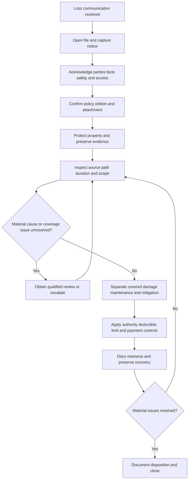

# Claims Intake, Investigation, and Mitigation

This page is operational guidance for property claims assigned to the carrier. It preserves the boundary between the **claims manual**, which governs internal handling and delegated authority, and the **policy and endorsements**, which govern contractual coverage. The manual and water-loss guidance do not create, expand, restrict, or waive coverage. Confirm the policy edition, declarations, and attached endorsements before applying any contract condition or coverage term ([Manual 1.A, 1.E–1.G](repo://manuals/claims/manual.md#L13-L55); [Water guidance H.0.1–H.0.3](repo://guidelines/claims/water-loss-handling.md#L13-L23)).

## Workflow at a glance

*Figure 1. Internal intake-to-resolution flow; it is not a coverage decision tree.*

An inspection, estimate, mitigation authorization, reservation of rights, reserve, or partial payment is not acceptance of the whole claim. Continue fact development and keep coverage analysis separate from valuation ([Manual 1.I–1.J](repo://manuals/claims/manual.md#L63-L73); [Water guidance H.7.3–H.7.8](repo://guidelines/claims/water-loss-handling.md#L589-L605)).

## 1. Intake and early controls

Open a claim record for any communication asserting property damage, loss, or a request for benefits; formal claim wording is unnecessary. Record the source and substance of notice, reported date and location, claimant and representative, affected property, handler, policy status, unverified facts, access and occupancy, emergency work, vendors, other insurance, warranties, and possible responsible parties ([Manual 2.A–2.E, 2.P–2.T](repo://manuals/claims/manual.md#L387-L467)). Acknowledge receipt in clear language without promising coverage, payment, or repair approval. Check safety, active damage, contamination, structural instability, criminal or fire-origin concerns, access barriers, related claims, and duplicate notices; escalate unsafe or specialized conditions ([Manual 2.F–2.O](repo://manuals/claims/manual.md#L409-L447)). Verify authority before disclosing material information or routing communications to a representative, contractor, public adjuster, lender, or other interested party.

Before a coverage statement or payment commitment, document the assigned role and authority, verify policy status, identify the policy under review, and read the applicable form and endorsements. Adjusters may investigate and evaluate only within delegated authority and may not waive conditions, alter terms, or create coverage by correspondence ([Manual 1.E–1.G](repo://manuals/claims/manual.md#L39-L55)). Refer an evaluated loss above **$25,000** before settlement or payment commitment, and do not split transactions to avoid the authority limit ([Manual 1.V–1.W](repo://manuals/claims/manual.md#L141-L151)). Keep expense authority distinct from indemnity authority ([Water guidance H.7.1–H.7.11](repo://guidelines/claims/water-loss-handling.md#L589-L611)).

### Timing boundary: internal handling versus contract

Use internal timing to control work, not to rewrite the policy:

- acknowledge promptly under the applicable claim-contact requirement;
- issue an approved reservation of rights within **10 days** when known facts may limit or preclude coverage but investigation must continue; identify the known facts, potentially applicable language, and investigation needed ([Manual 2.X–2.AC](repo://manuals/claims/manual.md#L481-L503));
- for internal water-loss handling, begin reasonable mitigation within **3 days after discovery** when covered water affects insured property ([Manual 3.A](repo://manuals/claims/manual.md#L709-L715); [Water guidance H.6.8–H.6.11](repo://guidelines/claims/water-loss-handling.md#L495-L501)).

Those are handling directions, not universal insured duties. Confirm the actual policy and attachment before applying contractual notice, preservation, maintenance, backflow, deductible, limit, or settlement conditions.

## 2. HO 04 90 2026-01 contract-boundary example

For a reported sewer, drain, sump, or sump-pump loss, first confirm that **HO 04 90 2026-01** is actually attached to the policy and that the policy edition and loss-date terms are correct. The endorsement is a multistate form that attaches to HO-3 and replaces 2010-10 for policies written on or after 2026-01-01; it modifies Section I Exclusions A.3 ([HO 04 90 2026-01](repo://forms/HO/MS/HO-04-90/2026-01.md#L1-L4)). Do not apply this example to an unverified or different endorsement.

If confirmed attached, investigate and document these contract-specific issues:

1. **Covered mechanism and scope.** W.1 covers direct physical loss to Coverage A, B, and C property caused by water or waterborne material backing up through sewers or drains, or overflowing or discharging from a sump, sump pump, or related equipment, including mechanical breakdown ([HO 04 90 W.1](repo://forms/HO/MS/HO-04-90/2026-01.md#L6-L11)). Establish the actual source and path; do not treat standing water or a contractor’s use of “backup” as proof.
2. **Limit and deductible.** W.2 sets a $10,000 maximum per policy period unless the Declarations show a higher endorsement limit, and that amount is part of—not in addition to—the Coverage A, B, and C limits. W.3 applies a separate $1,000 deductible to each loss, instead of the Section I deductible ([HO 04 90 W.2–W.3](repo://forms/HO/MS/HO-04-90/2026-01.md#L13-L23)). Confirm the Declarations and allocate damage before calculating payment.
3. **Remaining exclusions.** W.4 leaves flood, surface water, waves, tidal water, storm surge, overflow of a body of water, and below-surface water, seepage, or pressure against a building, foundation, or pool excluded ([HO 04 90 W.4](repo://forms/HO/MS/HO-04-90/2026-01.md#L25-L33)). Trace the entry route and separate those causes from qualifying backup.
4. **Known maintenance failure.** W.5 excludes loss under the endorsement when the backup, overflow, or discharge resulted from the insured’s failure to maintain the serving sewer line, drain, sump, or sump pump, the failure was known before loss, and a reasonable person would have remedied it ([HO 04 90 W.5](repo://forms/HO/MS/HO-04-90/2026-01.md#L35-L40)). Investigate notice, prior service records, recurring problems, and what was reasonably remediable; do not infer the condition from age alone.
5. **New below-grade backflow requirement.** When the residence has a finished area below grade, W.6 requires an installed and operable backwater valve or equivalent backflow-prevention device on the serving sewer line at the time of loss. This requirement is new in 2026-01 and was absent from 2010-10 ([HO 04 90 W.6](repo://forms/HO/MS/HO-04-90/2026-01.md#L42-L47)). Verify finished below-grade areas, device location, installation, operation at loss, inspection or service records, and any disputed access or expert evidence.
6. **Settlement basis.** W.7 sends Coverage A and B loss to the attached policy’s settlement basis but sets Coverage C loss at actual cash value despite a replacement-cost personal-property endorsement unless the Declarations say otherwise ([HO 04 90 W.7](repo://forms/HO/MS/HO-04-90/2026-01.md#L49-L56)). Keep cause, covered scope, and valuation as separate file analyses.

The endorsement does not replace the internal investigation checklist. It changes what must be verified before a coverage conclusion, and its terms control only if the confirmed policy actually contains it.

## 3. Investigation and evidence checklist

Develop the facts before stating coverage. For water losses, determine where water began, how it traveled, when it was discovered, whether the event was sudden or recurring, and what property it affected ([Manual 3.B–3.G](repo://manuals/claims/manual.md#L717-L751)). Then:

- inspect accessible plumbing, appliances, fixtures, drains, sewers, sump equipment, roof and exterior paths as facts require;
- inspect affected and adjacent rooms, cavities, flooring, walls, ceilings, insulation, cabinetry, and contents rather than only the first visible area;
- separate the failed source component from resulting damage, building from contents, emergency work from permanent repair, and current damage from prior condition;
- compare the insured’s account with photographs, moisture findings, service records, invoices, weather or utility information, witness statements, and qualified reports;
- record pre-existing staining, rot, corrosion, deterioration, recurring leakage, prior repairs, and competing explanations without converting any one fact into an automatic denial ([Manual 3.E, 3.H, 3.U](repo://manuals/claims/manual.md#L735-L739); [repo://manuals/claims/manual.md#L753-L763]; [repo://manuals/claims/manual.md#L831-L835)).

Preserve failed pipes, hoses, valves, appliance parts, removed materials, photographs, recordings, estimates, invoices, statements, moisture records, and expert opinions when safe and practical. Inspect before demolition when conditions permit; if emergency work prevents that, preserve representative evidence and document the limitation ([Manual 1.K–1.M](repo://manuals/claims/manual.md#L75-L91); [Manual 3.E](repo://manuals/claims/manual.md#L735-L739)). Do not direct unsafe entry or work. Use qualified review for contamination, unsafe conditions, concealed sources, disputed causation, engineering, environmental issues, or material scope and valuation uncertainty ([Manual 2.BN–2.BO](repo://manuals/claims/manual.md#L649-L655); [Manual 3.R–3.T](repo://manuals/claims/manual.md#L813-L829)).

For confirmed HO 04 90 2026-01 losses, add photographs and records showing the drain, sewer, sump and discharge arrangement; the water’s point of emergence; below-grade finished areas; backwater-device installation and operation; prior maintenance knowledge; and the allocation of Coverage A, B, and C damage. A device inspection or maintenance record is evidence to evaluate, not by itself a coverage conclusion.

## 4. Mitigation, scope, payment, and recovery

Advise safe, reasonable emergency protection: stop an active discharge when safe, remove standing water, dry affected materials, protect unaffected property, and use temporary protection. Authorize only within assigned authority and state conditionally that mitigation approval is not acceptance of the full claim ([Manual 3.C](repo://manuals/claims/manual.md#L723-L727); [Water guidance H.7.6–H.7.8](repo://guidelines/claims/water-loss-handling.md#L601-L605)). Do not require permanent repairs before cause and scope are reasonably documented ([Water guidance H.6.20–H.6.24](repo://guidelines/claims/water-loss-handling.md#L519-L527)).

Review emergency invoices for timing, affected areas, equipment, materials, necessity, and relation to the event. Review permanent work for supported damage, repairability, access, betterment, maintenance, upgrades, redesign, and unrelated renovation. Verify moisture before reconstruction and separate unsupported or duplicated charges ([Manual 3.V–3.Z](repo://manuals/claims/manual.md#L837-L865)).

Only after coverage and allocation are established should the handler apply the confirmed deductible, limit, valuation basis, interested-party payment directions, and authority approval. Under confirmed HO 04 90 2026-01, test the separate $1,000 deductible, endorsement sublimit, and Coverage C actual-cash-value rule against the Declarations and attached policy. Issue an undisputed covered amount when it can be determined without waiting for an unrelated dispute, while preserving the unresolved issue ([Water guidance H.1.29–H.1.30](repo://guidelines/claims/water-loss-handling.md#L117-L119)).

Identify subrogation, salvage, contribution, other insurance, and responsible parties early. Preserve failed components and records, and do not release a responsible party or compromise recovery rights without approval ([Manual 1.AC–1.AD](repo://manuals/claims/manual.md#L183-L193); [Manual 3.AA–3.AB](repo://manuals/claims/manual.md#L867-L877)). Record fraud indicators neutrally and refer them; do not accuse a party without supported evidence ([Manual 1.AB](repo://manuals/claims/manual.md#L177-L181)).

## 5. Diary, reassess, and close

Maintain a chronological activity record, evidence log, outstanding-information list, authority and referral decisions, communications, mitigation status, separate coverage and valuation analyses, payment ledger, and recovery actions. Reassess when new facts, policy information, estimates, or expert findings materially change source, duration, scope, exposure, or coverage ([Manual 1.AR](repo://manuals/claims/manual.md#L273-L277); [Manual 2.AI–2.AK](repo://manuals/claims/manual.md#L525-L535)).

Do not close while material causation, coverage, scope, payment, recovery, complaint, or access issues remain unresolved. Before closure, ensure the file explains the reported and established water mechanism, policy edition and attachment verification, inspection and evidence limits, mitigation, supported scope, applicable contract terms, authority approvals, payments, communications, and remaining issues. Reopen when credible new information requires carrier action ([Manual 1.AT–1.AU](repo://manuals/claims/manual.md#L285-L295); [Water guidance H.6.53–H.6.54](repo://guidelines/claims/water-loss-handling.md#L583-L587)).

## Operational invariants

- **Contract first:** confirm the policy edition and attachment; internal timing and guidance cannot substitute for contractual conditions.
- **Investigation is not acceptance:** inspection, estimates, mitigation, reserves, reservations, and partial payments do not decide the whole claim.
- **Evidence precedes conclusions:** attribute reported facts, observations, and expert opinions; preserve limitations and unavailable evidence.
- **Emergency protection is bounded:** prevent additional damage safely, but do not direct permanent work or promise payment without authority and supported scope.
- **Coverage and valuation are distinct:** apply cause, exclusions, conditions, limits, deductibles, and settlement terms before calculating payment.
- **Authority follows exposure:** refer material exposure and do not divide transactions to avoid a limit.
- **The file tells the story:** every material request, inspection, referral, reservation, payment, reassessment, and closure decision needs a retrievable factual basis.
