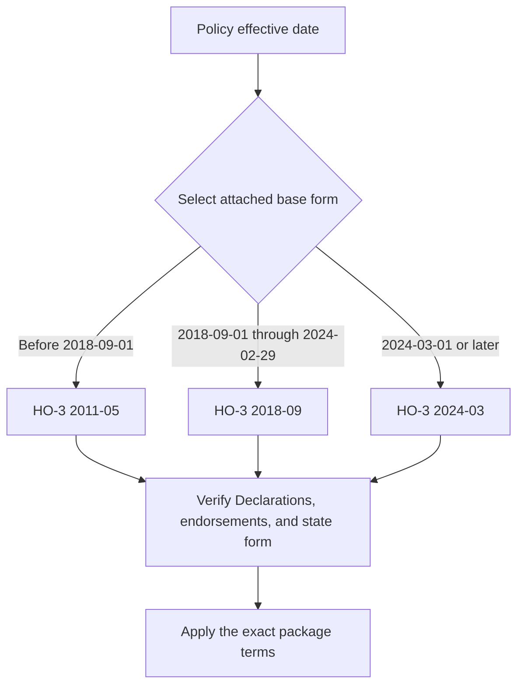

# HO-3 Form Editions

## Scope and authority

This page compares the three HO-3 base-form editions in the repository: 2011-05, 2018-09, and 2024-03. The effective-date labels identify the applicable base edition: 2011-05 precedes 2018-09-01, 2018-09 applies from 2018-09-01 through 2024-02-29, and 2024-03 applies from 2024-03-01. Each superseded edition remains in force for policies written under it. [2011-05](repo://forms/HO/MS/HO-3/2011-05.md#L2-L9) · [2018-09](repo://forms/HO/MS/HO-3/2018-09.md#L2-L9) · [2024-03](repo://forms/HO/MS/HO-3/2024-03.md#L2-L8)

The issued policy package—not a later edition selected by analogy—governs. Confirm the Declarations, attached endorsements, and any applicable state amendatory form. The 2024 agreement says coverage is determined from facts, policy terms, and applicable law, and that policy terms change only by authorized written action. A memorandum explains filing rationale; it does not replace the filed form. [2024 agreement](repo://forms/HO/MS/HO-3/2024-03.md#L29-L39) · [2024 memorandum](repo://memoranda/HO-3-2024-03.md#L13-L75) · [assembly guidance](repo://openwiki/policy-assembly/editions-and-state-attachments.md#L42-L66)

## Stable structure and limits

All three forms contain Section I property coverages A–D, Additional Coverages and exclusions, and Section II liability and medical-payments coverages. Similar headings do not make editions interchangeable. Coverage B is 10% of Coverage A and Coverage C is 50% of Coverage A in each edition; Coverage D is 20% of Coverage A in each edition, although its operative tests and enumerated expenses differ. [2011 limits](repo://forms/HO/MS/HO-3/2011-05.md#L121-L125) · [2018 limits](repo://forms/HO/MS/HO-3/2018-09.md#L143-L147) · [2024 limits](repo://forms/HO/MS/HO-3/2024-03.md#L155-L159) · [2011 Coverage D](repo://forms/HO/MS/HO-3/2011-05.md#L305-L341) · [2018 Coverage D](repo://forms/HO/MS/HO-3/2018-09.md#L327-L375) · [2024 Coverage D](repo://forms/HO/MS/HO-3/2024-03.md#L355-L397)

| Area | 2011-05 | 2018-09 | 2024-03 |
|---|---|---|---|
| Coverage A | Direct physical loss to the dwelling and attached property; 80% replacement-cost threshold. [A.1–A.7](repo://forms/HO/MS/HO-3/2011-05.md#L63-L79) | 80% threshold plus revised equipment, duties, and exclusion wording. [A.1–A.10](repo://forms/HO/MS/HO-3/2018-09.md#L85-L105) | Declarations-based residence-premises wording, replacement-cost provisions, and a roof-surfacing rule. [A.1–A.13](repo://forms/HO/MS/HO-3/2024-03.md#L97-L123) |
| Coverage B | 10% of Coverage A for qualifying detached structures. [B.1–B.4](repo://forms/HO/MS/HO-3/2011-05.md#L121-L129) | 10% with more detailed structure, rental, and business classifications. [B.1–B.8](repo://forms/HO/MS/HO-3/2018-09.md#L143-L171) | 10% with revised separation, connection, ownership, use, and location wording. [B.1–B.8](repo://forms/HO/MS/HO-3/2024-03.md#L155-L171) |
| Coverage C | 50% of Coverage A and the 2011 special-limit schedule. [C.1–C.3](repo://forms/HO/MS/HO-3/2011-05.md#L183-L189) | 50% with a reorganized schedule. [C.1–C.3](repo://forms/HO/MS/HO-3/2018-09.md#L209-L215) | 50% with revised category limits and location wording. [C.1–C.3](repo://forms/HO/MS/HO-3/2024-03.md#L217-L223) |
| Coverage D | 20%; additional living expense and fair rental value depend on uninhabitability. [D.1–D.5](repo://forms/HO/MS/HO-3/2011-05.md#L305-L315) | 20%; includes civil-authority and records provisions. [D.1–D.13](repo://forms/HO/MS/HO-3/2018-09.md#L327-L353) | 20%; expressly addresses lodging, meals, transportation, rental income, moving, storage, and causation. [D.1–D.20](repo://forms/HO/MS/HO-3/2024-03.md#L355-L391) |

Special limits also change by edition: the 2011 schedule lists $200 money, $1,000 jewelry theft, $2,000 firearms theft, and $1,000 watercraft; 2018 raises those to $250, $1,500, $2,500, and $1,500; 2024 raises money, jewelry theft, firearms theft, and silverware theft to $300, $2,000, $3,000, and $3,000. [2011](repo://forms/HO/MS/HO-3/2011-05.md#L225-L239) · [2018](repo://forms/HO/MS/HO-3/2018-09.md#L241-L255) · [2024](repo://forms/HO/MS/HO-3/2024-03.md#L261-L285)

## Water-backup analysis

The base forms exclude water-backup causes differently. The 2011 form excludes sewer, drain, sump, and related-equipment backup. The 2018 form excludes sewer/drain backup and sump discharge or overflow in A.12, while separately addressing other water exclusions. The 2024 form excludes backup and sump discharge in its base exclusions and also excludes flood, surface water, below-ground water, repeated seepage, and system/opening leakage. [2011](repo://forms/HO/MS/HO-3/2011-05.md#L493-L509) · [2018 A.12–A.14](repo://forms/HO/MS/HO-3/2018-09.md#L103-L115) · [2024 water exclusions](repo://forms/HO/MS/HO-3/2024-03.md#L481-L511) · [2024 exclusions](repo://forms/HO/MS/HO-3/2024-03.md#L579-L601)

**HO 04 90 2026-01 modifies** the attached HO-3 policy only within its stated scope; it does not revise the base-form edition history and must not be treated as automatically attached. It replaces HO 04 90 2010-10 for policies written on or after 2026-01-01. [2026-01 identification and scope](repo://forms/HO/MS/HO-04-90/2026-01.md#L1-L4)

When attached, HO 04 90 2026-01 covers direct physical loss to Coverage A, B, and C property caused by sewer/drain backup or sump, sump-pump, or related-equipment overflow or discharge, including where mechanical breakdown causes the event. Its $10,000 per-policy-period sublimit is part of—not additional to—the A, B, and C limits unless a higher Declaration limit applies. A separate $1,000 deductible applies to each loss, and the Section I deductible does not apply. [coverage](repo://forms/HO/MS/HO-04-90/2026-01.md#L6-L23)

The 2026-01 endorsement **retains** the flood, surface-water, wave, tidal-water, storm-surge, body-of-water-overflow, and below-ground-water exclusions, expressly leaving Section I Exclusions A.1 and A.2 in full effect. It adds a known-and-unremedied maintenance exclusion and, for a finished area below grade, requires an installed and operable backwater valve or equivalent device. The backflow requirement is expressly new and absent from 2010-10. [remaining exclusions](repo://forms/HO/MS/HO-04-90/2026-01.md#L25-L47)

The attached endorsement also changes settlement only for its covered loss: A and B follow the attached policy’s settlement basis; C is actual cash value unless the endorsement Declarations state otherwise, even if a replacement-cost personal-property endorsement exists. [loss settlement](repo://forms/HO/MS/HO-04-90/2026-01.md#L49-L56)

For comparison, HO 04 90 2010-10 covers specified backup or sump discharge/overflow with a $5,000 limit and $500 deductible, and its attachment text says unmodified policy exclusions continue. The 2010-10 terms cannot be substituted for 2026-01, and neither edition applies without confirming attachment. [2010 attachment](repo://forms/HO/MS/HO-04-90/2010-10.md#L13-L33) · [2010 coverage and limit](repo://forms/HO/MS/HO-04-90/2010-10.md#L35-L59) · [2010 limit](repo://forms/HO/MS/HO-04-90/2010-10.md#L107-L115) · [2010 deductible](repo://forms/HO/MS/HO-04-90/2010-10.md#L157-L167)

## Claim and authority rules

For a claim, select the base edition by policy effective date, verify the actually issued endorsement package, identify the asserted cause and damaged Coverage A/B/C property, then apply the grant, exclusions, sublimit, deductible, settlement basis, and conditions in that package. An endorsement modifies the attached policy only within its stated scope; it does not create coverage beyond its terms or backdate later wording. A filing memorandum supplies rationale, not operative coverage. [2024 agreement](repo://forms/HO/MS/HO-3/2024-03.md#L15-L39) · [2010 attachment limits](repo://forms/HO/MS/HO-04-90/2010-10.md#L15-L33) · [2026 terms](repo://forms/HO/MS/HO-04-90/2026-01.md#L6-L56)

Edition-specific conditions remain important: 2018-09 requires a signed, sworn proof of loss within 60 days after request, while 2024-03 uses 90 days; 2018 provides a 20-day appraiser-selection period and 2024 provides 30 days. Appraisal addresses amount, not coverage or interpretation. [2018 conditions](repo://forms/HO/MS/HO-3/2018-09.md#L863-L915) · [2024 conditions](repo://forms/HO/MS/HO-3/2024-03.md#L731-L805)

Section II must likewise be read from the selected base form: Coverage E is liability for bodily injury or property damage caused by an occurrence, and Coverage F is medical-payments coverage, but grants, exclusions, territories, and duties differ by edition. [2011 Section II](repo://forms/HO/MS/HO-3/2011-05.md#L947-L1015) · [2018 Section II](repo://forms/HO/MS/HO-3/2018-09.md#L973-L1059) · [2024 Section II](repo://forms/HO/MS/HO-3/2024-03.md#L933-L1015)
