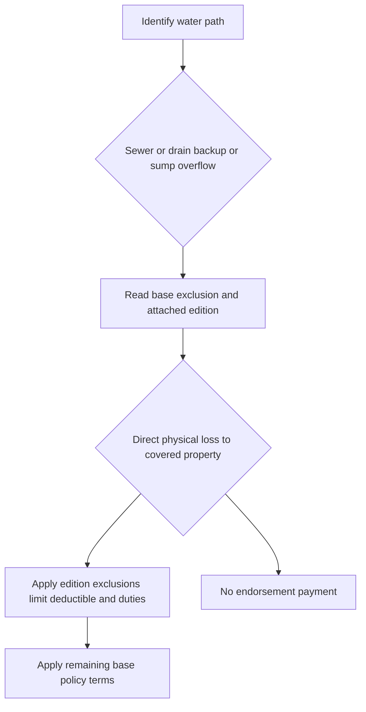

# Water Backup and Sump Overflow

## Short answer

A sewer or drain backup is water moving in reverse through a sewer or drain. Sump discharge or overflow is water released from, or overflowing from, a sump, sump pump, or related equipment. The water path must be established before applying an endorsement. The endorsement writes back only the coverage it states; it does not convert flood, groundwater, maintenance, failed-equipment repair, or otherwise excluded property into covered loss.

These endorsements generally cover resulting direct physical loss to property already insured by the base policy. They do not automatically pay to replace the failed sewer, drain, sump, pump, valve, or related equipment. Check the issued declarations, attached endorsement, base form, and applicable state overlay.

## Coverage decision path

*This flow shows the source, attachment, covered-property, and adjustment sequence.*

1. Identify whether water backed up through a sewer or drain, discharged or overflowed from a sump system, escaped from plumbing or an appliance, entered through an opening, or came from flood, surface water, or subsurface water.
2. Identify the property and insured interest: dwelling or building property, other structures, contents, improvements and betterments, or another class insured by the base form.
3. Read the base exclusion and acting endorsement together. The endorsement modifies or writes back the cited exclusion only to the extent stated and preserves unmodified policy terms.
4. Apply the edition-specific event test, exclusions, limit, deductible, valuation, and loss-of-use provisions.
5. Investigate and preserve evidence without treating inspection or partial payment as a coverage admission.

## Comparison at a glance

| Form and acting endorsement | Base-form treatment and write-back | Limit and deductible | Key conditions and boundaries |
| --- | --- | --- | --- |
| **HO-3 — HO 04 90 (2010-10)** | Legacy endorsement writes back accidental direct physical loss to covered property caused by sewer/drain backup or sump discharge/overflow. It modifies the applicable HO-3 exclusion but does not replace the base form. | **$5,000** aggregate; **$500** endorsement deductible | Precipitation, flood, surface/subsurface water, repeated seepage, neglect, and repair of failed equipment remain excluded. Source: repo://forms/HO/MS/HO-04-90/2010-10.md#L35-L105, repo://forms/HO/MS/HO-04-90/2010-10.md#L107-L205 |
| **HO-3 — HO 04 90 (2026-01)** | Effective for policies written on or after **2026-01-01**, this endorsement attaches to HO-3 and modifies Section I—Exclusions A.3. It writes back direct physical loss to Coverage A, B, and C property caused by sewer/drain backup or sump discharge/overflow, whether or not the event results from mechanical breakdown. | **$10,000** per policy period unless a higher declarations limit applies; **$1,000** separate deductible per loss. The sublimit is part of, not in addition to, Coverage A, B, and C limits. | For finished areas below grade, a backwater valve or equivalent device must be installed and operable. Flood, surface water, waves, tidal water, storm surge, body-of-water overflow, below-ground water, known unremedied maintenance failure, and loss caused by mechanical/electrical failure or power interruption remain excluded. Coverage C is settled at actual cash value unless the declarations say otherwise. Source: repo://forms/HO/MS/HO-04-90/2026-01.md#L1-L5, repo://forms/HO/MS/HO-04-90/2026-01.md#L6-L23, repo://forms/HO/MS/HO-04-90/2026-01.md#L25-L47, repo://forms/HO/MS/HO-04-90/2026-01.md#L49-L56 |
| **HO-5 2022-06 — HO 04 90 (2026-01)** | Use only if the endorsement is actually attached and its HO-3 attachment language is applicable to the issued package. The HO-5 base exclusions remain operative except to the extent the endorsement modifies them. | Apply the attached endorsement's declarations limit and deductible; do not infer coverage from a base-form reference to a limit. | HO-5 base exclusions and the endorsement's flood, below-ground water, maintenance, failed-equipment, and repair exclusions remain boundaries. Source: repo://forms/HO/MS/HO-5/2022-06.md#L713-L731, repo://forms/HO/MS/HO-04-90/2026-01.md#L1-L5 |
| **HO-6 — HO 04 91 (2019-03)** | Writes back Water Backup for covered building property, improvements and betterments, personal property, and listed water-removal expenses; modifies the HO-6 base exclusion when attached. | **$7,500** aggregate; **$750** deductible | Notice within **60 days after discovery**; condominium access and cooperation duties apply. Source: repo://forms/HO/MS/HO-04-91/2019-03.md#L41-L111, repo://forms/HO/MS/HO-04-91/2019-03.md#L113-L203, repo://forms/HO/MS/HO-6/2023-02.md#L656-L666 |
| **HO-4 — HO 04 92 (2019-03)** | Writes back direct physical loss to the tenant's covered personal property; it does not insure the landlord's building or itself add loss-of-use coverage. | **$2,500** aggregate; **$250** deductible | Notice within **90 days after discovery**. Source: repo://forms/HO/MS/HO-04-92/2019-03.md#L41-L113, repo://forms/HO/MS/HO-04-92/2019-03.md#L115-L215, repo://forms/HO/MS/HO-4/2021-10.md#L746-L759 |
| **DP-3 — DP 04 95 (2021-05)** | Writes back direct physical loss to covered property caused by sewer/drain backup or sump overflow/discharge; DP-3 X.6 preserves the exclusion unless attached. | **$5,000** aggregate; **$1,000** deductible | Notice within **30 days after loss**; failed-system repair is excluded while resulting direct physical loss may be covered. Source: repo://forms/DP/MS/DP-04-95/2021-05.md#L13-L81, repo://forms/DP/MS/DP-04-95/2021-05.md#L113-L145, repo://forms/DP/MS/DP-3/2026-01.md#L1459-L1466 |

## HO 04 90 (2026-01): contract operation

The 2026-01 form is a multistate endorsement that attaches to HO-3 and “modifies Section I — Exclusions A.3.” It expressly says it replaces 2010-10 for policies written on or after 2026-01-01. That is an effective-date boundary in this form; it does not establish that 2026-01 replaces every neighboring edition or that it governs a policy with a different attached endorsement. Source: repo://forms/HO/MS/HO-04-90/2026-01.md#L1-L5

The acting document grants coverage for “direct physical loss to property described in Coverage A, Coverage B, and Coverage C” caused by water or waterborne material backing up through sewers or drains, or overflowing or discharged from a sump, sump pump, or related equipment. The grant applies “whether or not” the event results from mechanical breakdown of that equipment. Thus the endorsement writes back the cited HO-3 water exclusion for the stated property and causes; it preserves all other policy provisions unless modified. Source: repo://forms/HO/MS/HO-04-90/2026-01.md#L6-L11, repo://forms/HO/MS/HO-04-90/2026-01.md#L49-L56

The most payable under the endorsement is **$10,000 in any one policy period**, unless a higher declarations limit applies. The sublimit is “part of, and not in addition to” Coverage A, B, and C limits. A separate **$1,000 deductible** applies to each endorsement loss; the Section I deductible does not apply to this loss. Source: repo://forms/HO/MS/HO-04-90/2026-01.md#L13-L23

The endorsement preserves HO-3 Exclusions A.1 and A.2 in full: flood, surface water, waves, tidal water, storm surge, body-of-water overflow, and water below ground remain excluded. It also excludes loss caused by a known failure to maintain the serving sewer, drain, sump, or pump where a reasonable person would have remedied it. Source: repo://forms/HO/MS/HO-04-90/2026-01.md#L25-L40

A new 2026-01 condition requires that, where the residence has a finished area below grade, a backwater valve or equivalent backflow-prevention device was installed and operable on the serving sewer line at the time of loss. The form states this requirement “did not appear in edition 2010-10”; do not impose it retroactively on a 2010-10 policy. Source: repo://forms/HO/MS/HO-04-90/2026-01.md#L42-L47

Settlement follows the attached policy for Coverage A and B property. Coverage C loss is settled at actual cash value “regardless of any replacement cost personal property endorsement,” unless the declarations state otherwise for this endorsement. All other policy provisions apply. Source: repo://forms/HO/MS/HO-04-90/2026-01.md#L49-L56

## Edition boundaries and neighboring forms

Do not backdate the 2026-01 terms to HO 04 90 (2010-10), and do not treat the filing memorandum for 2027-01 as contract wording for either edition. The 2010-10 form expressly supplies a $5,000 limit and $500 deductible and has no 2026 backwater-valve condition. Source: repo://forms/HO/MS/HO-04-90/2010-10.md#L1-L9, repo://forms/HO/MS/HO-04-90/2010-10.md#L107-L127, repo://forms/HO/MS/HO-04-90/2010-10.md#L157-L167

The HO-3 2024-03 base form excludes water backing up through a drain or sump for other-structure property and directs the reader to the applicable endorsement. A base-form reference or limit does not itself grant water-backup coverage. Read the issued base form and attached endorsement together. Source: repo://forms/HO/MS/HO-3/2024-03.md#L197-L205, repo://forms/HO/MS/HO-3/2024-03.md#L593-L597

The HO-5, HO-6, HO-4, and DP-3 rows demonstrate why the acting form controls: each line has different covered property, limits, deductibles, and notice conditions. The HO 04 90 (2026-01) form's attachment language is HO-3-specific, so its use with another line requires an issued package and applicable policy wording, not assumption from a similar endorsement number.

## Common claim boundaries and duties

- Establish the water path separately from the resulting damage. Rain or runoff entering through an opening is not sewer backup merely because it later contacts a drain.
- Separate resulting direct physical loss from the cost to clear a clog, replace a pump, install a valve, or correct defective equipment.
- Check flood, surface water, groundwater, seepage, maintenance, power, mechanical failure, contamination, and loss-of-use provisions in the governing edition.
- Mitigate safely, preserve damaged property and failed components when reasonably possible, provide notice within the applicable deadline, permit inspection, provide records, and preserve recovery rights.
- Do not treat a form's limit as a grant, or a filing memorandum as contract authority. Apply the attached endorsement and declarations.

For Illinois policies, the IDOI water-backup disclosure is a state-overlay requirement rather than replacement contract language. It requires clear disclosure of whether backup is covered, limited, excluded, or available by endorsement, including the applicable limit, deductible, exclusions, and distinction from flood and surface water. Source: repo://bulletins/IL/idoi-2017-10-water-backup-disclosure.md#L13-L43, repo://bulletins/IL/idoi-2017-10-water-backup-disclosure.md#L55-L71

## Operational checklist

Record the base form and edition; endorsement number, edition, effective date, and attachment; policy period; exact water path; property class and insured interest; applicable limit, remaining limit, deductible, and valuation; excluded source or contributing condition; and notice, mitigation, preservation, inspection, proof-of-loss, other-insurance, and recovery-rights compliance.

If the facts do not establish the source, do not label the loss from visible staining or the claimant's use of “flood.” Preserve photographs, plumber or municipal reports, invoices, failed components, moisture records, and the timeline of discovery and mitigation.
