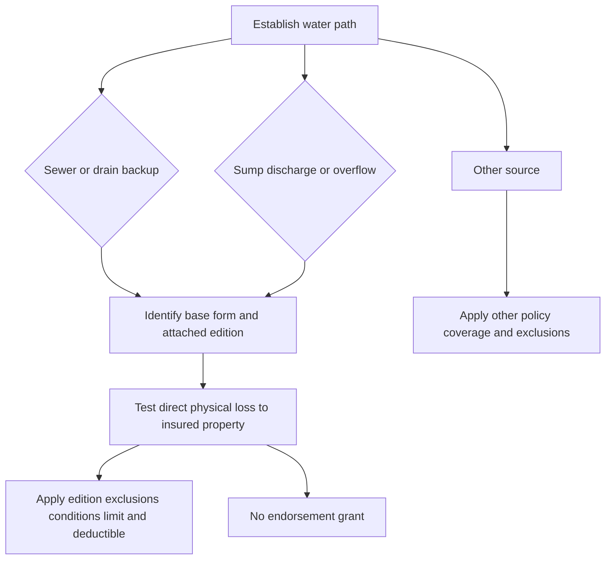

# Water Backup and Sump Discharge

## Short answer

Water-backup coverage is not established by the presence of water near a drain or sump. Establish the path of the water and the resulting direct physical loss, identify the base form and attached endorsement edition, and then apply that edition's grant, exclusions, limit, deductible, and conditions. The endorsement covers damage to property already insured by the policy; it does not automatically cover the failed sewer, drain, sump, pump, or related equipment.

*Decision path for separating cause, attachment, covered property, and adjustment terms.*

## Governing-edition rule

<!-- openwiki: broken internal link [../../../forms/HO/MS/HO-04-90/2010-10.md#L1-L9] heading anchor "L1-L9" does not exist in "../../../forms/HO/MS/HO-04-90/2010-10.md". Fix the href or restore the target, then delete this comment. -->
<!-- openwiki: broken internal link [../../../forms/HO/MS/HO-04-90/2026-01.md#L1-L4] heading anchor "L1-L4" does not exist in "../../../forms/HO/MS/HO-04-90/2026-01.md". Fix the href or restore the target, then delete this comment. -->
<!-- openwiki: broken internal link [../../../forms/HO/MS/HO-04-90/2027-01.md#L1-L8] heading anchor "L1-L8" does not exist in "../../../forms/HO/MS/HO-04-90/2027-01.md". Fix the href or restore the target, then delete this comment. -->
The attached endorsement and the policy form in force on the loss date control. HO 04 90 (2010-10) states that it is superseded by HO 04 90 (2027-01) for policies effective on or after January 1, 2027, while remaining in force for policies written under it. HO 04 90 (2026-01) is a separate multistate edition: it replaces 2010-10 for policies written on or after January 1, 2026. Do not apply a limit, deductible, or condition from one edition to another. Sources: [2010-10](../../../forms/HO/MS/HO-04-90/2010-10.md#L1-L9), [2026-01](../../../forms/HO/MS/HO-04-90/2026-01.md#L1-L4), [2027-01](../../../forms/HO/MS/HO-04-90/2027-01.md#L1-L8).

### Comparison

| Edition | Write-back and scope | Limit and deductible | Important boundaries |
| --- | --- | --- | --- |
<!-- openwiki: broken internal link [../../../forms/HO/MS/HO-04-90/2010-10.md#L35-L59] heading anchor "L35-L59" does not exist in "../../../forms/HO/MS/HO-04-90/2010-10.md". Fix the href or restore the target, then delete this comment. -->
<!-- openwiki: broken internal link [../../../forms/HO/MS/HO-04-90/2010-10.md#L77-L105] heading anchor "L77-L105" does not exist in "../../../forms/HO/MS/HO-04-90/2010-10.md". Fix the href or restore the target, then delete this comment. -->
<!-- openwiki: broken internal link [../../../forms/HO/MS/HO-04-90/2010-10.md#L107-L125] heading anchor "L107-L125" does not exist in "../../../forms/HO/MS/HO-04-90/2010-10.md". Fix the href or restore the target, then delete this comment. -->
<!-- openwiki: broken internal link [../../../forms/HO/MS/HO-04-90/2010-10.md#L157-L167] heading anchor "L157-L167" does not exist in "../../../forms/HO/MS/HO-04-90/2010-10.md". Fix the href or restore the target, then delete this comment. -->
| **HO 04 90 (2010-10)** | Accidental direct physical loss to covered property caused by sewer/drain backup or sump, sump-pump, or related-equipment discharge or overflow. The property must already be covered by the policy. | $5,000 maximum for covered loss; $500 endorsement deductible. | Precipitation, flood, surface water, subsurface water, repeated seepage, neglect, maintenance failure, and failed-equipment repair remain excluded. Sources: [2010-10 coverage](../../../forms/HO/MS/HO-04-90/2010-10.md#L35-L59), [2010-10 exclusions](../../../forms/HO/MS/HO-04-90/2010-10.md#L77-L105), [2010-10 limit](../../../forms/HO/MS/HO-04-90/2010-10.md#L107-L125), [2010-10 deductible](../../../forms/HO/MS/HO-04-90/2010-10.md#L157-L167). |
<!-- openwiki: broken internal link [../../../forms/HO/MS/HO-04-90/2026-01.md#L6-L47] heading anchor "L6-L47" does not exist in "../../../forms/HO/MS/HO-04-90/2026-01.md". Fix the href or restore the target, then delete this comment. -->
| **HO 04 90 (2026-01)** | For HO-3, covers direct physical loss to Coverage A, B, and C property from sewer/drain backup or sump discharge/overflow **whether or not** the backup, overflow, or discharge results from mechanical breakdown of the equipment. | $10,000 for all loss under the endorsement in one policy period, unless a higher declarations limit applies; it is part of, not in addition to, Coverage A, B, and C limits. Separate $1,000 deductible per loss; the Section I deductible does not apply. | Flood, surface water, waves, tidal water, storm surge, body-of-water overflow, and below-ground water remain excluded. Known, unremedied maintenance failure is a condition excluding loss. A finished below-grade area requires an installed and operable backwater valve or equivalent device. Sources: [2026-01 W.1-W.6](../../../forms/HO/MS/HO-04-90/2026-01.md#L6-L47). |
<!-- openwiki: broken internal link [../../../forms/HO/MS/HO-04-90/2027-01.md#L14-L60] heading anchor "L14-L60" does not exist in "../../../forms/HO/MS/HO-04-90/2027-01.md". Fix the href or restore the target, then delete this comment. -->
<!-- openwiki: broken internal link [../../../forms/HO/MS/HO-04-90/2027-01.md#L62-L146] heading anchor "L62-L146" does not exist in "../../../forms/HO/MS/HO-04-90/2027-01.md". Fix the href or restore the target, then delete this comment. -->
<!-- openwiki: broken internal link [../../../forms/HO/MS/HO-04-90/2027-01.md#L254-L271] heading anchor "L254-L271" does not exist in "../../../forms/HO/MS/HO-04-90/2027-01.md". Fix the href or restore the target, then delete this comment. -->
| **HO 04 90 (2027-01)** | When attached, modifies the policy for Water Backup and Sump Discharge or Overflow; covers direct physical loss and reasonable necessary protective measures. It recognizes sudden or gradual events, but requires direct physical loss during the policy period. | $10,000 maximum for the loss, regardless of insureds, claims, or covered-property items; $1,000 deductible per covered loss. | Preserves unmodified policy terms and exclusions. It separately imposes sump maintenance and known-obstruction duties, and requires an operable backwater valve for finished areas below grade. Sources: [2027-01 attachment and grant](../../../forms/HO/MS/HO-04-90/2027-01.md#L14-L60), [2027-01 grant and exclusions](../../../forms/HO/MS/HO-04-90/2027-01.md#L62-L146), [2027-01 limit](../../../forms/HO/MS/HO-04-90/2027-01.md#L254-L271). |

## HO 04 90 (2026-01): controlling position

<!-- openwiki: broken internal link [../../../forms/HO/MS/HO-04-90/2026-01.md#L1-L11] heading anchor "L1-L11" does not exist in "../../../forms/HO/MS/HO-04-90/2026-01.md". Fix the href or restore the target, then delete this comment. -->
HO 04 90 (2026-01) attaches to HO-3 and modifies Section I—Exclusions A.3. Its W.1 grant covers direct physical loss to property described in Coverage A, Coverage B, and Coverage C caused by water or waterborne material backing up through sewers or drains, or overflowing or discharging from a sump, sump pump, or related equipment, **whether or not** the event results from mechanical breakdown of that equipment. This is the controlling write-back; do not infer it from the endorsement title or training material. Source: [2026-01 W.1](../../../forms/HO/MS/HO-04-90/2026-01.md#L1-L11).

<!-- openwiki: broken internal link [../../../forms/HO/MS/HO-04-90/2026-01.md#L13-L23] heading anchor "L13-L23" does not exist in "../../../forms/HO/MS/HO-04-90/2026-01.md". Fix the href or restore the target, then delete this comment. -->
The 2026-01 edition provides a **$10,000 policy-period sublimit** for all loss under the endorsement, unless a higher limit appears in the Declarations. The sublimit is part of, and not in addition to, the limits applying to Coverage A, B, and C. A **separate $1,000 deductible** applies to each loss; the Section I declarations deductible does not apply to loss covered here. Sources: [2026-01 W.2-W.3](../../../forms/HO/MS/HO-04-90/2026-01.md#L13-L23).

<!-- openwiki: broken internal link [../../../forms/HO/MS/HO-04-90/2026-01.md#L25-L33] heading anchor "L25-L33" does not exist in "../../../forms/HO/MS/HO-04-90/2026-01.md". Fix the href or restore the target, then delete this comment. -->
<!-- openwiki: broken internal link [../../../forms/HO/MS/HO-3/2024-03.md#L593-L601] heading anchor "L593-L601" does not exist in "../../../forms/HO/MS/HO-3/2024-03.md". Fix the href or restore the target, then delete this comment. -->
The endorsement expressly preserves the base-form water exclusions: flood, surface water, waves, tidal water, storm surge, and overflow of a body of water remain excluded **whether or not driven by wind**, and Section I—Exclusions A.1 continues in full. Water below the surface of the ground, including water exerting pressure on or seeping or leaking through a building or foundation, remains excluded and Section I—Exclusions A.2 continues in full. Sources: [2026-01 W.4](../../../forms/HO/MS/HO-04-90/2026-01.md#L25-L33), [HO-3 2024-03 X.7-X.10](../../../forms/HO/MS/HO-3/2024-03.md#L593-L601).

<!-- openwiki: broken internal link [../../../forms/HO/MS/HO-04-90/2026-01.md#L35-L47] heading anchor "L35-L47" does not exist in "../../../forms/HO/MS/HO-04-90/2026-01.md". Fix the href or restore the target, then delete this comment. -->
The maintenance condition is narrower and fact-specific: the endorsement does not cover loss when the event resulted from the insured's failure to maintain the sewer line, drain, sump, or sump pump serving the residence premises, where the failure was known before the loss and a reasonable person would have remedied it. For a finished area below grade, coverage applies only if a backwater valve or equivalent backflow-prevention device was installed and operable on the serving sewer line at the time of loss. Sources: [2026-01 W.5-W.6](../../../forms/HO/MS/HO-04-90/2026-01.md#L35-L47).

## What the 2026 edition does not change

<!-- openwiki: broken internal link [../../../forms/HO/MS/HO-3/2024-03.md#L593-L597] heading anchor "L593-L597" does not exist in "../../../forms/HO/MS/HO-3/2024-03.md". Fix the href or restore the target, then delete this comment. -->
<!-- openwiki: broken internal link [../../../forms/HO/MS/HO-04-90/2026-01.md#L25-L47] heading anchor "L25-L47" does not exist in "../../../forms/HO/MS/HO-04-90/2026-01.md". Fix the href or restore the target, then delete this comment. -->
The 2026 endorsement writes back only the stated water-backup peril and does not replace the HO-3 contract. The HO-3 base form excludes sewer/drain backup unless a water-backup endorsement is attached and separately excludes sump discharge or overflow; the base-form reference to a “backup and sump overflow limit” is not itself a grant. HO 04 90 (2026-01) supplies the grant, subject to its terms, while other base-form provisions remain controlling. Sources: [HO-3 X.8-X.9](../../../forms/HO/MS/HO-3/2024-03.md#L593-L597), [2026-01 W.4 and W.6](../../../forms/HO/MS/HO-04-90/2026-01.md#L25-L47).

<!-- openwiki: broken internal link [../../../forms/HO/MS/HO-04-90/2026-01.md#L49-L56] heading anchor "L49-L56" does not exist in "../../../forms/HO/MS/HO-04-90/2026-01.md". Fix the href or restore the target, then delete this comment. -->
The 2026 wording does not authorize payment merely to repair or replace the failed equipment, nor does it turn excluded flood or below-ground water into covered water. Coverage analysis must still separate the covered resulting damage from the source condition and apply the policy's property, valuation, and other exclusions. The 2026 form says all other policy provisions apply. Source: [2026-01 W.7](../../../forms/HO/MS/HO-04-90/2026-01.md#L49-L56).

## Distinguishing 2010-10 and 2027-01

<!-- openwiki: broken internal link [../../../forms/HO/MS/HO-04-90/2010-10.md#L57-L59] heading anchor "L57-L59" does not exist in "../../../forms/HO/MS/HO-04-90/2010-10.md". Fix the href or restore the target, then delete this comment. -->
<!-- openwiki: broken internal link [../../../forms/HO/MS/HO-04-90/2010-10.md#L107-L135] heading anchor "L107-L135" does not exist in "../../../forms/HO/MS/HO-04-90/2010-10.md". Fix the href or restore the target, then delete this comment. -->
<!-- openwiki: broken internal link [../../../forms/HO/MS/HO-04-90/2010-10.md#L225-L235] heading anchor "L225-L235" does not exist in "../../../forms/HO/MS/HO-04-90/2010-10.md". Fix the href or restore the target, then delete this comment. -->
**2010-10 is not 2026-01.** The legacy edition requires an accidental event, uses a $5,000 limit and $500 endorsement deductible, and expressly excludes loss caused by mechanical breakdown, power interruption, inadequate maintenance, and blocked or improperly maintained sewer or drain. Sources: [2010-10 W.11 and exclusions](../../../forms/HO/MS/HO-04-90/2010-10.md#L57-L59), [2010-10 W.2-W.13](../../../forms/HO/MS/HO-04-90/2010-10.md#L107-L135), [2010-10 W.7-W.12 exclusions](../../../forms/HO/MS/HO-04-90/2010-10.md#L225-L235).

<!-- openwiki: broken internal link [../../../forms/HO/MS/HO-04-90/2027-01.md#L14-L117] heading anchor "L14-L117" does not exist in "../../../forms/HO/MS/HO-04-90/2027-01.md". Fix the href or restore the target, then delete this comment. -->
<!-- openwiki: broken internal link [../../../forms/HO/MS/HO-04-90/2027-01.md#L140-L191] heading anchor "L140-L191" does not exist in "../../../forms/HO/MS/HO-04-90/2027-01.md". Fix the href or restore the target, then delete this comment. -->
<!-- openwiki: broken internal link [../../../forms/HO/MS/HO-04-90/2027-01.md#L254-L321] heading anchor "L254-L321" does not exist in "../../../forms/HO/MS/HO-04-90/2027-01.md". Fix the href or restore the target, then delete this comment. -->
**2027-01 is not 2026-01.** The 2027 edition applies only when attached, preserves unmodified policy terms, and states that Water Backup and Sump Discharge or Overflow may occur suddenly or gradually. It provides a $10,000 maximum and $1,000 deductible, but its detailed provisions include maintenance, known-obstruction, mitigation, evidence-preservation, and backwater-valve controls. Sources: [2027-01 W.1-W.13](../../../forms/HO/MS/HO-04-90/2027-01.md#L14-L117), [2027-01 W.20-W.32](../../../forms/HO/MS/HO-04-90/2027-01.md#L140-L191), [2027-01 limit and deductible](../../../forms/HO/MS/HO-04-90/2027-01.md#L254-L321).

## Contract terms versus handling guidance

<!-- openwiki: broken internal link [../../../forms/HO/MS/HO-04-90/2026-01.md#L6-L56] heading anchor "L6-L56" does not exist in "../../../forms/HO/MS/HO-04-90/2026-01.md". Fix the href or restore the target, then delete this comment. -->
<!-- openwiki: broken internal link [../../../training/water-losses-101.md#L93-L107] heading anchor "L93-L107" does not exist in "../../../training/water-losses-101.md". Fix the href or restore the target, then delete this comment. -->
Forms are contract evidence. Claims or training material may guide investigation but cannot enlarge the grant. For every loss, record the base form and edition, attached endorsement and edition, policy and loss dates, water path, direct physical damage, property class, declarations limit, applicable sublimit, deductible, maintenance facts, backwater-valve facts, and evidence preserved. Investigate the actual policy and endorsement rather than importing a $10,000 or $1,000 figure from training. Sources: [2026-01 form](../../../forms/HO/MS/HO-04-90/2026-01.md#L6-L56), [training guidance](../../../training/water-losses-101.md#L93-L107).

<!-- openwiki: broken internal link [../../../forms/HO/MS/HO-04-90/2027-01.md#L152-L173] heading anchor "L152-L173" does not exist in "../../../forms/HO/MS/HO-04-90/2027-01.md". Fix the href or restore the target, then delete this comment. -->
<!-- openwiki: broken internal link [../../../forms/HO/MS/HO-04-90/2027-01.md#L240-L252] heading anchor "L240-L252" does not exist in "../../../forms/HO/MS/HO-04-90/2027-01.md". Fix the href or restore the target, then delete this comment. -->
The practical investigation sequence is: mitigate safely; notify under the applicable policy conditions; preserve failed components and records where reasonably possible; establish the water path and direct physical loss; then apply the governing edition's exclusions, sublimit, deductible, and valuation terms. An inspection or investigation is not a coverage admission. Source: [2027-01 duties](../../../forms/HO/MS/HO-04-90/2027-01.md#L152-L173), [2027-01 investigation control](../../../forms/HO/MS/HO-04-90/2027-01.md#L240-L252).
