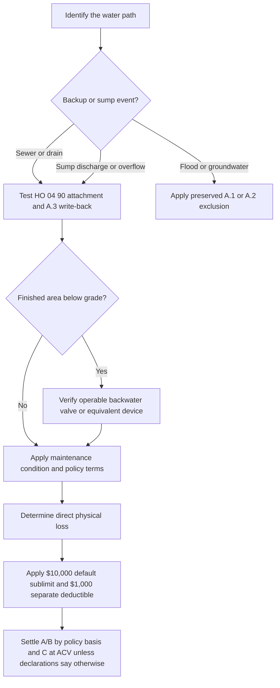

# Water Backup and Sump Discharge

## At a glance

HO 04 90 (2026-01) is an HO-3 endorsement. It replaces the 2010-10 edition for policies written on or after **2026-01-01** and modifies **HO-3 Section I—Exclusions A.3**. It covers direct physical loss to property described in Coverages A, B, and C when water backs up through a sewer or drain, or overflows or is discharged from a sump, sump pump, or related equipment. The endorsement expressly applies whether or not the backup, overflow, or discharge results from mechanical breakdown of that equipment. Source: `repo://forms/HO/MS/HO-04-90/2026-01.md#L1-L11`

The default maximum is **$10,000 for all loss under the endorsement in one policy period**, unless the Declarations show a higher endorsement limit. The sublimit is part of—not additional to—the Coverage A, B, and C limits. A **separate $1,000 deductible applies to each loss**; the Section I deductible does not apply to loss covered by this endorsement. Source: `repo://forms/HO/MS/HO-04-90/2026-01.md#L13-L23`

## Coverage relationship to HO-3 exclusions

The endorsement acts on the HO-3 water exclusions rather than replacing the policy wholesale:

- **Writes back:** limited coverage for the defined sewer/drain backup and sump discharge or overflow, to the extent stated in HO 04 90.
- **Preserves:** Section I—Exclusions A.1 for flood, surface water, waves, tidal water, storm surge, and overflow of a body of water; and A.2 for water below the surface of the ground, including water exerting pressure on or seeping or leaking through a building, foundation, or pool. The endorsement states, “Section I — Exclusions A.1 continues to apply in full” and “Section I — Exclusions A.2 continues to apply in full.” Source: `repo://forms/HO/MS/HO-04-90/2026-01.md#L25-L33`
- **Modifies:** Section I—Exclusions A.3 only to the extent necessary to provide this endorsement’s stated water-backup and sump-discharge coverage. All other policy provisions continue to apply. Source: `repo://forms/HO/MS/HO-04-90/2026-01.md#L1-L4`, `repo://forms/HO/MS/HO-04-90/2026-01.md#L49-L56`

The HO-3 base form confirms the boundary: sewer or drain backup is excluded unless a water-backup endorsement is attached, and sump discharge or overflow is separately excluded. Its reference to a “backup and sump overflow limit” does not itself create coverage. Source: `repo://forms/HO/MS/HO-3/2024-03.md#L593-L601`

## Decision flow

*This flow separates the covered path from the flood and groundwater exclusions, then applies the new device condition and settlement rules.*

## Conditions that decide a 2026-01 claim

### Known maintenance failure

The maintenance condition is controlling and should be quoted, not softened into a general “maintenance issue” rule: **“We do not cover loss under this endorsement if the backup, overflow, or discharge resulted from an insured's failure to maintain the sewer line, drain, sump, or sump pump serving the residence premises, where that failure was known to the insured before the loss and a reasonable person would have remedied it.”** Source: `repo://forms/HO/MS/HO-04-90/2026-01.md#L35-L40`

The condition requires all of the stated elements: an insured’s failure to maintain a listed system, knowledge before the loss, and a condition a reasonable person would have remedied. It is not a blanket exclusion for every equipment malfunction.

### New below-grade backflow-device requirement

Where the residence premises has a **finished area below grade**, coverage applies only if **“a backwater valve or equivalent backflow prevention device was installed and operable on the sewer line serving the premises at the time of loss.”** The form expressly says this requirement is new in 2026-01 and did not appear in 2010-10. Source: `repo://forms/HO/MS/HO-04-90/2026-01.md#L42-L47`

Investigation should therefore establish whether a finished below-grade area existed, identify the device serving the premises, and document its installation and operability at the time of loss. Installing a device after the event does not establish the condition at the time of loss.

### Loss settlement

The endorsement does not create one universal valuation basis. **Coverage A and Coverage B** property is settled “on the basis stated in the policy to which this endorsement attaches.” **Coverage C** property is settled at **actual cash value**, even if a replacement-cost personal-property endorsement exists, unless the Declarations state otherwise for this endorsement. Source: `repo://forms/HO/MS/HO-04-90/2026-01.md#L49-L54`

Thus, the endorsement sublimit is a ceiling on the covered loss; it is not a replacement-cost promise. Determine the applicable policy valuation first, then apply exclusions, the $10,000 default sublimit or declared higher limit, and the separate $1,000 deductible.

## What is and is not within the grant

The covered event is water or waterborne material that backs up through sewers or drains, or water that overflows or is discharged from a sump, sump pump, or related equipment. The 2026 wording does not remove the need to establish direct physical loss to insured Coverage A, B, or C property. Source: `repo://forms/HO/MS/HO-04-90/2026-01.md#L6-L11`

The endorsement does **not** write back:

- flood, surface water, waves, tidal water, storm surge, or body-of-water overflow;
- water below ground, including pressure, seepage, or leakage through a building, foundation, or pool;
- a loss failing the quoted known-maintenance condition; or
- a loss at a residence with a finished below-grade area when the required backflow device was not installed and operable at the time of loss.

Those boundaries are not merely claims preferences: A.1 and A.2 are expressly preserved, and W.5 and W.6 state the additional endorsement conditions. Source: `repo://forms/HO/MS/HO-04-90/2026-01.md#L25-L47`

## 2010-10 and 2027-01 distinction

Do not backdate the 2026 terms or import the 2027 terms into a different policy. The 2026 form says it replaces 2010-10 for policies written on or after 2026-01-01. The older edition therefore cannot be assigned the 2026 $10,000 sublimit, separate $1,000 deductible, below-grade device condition, or Coverage C settlement rule without the governing policy text. Source: `repo://forms/HO/MS/HO-04-90/2026-01.md#L1-L4`, `repo://forms/HO/MS/HO-04-90/2010-10.md#L1-L9`

The repository also contains a distinct 2027-01 endorsement. It has a different, substantially expanded structure and states that it applies only when attached, controls conflicts, and leaves unmodified policy provisions unchanged. Treat it as a separate edition, not as interpretive text for 2026-01. Source: `repo://forms/HO/MS/HO-04-90/2027-01.md#L14-L39`

## Claim-handling checklist

1. Confirm the HO-3 edition, the HO 04 90 edition, attachment, declarations, and loss date.
2. Establish the path: sewer/drain backup, sump discharge or overflow, flood, groundwater, or another source.
3. Identify damaged property as Coverage A, B, or C and determine the policy valuation basis.
4. For a finished below-grade area, document the backwater valve or equivalent device and its operability at the time of loss.
5. Investigate the sewer, drain, sump, and pump maintenance history, including whether a correctable condition was known before the loss.
6. Apply preserved A.1 and A.2 exclusions before applying the endorsement sublimit and separate deductible.
7. Apply the default $10,000 policy-period sublimit unless the Declarations show a higher endorsement limit; then apply the $1,000 deductible to each covered loss.

The endorsement says all other policy provisions apply, so ordinary notice, mitigation, inspection, proof, and cooperation duties remain relevant even though they are not rewritten by this short endorsement. Source: `repo://forms/HO/MS/HO-04-90/2026-01.md#L49-L56`
