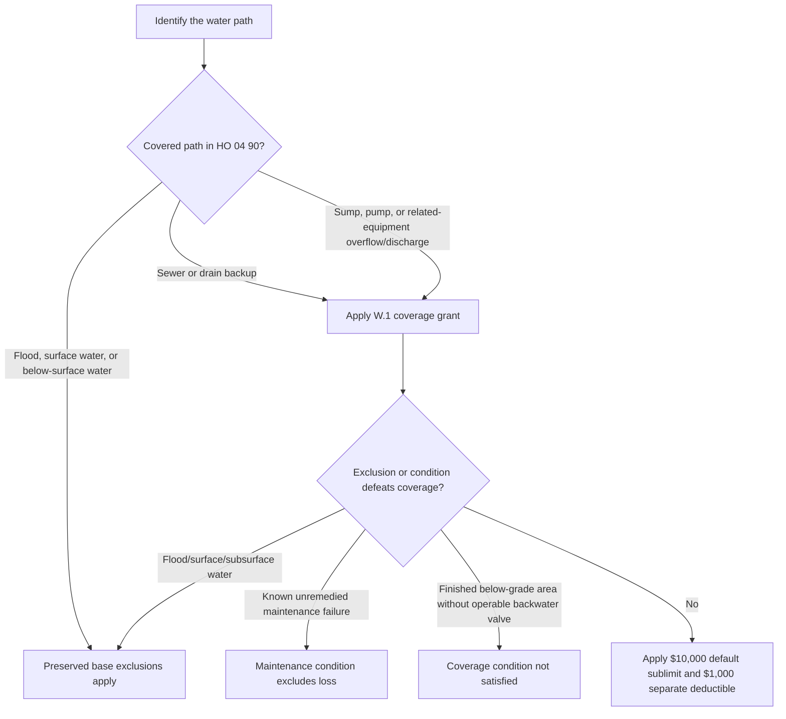

# Water Backup and Sump Discharge Coverage

## Short answer

**HO 04 90 (2026-01) writes back** limited HO-3 coverage for direct physical loss to Coverage A, B, and C property caused by water or waterborne material that backs up through a sewer or drain, or overflows or discharges from a sump, sump pump, or related equipment. The endorsement applies whether or not the event results from mechanical breakdown of that equipment. It attaches only when issued with the policy and is subject to its own terms. [^2026-coverage]

The default sublimit is **$10,000 for all loss in one policy period**, unless the Declarations show a higher endorsement limit. That sublimit is part of—not additional to—the Coverage A, B, and C limits. A separate **$1,000 deductible applies to each loss**; the Section I deductible does not apply to this endorsement. [^2026-limit]

The endorsement does not convert flood, surface water, waves, tidal water, storm surge, body-of-water overflow, or below-surface water into covered backup. It expressly says Section I Exclusions A.1 and A.2 continue to apply in full. [^2026-water-exclusions]

## How the 2026-01 endorsement operates

1. **Confirm attachment and edition.** The 2026-01 form is a multistate endorsement that attaches to HO-3 and modifies Section I—Exclusions A.3. It replaces 2010-10 for policies written on or after **2026-01-01**. [^2026-preamble]
2. **Establish the water path and damaged property.** The grant is for direct physical loss to property described in Coverage A, B, or C—not merely the presence of water. The source must be sewer/drain backup or sump-related overflow/discharge as described in W.1. [^2026-coverage]
3. **Apply preserved exclusions and conditions.** Test the express A.1/A.2 exclusions, the W.5 known-maintenance condition, and the W.6 below-grade backflow-prevention requirement before applying the limit and deductible. [^2026-water-exclusions] [^2026-maintenance]
4. **Settle under the remaining policy terms.** Coverage A and B property uses the policy’s stated settlement basis. Coverage C is actual-cash-value settlement despite a replacement-cost personal-property endorsement unless the Declarations provide otherwise. [^2026-settlement]

## What is covered

**HO 04 90 (2026-01) modifies** the HO-3 water exclusion by providing the stated write-back for:

- water or waterborne material backing up through **sewers or drains**; and
- water overflowing or discharged from a **sump, sump pump, or related equipment**, even when mechanical breakdown of that equipment caused the event.

The covered interest is direct physical loss to property described in Coverage A, Coverage B, or Coverage C. The failed sewer, drain, sump, pump, or related equipment is not itself made a covered item merely because it is the source of the water; the endorsement grants the loss described in W.1, subject to its exclusions and conditions. [^2026-coverage]

The acting document is the attached endorsement: it **modifies** Section I—Exclusions A.3, while all other policy provisions apply unless changed by the endorsement. The HO-3 base form **preserves** its sewer, drain, and sump-system exclusion unless the applicable water-backup endorsement is attached. [^2026-preamble] [^ho3-exclusion]

## Limit and deductible

- **Default sublimit:** $10,000 for all endorsement loss in one policy period.
- **Declarations control:** a higher endorsement limit applies if shown there.
- **Limit relationship:** the sublimit is part of the Coverage A, B, and C limits, not an addition to them.
- **Separate deductible:** $1,000 for each loss under the endorsement.
- **Section I deductible:** does not apply to loss covered here.

These are contract terms, not internal claims or underwriting guidance. Check the issued Declarations for a higher limit and apply the deductible only after determining the loss covered by this endorsement. [^2026-limit]

## Exclusions expressly preserved

### Flood and surface water — A.1

The endorsement **preserves** Section I Exclusions A.1 in full. It does not cover loss caused by **flood, surface water, waves, tidal water, storm surge, or overflow of a body of water**, whether or not wind-driven. A sewer or sump claim cannot be relabeled as covered backup when the operative cause is one of those excluded waters. [^2026-water-exclusions]

### Subsurface water — A.2

The endorsement also **preserves** Section I Exclusions A.2 in full. It does not cover loss caused by water below the surface of the ground, including water exerting pressure on or seeping or leaking through a building, foundation, or swimming pool. This boundary is distinct from water that has backed up through a sewer or drain. [^2026-water-exclusions]

### Known maintenance failure — W.5

The endorsement **constrains** its own grant through W.5: loss is not covered when the backup, overflow, or discharge resulted from the insured’s failure to maintain the sewer line, drain, sump, or sump pump serving the residence premises, where the failure was known before the loss and a reasonable person would have remedied it. This is a contract condition, not a general statement that every equipment failure defeats coverage. [^2026-maintenance]

### Finished areas below grade — W.6

Where the residence premises has a finished area below grade, coverage applies only if a backwater valve or equivalent backflow-prevention device was installed and operable on the sewer line serving the premises at the time of loss. W.6 identifies this as new in 2026-01 and says it did not appear in 2010-10. [^2026-backflow]

## Edition applicability and supersession

**HO 04 90 (2026-01) supersedes** HO 04 90 (2010-10) for policies written on or after **2026-01-01**. The 2010-10 edition remains live knowledge for policies written under that edition; do not import the 2026-01 $10,000 sublimit, $1,000 deductible, maintenance condition, or below-grade backflow requirement into a 2010-10 contract. [^2026-preamble] [^2010-preamble]

The repository also contains HO 04 90 (2027-01), effective 2027-01-01. That later edition is not the acting document for a 2026-01 policy. Determine the governing edition from the attached endorsement, effective date, and Declarations before applying any limit or condition. [^2027-preamble]

## Contract application checklist

1. Verify the HO-3 base form, attached HO 04 90 edition, policy period, and Declarations.
2. Document whether the water backed up through a sewer/drain or came from sump-related overflow/discharge.
3. Separate direct physical loss to Coverage A/B/C property from the source equipment and from excluded flood, surface, or subsurface water.
4. Test W.5’s known-and-unremedied maintenance condition and W.6’s operable backwater-valve requirement where a finished below-grade area exists.
5. Apply the Declarations limit (or $10,000 default), the $1,000 separate deductible, and the applicable settlement basis.

[^2026-preamble]: repo://forms/HO/MS/HO-04-90/2026-01.md#L1-L4
[^2026-coverage]: repo://forms/HO/MS/HO-04-90/2026-01.md#L6-L11
[^2026-limit]: repo://forms/HO/MS/HO-04-90/2026-01.md#L13-L23
[^2026-water-exclusions]: repo://forms/HO/MS/HO-04-90/2026-01.md#L25-L33
[^2026-maintenance]: repo://forms/HO/MS/HO-04-90/2026-01.md#L35-L40
[^2026-backflow]: repo://forms/HO/MS/HO-04-90/2026-01.md#L42-L47
[^2026-settlement]: repo://forms/HO/MS/HO-04-90/2026-01.md#L49-L56
[^ho3-exclusion]: repo://forms/HO/MS/HO-3/2024-03.md#L593-L597
[^2010-preamble]: repo://forms/HO/MS/HO-04-90/2010-10.md#L1-L9
[^2027-preamble]: repo://forms/HO/MS/HO-04-90/2027-01.md#L1-L8
