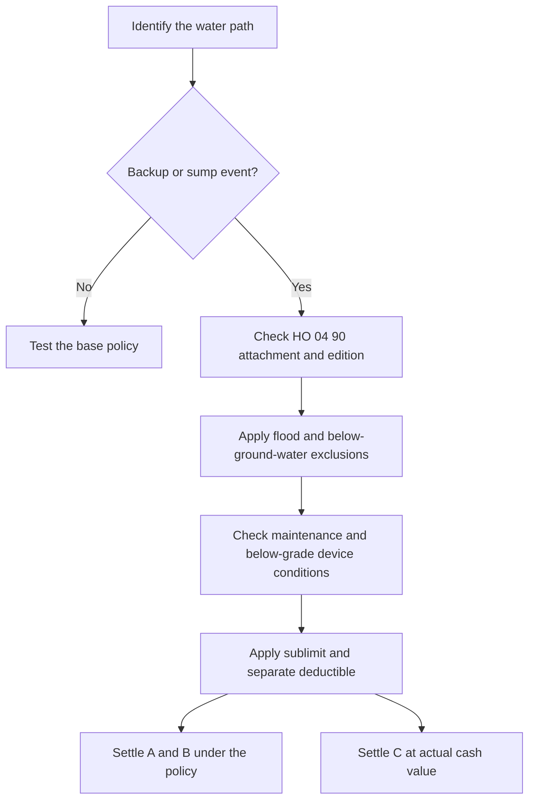

# Water Backup and Sump Discharge Coverage

## Short answer

For policies written on or after **2026-01-01**, HO 04 90 (2026-01) replaces HO 04 90 (2010-10). It attaches to HO-3 and modifies Section I—Exclusions A.3. The endorsement covers direct physical loss to Coverage A, B, and C property caused by water backing up through a sewer or drain, or overflowing or discharging from a sump, sump pump, or related equipment. The new grant applies **“whether or not the backup, overflow, or discharge results from mechanical breakdown of that equipment.”** Source: `repo://forms/HO/MS/HO-04-90/2026-01.md#L1-L11`

It is a limited write-back, not a replacement for the policy. The HO-3 exclusions for flood and below-ground water continue in full, and all other policy provisions apply unless the endorsement changes them. Source: `repo://forms/HO/MS/HO-04-90/2026-01.md#L25-L33`, `repo://forms/HO/MS/HO-04-90/2026-01.md#L56-L56`

## Coverage decision path

*This diagram shows the contract-language sequence for evaluating an attached 2026-01 endorsement.*

## What HO 04 90 (2026-01) changes

### Grant and property scope

W.1 covers direct physical loss to property described in Coverage A, Coverage B, and Coverage C when caused by water or waterborne material that backs up through sewers or drains, or overflows or is discharged from a sump, sump pump, or related equipment. The mechanical-breakdown phrase is part of the grant; it does not by itself promise payment for repairing the failed equipment. Source: `repo://forms/HO/MS/HO-04-90/2026-01.md#L6-L11`

### Sublimit and deductible

The default maximum is **$10,000 for all loss under the endorsement in one policy period**, unless the Declarations show a higher endorsement limit. The sublimit is part of, not additional to, the Coverage A, B, and C limits. Source: `repo://forms/HO/MS/HO-04-90/2026-01.md#L13-L18`

A **separate $1,000 deductible applies to each loss** under the endorsement. The Section I deductible in the Declarations does not apply to loss covered here. Source: `repo://forms/HO/MS/HO-04-90/2026-01.md#L20-L23`

### Preserved exclusions

The endorsement does not cover loss caused by flood, surface water, waves, tidal water, storm surge, or overflow of a body of water, **“whether or not driven by wind.”** Section I—Exclusions A.1 continues in full. Source: `repo://forms/HO/MS/HO-04-90/2026-01.md#L25-L29`

It also does not cover loss caused by water below the surface of the ground, including water exerting pressure on or seeping or leaking through a building, foundation, or swimming pool. Section I—Exclusions A.2 continues in full. Source: `repo://forms/HO/MS/HO-04-90/2026-01.md#L31-L33`

Accordingly, the endorsement distinguishes a covered sewer, drain, or sump pathway from flood, surface water, storm surge, body-of-water overflow, and subsurface seepage. A report that merely says “water damage” is not enough to select this grant; the path and resulting direct physical loss must be established.

### Maintenance condition

W.5 excludes loss when the backup, overflow, or discharge resulted from the insured’s failure to maintain the sewer line, drain, sump, or sump pump serving the residence premises, if the failure was known before the loss and a reasonable person would have remedied it. This is a contract condition, not a general instruction to infer neglect from any equipment failure. Source: `repo://forms/HO/MS/HO-04-90/2026-01.md#L35-L40`

### Below-grade backflow-device requirement

When the residence premises has a finished area below grade, coverage applies only if a backwater valve or equivalent backflow-prevention device was installed and operable on the sewer line serving the premises at the time of loss. The 2026-01 form expressly identifies this requirement as new and says it did not appear in 2010-10. Source: `repo://forms/HO/MS/HO-04-90/2026-01.md#L42-L47`

### Settlement

Coverage A and Coverage B property is settled on the basis stated in the policy to which the endorsement attaches. Coverage C property is settled at **actual cash value**, regardless of a replacement-cost personal-property endorsement, unless the Declarations state otherwise for this endorsement. Source: `repo://forms/HO/MS/HO-04-90/2026-01.md#L49-L54`

## Relationship to HO-3

HO-3 2024-03 excludes water backing up through sewers, drains, or sump systems unless a water-backup endorsement is attached, and separately excludes water overflowing or discharged from a sump, sump pump, or related equipment. Its reference identifies HO 04 90 (2026-01), W.1 as the relevant write-back. HO 04 90 therefore **modifies** those HO-3 exclusions only to the extent its W.1 grant applies; it does not erase the neighboring flood and below-ground-water exclusions. Source: `repo://forms/HO/MS/HO-3/2024-03.md#L593-L600`, `repo://forms/HO/MS/HO-04-90/2026-01.md#L6-L11`, `repo://forms/HO/MS/HO-04-90/2026-01.md#L25-L33`

The endorsement’s final provision preserves the rest of the attached policy. Read the endorsement and HO-3 together, including the property coverage, valuation, conditions, and exclusions that HO 04 90 does not modify. Source: `repo://forms/HO/MS/HO-04-90/2026-01.md#L56-L56`

## 2010-10 comparison

HO 04 90 (2010-10) remains the governing endorsement for policies written under that edition, but it is superseded for policies effective on or after 2027-01-01 according to the repository’s 2010-10 form. Do not import the newer edition’s terms into a 2010-10 policy. Source: `repo://forms/HO/MS/HO-04-90/2010-10.md#L1-L9`

The legacy edition has a **$5,000** limit and a **$500** deductible. It requires an accidental water backup or sump discharge/overflow and excludes precipitation-related water, repair or maintenance of the failed system, and other listed causes. Source: `repo://forms/HO/MS/HO-04-90/2010-10.md#L35-L39`, `repo://forms/HO/MS/HO-04-90/2010-10.md#L57-L59`, `repo://forms/HO/MS/HO-04-90/2010-10.md#L77-L93`, `repo://forms/HO/MS/HO-04-90/2010-10.md#L107-L127`, `repo://forms/HO/MS/HO-04-90/2010-10.md#L157-L167`

Most importantly, 2010-10 did **not** contain the 2026-01 W.6 below-grade backwater-valve requirement; the 2026-01 form says so expressly. The editions also differ in the grant wording, default limit, deductible, and Coverage C settlement rule. Source: `repo://forms/HO/MS/HO-04-90/2026-01.md#L42-L47`, `repo://forms/HO/MS/HO-04-90/2026-01.md#L49-L54`

## Claim-handling checklist (not contract language)

For a claim under an attached HO 04 90 (2026-01), document:

- the policy’s base form, endorsement edition, attachment, and loss date;
- whether water backed up through a sewer or drain, or discharged/overflowed from a sump system;
- the affected Coverage A, B, or C property and evidence of direct physical loss;
- flood, surface-water, body-of-water, storm-surge, or below-ground-water facts;
- known pre-loss maintenance problems and whether a reasonable person would have remedied them;
- any finished area below grade and whether the required backwater valve or equivalent device was installed and operable at the time of loss;
- the applicable Declarations limit, $10,000 default sublimit if no higher limit is shown, and separate $1,000 deductible; and
- whether Coverage C requires actual-cash-value settlement under W.7.

These are investigation controls, not additions to the grant. The contract controls, and the governing edition must be verified before applying the 2026-01 terms.
