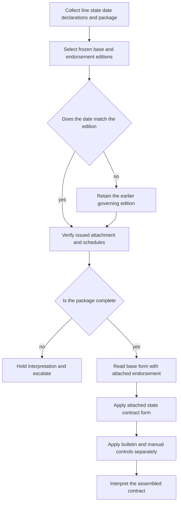

# Policy Editions, Endorsements, and State Attachments

A coverage conclusion starts with the **issued package**, not with the newest file in the repository. Identify the line, state, policy-effective date, Declarations, base-form edition, attached endorsements, schedules, referenced pages, and applicable state form. The repository path is load-bearing: `forms/` and `bulletins/` are frozen authority, while manuals and guidelines are living internal guidance ([README layout](repo://README.md#L13-L31), [README frozen authority](repo://README.md#L33-L41)).

## Authority boundaries

| Layer | Role | Boundary |
| --- | --- | --- |
| Base form and attached endorsement | Supply the contract’s grants, exclusions, limits, conditions, and settlement terms. | The endorsement applies only when attached and only within its stated terms. |
| State amendatory form | Add state-specific contract wording and precedence for matters addressed. | The state form is contract authority; it does not automatically replace the base policy. |
| State bulletin | Govern disclosure, filing, issuance, and claims or administrative operations. | A bulletin constrains operations; it does not create or rewrite coverage. |
| Manual and underwriting guidance | Govern eligibility, authority, referrals, evidence, and attachment controls. | Internal guidance constrains carrier action; it does not become a policy term. |

Use one directional relationship verb and name the acting document first. For example, **HO 04 90 2026-01 modifies HO-3 2024-03** only within its stated scope; **HO 04 90 2026-01 preserves HO-3 2024-03 exclusions** that it does not change. Cite both provisions when making such a relationship ([HO 04 90 2026-01](repo://forms/HO/MS/HO-04-90/2026-01.md#L1-L56), [HO-3 2024-03 water exclusions](repo://forms/HO/MS/HO-3/2024-03.md#L593-L601)).

## Edition and effective-date gate

Frozen editions remain separate. A later file does not rewrite a policy issued under an earlier edition ([README](repo://README.md#L33-L37)). Select the edition whose effective interval contains the policy-effective date, then verify that it was issued and attached:

- **HO 04 90 2010-10** governs policies written under that edition before the 2026 boundary. It remains the applicable frozen wording for those policies; its attachment language says that it forms part of the policy and changes policy provisions only as expressly stated ([2010-10](repo://forms/HO/MS/HO-04-90/2010-10.md#L1-L9), [2010-10 attachment](repo://forms/HO/MS/HO-04-90/2010-10.md#L13-L27)).
- **HO 04 90 2026-01** replaces 2010-10 for policies written on or after **2026-01-01**. This is the requested effective-date boundary; do not apply its new condition or $10,000/$1,000 amounts to an earlier policy ([2026-01](repo://forms/HO/MS/HO-04-90/2026-01.md#L1-L4), [2026-01 limits](repo://forms/HO/MS/HO-04-90/2026-01.md#L13-L23)).
- **HO 04 90 2027-01** is a later edition effective 2027-01-01. It must remain distinct from 2026-01 and must not be used to backdate either edition ([2027-01](repo://forms/HO/MS/HO-04-90/2027-01.md#L1-L7)).

The effective date selects a candidate; it does not prove attachment. A schedule entry or system label is an index, not the operative endorsement. If the package is incomplete or the attachment cannot be tied to the insured, term, location, and property, hold interpretation and obtain the issued copy or escalate ([authority and clearance](repo://openwiki/underwriting/manual/authority-referrals-and-clearance.md#L22-L26)).

*This flow shows date routing, attachment verification, contract assembly, and the separate operational overlays.*

## HO-3 water exclusions and HO 04 90 2026-01

HO-3 2024-03 excludes flood and surface water and separately excludes sewer, drain, and sump backup or discharge in X.7–X.9. Its exception points to an attached water-backup endorsement ([HO-3 2024-03](repo://forms/HO/MS/HO-3/2024-03.md#L593-L601)). **HO 04 90 2026-01 modifies HO-3 2024-03** for direct physical loss caused by sewer or drain backup and sump discharge or overflow, subject to the endorsement’s terms ([HO 04 90 2026-01](repo://forms/HO/MS/HO-04-90/2026-01.md#L6-L11)).

The 2026-01 endorsement provides:

- a **$10,000 per-policy-period sublimit**, unless a higher amount appears in its Declarations; the sublimit is part of, not in addition to, Coverage A, B, and C limits ([2026-01 W.2](repo://forms/HO/MS/HO-04-90/2026-01.md#L13-L18));
- a **separate $1,000 deductible** for each endorsement loss; the Section I deductible does not apply to this loss ([2026-01 W.3](repo://forms/HO/MS/HO-04-90/2026-01.md#L20-L23));
- continued exclusions for flood, surface water, waves, tidal water, storm surge, body-of-water overflow, and below-surface water ([2026-01 W.4](repo://forms/HO/MS/HO-04-90/2026-01.md#L25-L33));
- a maintenance condition for a known failure to maintain the relevant sewer, drain, sump, or pump ([2026-01 W.5](repo://forms/HO/MS/HO-04-90/2026-01.md#L35-L40)); and
- for a finished below-grade area, a requirement that an operable backwater valve or equivalent device existed at loss. This requirement is new in 2026-01 and did not appear in 2010-10 ([2026-01 W.6](repo://forms/HO/MS/HO-04-90/2026-01.md#L42-L47), [2010-10](repo://forms/HO/MS/HO-04-90/2010-10.md#L13-L27)).

**HO 04 90 2026-01 modifies HO-3 2024-03** only for that stated write-back. It preserves the base form’s other exclusions and conditions; it does not convert flood, surface water, seepage, or an unattached endorsement into covered loss. All other policy provisions continue to apply ([2026-01](repo://forms/HO/MS/HO-04-90/2026-01.md#L25-L56)).

## State overlays and operational guidance

A state amendatory form is contract wording when attached. A bulletin constrains the carrier’s operations, while internal guidance governs binding and referral. Neither layer silently changes the contract. Illinois illustrates the distinction: its overlay identifies HO 01 12 as contract language when attached, while the water-backup disclosure bulletin requires an accurate disclosure of what the policy offers, limits, excludes, or makes available; the bulletin does not itself create coverage ([Illinois overlay](repo://openwiki/state-overlays/illinois.md#L23-L35), [Illinois applicability](repo://openwiki/state-overlays/illinois.md#L37-L41)).

For an Illinois transaction or claim, keep three questions separate: (1) what the attached policy and endorsement cover, (2) what the applicable bulletin required the applicant or insured to be told, and (3) what claims-handling or underwriting controls apply. A disclosure must be consistent with the contract and retained with the transaction, but it cannot substitute for an attached grant ([Illinois disclosure](repo://openwiki/state-overlays/illinois.md#L67-L81)). **IDOI-2017-10 constrains insurer disclosures and claims handling**; **HO 01 12 modifies the Illinois HO-3 contract** only within its attached terms ([Illinois overlay](repo://openwiki/state-overlays/illinois.md#L83-L95), [Illinois claims](repo://openwiki/state-overlays/illinois.md#L111-L115)).

Internal authority is a separate gate. The manual says that authority and referral rules determine who may bind what, require supported evidence and documented direction, and do not decide whether a loss is covered ([authority and clearance](repo://openwiki/underwriting/manual/authority-referrals-and-clearance.md#L22-L26), [manual coverage boundary](repo://openwiki/underwriting/manual/authority-referrals-and-clearance.md#L57-L59)). For water backup, Rule 900 refers requested coverage above $25,000; that is an underwriting referral threshold, not a policy limit ([authority and clearance](repo://openwiki/underwriting/manual/authority-referrals-and-clearance.md#L102-L115)).

## Assembly checklist and failure controls

1. Record line, state, policy-effective date, Declarations, base edition, endorsements, schedules, referenced pages, and state form.
2. Select the frozen HO-3 and HO 04 90 editions by effective date. For a date on or after 2026-01-01, consider 2026-01; do not replace it with 2027-01 unless that later edition governs.
3. Confirm the complete endorsement is actually attached. If it is listed but missing, hold; if attached but unlisted, reconcile the policy record.
4. Read the endorsement with HO-3 water exclusions and the Declarations. Apply only the stated write-back, limit, deductible, conditions, and settlement terms.
5. Apply any attached state amendatory form as contract wording. Apply bulletins to disclosure, filing, and administration, not as coverage grants.
6. Apply manual authority, eligibility, and referral controls before binding or attachment. Record the evidence and direction; do not treat approval or referral as a coverage determination.

Common failures are using 2026-01 for a pre-2026 policy, treating a schedule label as attachment, importing the 2026 backwater-valve condition into 2010-10, treating an Illinois disclosure as coverage, or using the manual’s $25,000 referral threshold as a policy limit. Each requires returning to the issued package and the applicable frozen provision before concluding coverage.

For the base form, see [HO-3 forms](../coverage/forms/ho-3.md). For Illinois operations, see [Illinois State Overlay](../state-overlays/illinois.md). For authority and referral controls, see [Manual Binding Authority, Referrals, and Unclearable Conditions](../underwriting/manual/authority-referrals-and-clearance.md).
