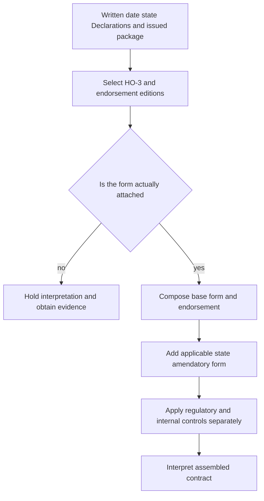

# Editions, Endorsements, and State Attachments

Policy assembly is a routing decision before it is a coverage interpretation. Treat the written date, governing HO-3 edition, Declarations, attached endorsements, and state amendatory form as separate inputs. The issued package—not a current repository file, a system label, or a memorandum—controls which contract wording is available for interpretation.

## Assembly control flow

*This flow separates date selection, attachment proof, contract composition, state amendments, and non-contractual controls.*

### 1. Select the governing editions

Use the policy’s written/effective date as the selection key, then verify issuance and attachment. **HO-3 2024-03 supersedes HO-3 2018-09** for its later effective interval; it does not erase the 2018-09 wording for policies written under that edition ([HO-3 2018-09](repo://forms/HO/MS/HO-3/2018-09.md#L1-L9), [HO-3 2024-03](repo://forms/HO/MS/HO-3/2024-03.md#L1-L7)).

For the water-backup endorsement, **HO 04 90 2026-01 supersedes HO 04 90 2010-10** for policies written on or after 2026-01-01. The 2010-10 edition remains live for earlier policies; supersession is prospective, not a backdated rewrite ([HO 04 90 2026-01](repo://forms/HO/MS/HO-04-90/2026-01.md#L1-L4), [HO 04 90 2010-10](repo://forms/HO/MS/HO-04-90/2010-10.md#L1-L9)). Do not infer that a later-dated file is attached merely because it is the newest file in the repository.

### 2. Prove the attachment and read the Declarations

An endorsement is contract authority only when it is part of the issued package. Confirm the named insured, policy term, location, insured property, completed schedule, edition, and attachment. The Declarations supply the applicable limits and any endorsement-specific higher limit; an index, quote, or blank schedule is evidence to reconcile, not substitute wording.

The 2026 endorsement attaches to HO-3 and modifies Section I—Exclusions A.3. It covers direct physical loss from sewer/drain backup or sump discharge, but its $10,000 amount is a sublimit unless a higher endorsement limit appears in the Declarations, and its separate deductible is $1,000 ([HO 04 90 2026-01](repo://forms/HO/MS/HO-04-90/2026-01.md#L1-L4), [HO 04 90 2026-01](repo://forms/HO/MS/HO-04-90/2026-01.md#L6-L23)).

### 3. Compose the contract in order

Read the selected HO-3, every attached endorsement, the Declarations, and the applicable state amendment together. The acting document must be named first when describing relationships:

- **HO 04 90 2026-01 modifies the applicable HO-3 exclusions** only within its stated water-backup and sump scope. It **preserves** the policy’s flood, surface-water, and below-surface-water exclusions, and all other policy provisions continue to apply ([HO 04 90 2026-01](repo://forms/HO/MS/HO-04-90/2026-01.md#L25-L56)).
- **HO 04 90 2026-01 modifies HO 04 90 2010-10’s edition-level terms** by replacing it for policies written from 2026-01-01, but it does not change a pre-2026 policy carrying the older endorsement. The older edition’s $5,000 limit and $500 deductible remain relevant to that older package ([HO 04 90 2010-10](repo://forms/HO/MS/HO-04-90/2010-10.md#L107-L113), [HO 04 90 2010-10](repo://forms/HO/MS/HO-04-90/2010-10.md#L157-L167)).
- A state amendatory form **modifies** the policy only within its stated scope and precedence terms. It is contract wording, unlike a regulator bulletin; compatible base and endorsement provisions remain applicable. Representative state forms include California HO 01 04, Colorado HO 01 05, Florida HO 01 09, Illinois HO 01 12, Louisiana HO 01 17, North Carolina HO 01 32, and New York HO 01 31 ([California form](repo://forms/HO/CA/HO-01-04/2021-06.md#L1-L15), [Colorado form](repo://forms/HO/CO/HO-01-05/2022-10.md#L1-L15), [Florida form](repo://forms/HO/FL/HO-01-09/2023-07.md#L1-L15)).

Where documents conflict, use operative precedence language, not titles or a preferred result. A state amendment can control a conflict in its addressed subject while preserving nonconflicting HO-3 and endorsement terms. A missing, duplicate, or irreconcilable attachment is a package failure: document the uncertainty and obtain the issued copy or escalate before deciding coverage.

## State attachments and non-contract layers

State forms implement state-specific contract requirements and may change exclusions, conditions, deductibles, or precedence within their scope. Select the edition applicable to the policy’s state and date; do not use a neighboring state’s form or assume the newest state file applies. Texas illustrates the boundary: **HO 01 45 2022-01 implements** the contractual Texas windstorm-and-hail deductible, while Bulletin B-2021-08 **constrains** disclosure and administration. The bulletin cannot create a deductible or coverage term absent from the attached policy form ([Texas form](repo://forms/HO/TX/HO-01-45/2022-01.md#L13-L23), [Texas deductible](repo://forms/HO/TX/HO-01-45/2022-01.md#L59-L91), [Bulletin](repo://bulletins/TX/b-2021-08-windstorm-deductibles.md#L19-L27)).

Memoranda and training explain an edition or review method; underwriting manuals and appetite guides constrain eligibility, authority, referral, and attachment operations. They do not supersede, write back, or enlarge the issued contract. Keep those controls separate from the assembled coverage conclusion.

## Worked routing example

For an HO-3 policy written on 2026-02-01, select HO-3 2024-03 if that is the governing base interval, select HO 04 90 2026-01 for the water-backup endorsement, and confirm that the endorsement is attached. Apply the applicable state amendatory form for the property’s state, then read the Declarations for any higher endorsement limit. The 2026 endorsement’s $1,000 deductible and $10,000 default sublimit apply only after attachment is established; its flood, surface-water, below-surface-water, maintenance, and backflow provisions remain part of the assembled terms ([HO 04 90 2026-01](repo://forms/HO/MS/HO-04-90/2026-01.md#L13-L56)).

For a pre-2026 policy, preserve HO 04 90 2010-10 instead. Do not backdate the 2026 replacement terms. If the policy date, Declarations, state form, or attachment record is unclear, stop at routing and escalate rather than selecting the wording that produces the preferred result.

## Failure checks

- **Wrong edition:** a later HO-3 or HO 04 90 file is used solely because it is current. Re-select by the policy date and preserve the older live edition.
- **Unattached write-back:** HO 04 90 coverage is applied from a schedule or system label without the issued form. Obtain the complete package.
- **State substitution:** a state amendment is omitted, or a form for another state is used. Match state, line, date, and property.
- **Authority inversion:** a bulletin, memorandum, training page, manual, or appetite guide is treated as contract wording. Return to the issued forms; use those materials only for their regulatory, explanatory, or operational purpose.

See [HO-3 forms](../coverage/forms/ho-3.md), [water backup](../coverage/perils/water-backup.md), [California state overlay](../state-overlays/california.md), [Florida state overlay](../state-overlays/florida.md), and [endorsements and deductibles](../underwriting/manual/endorsements-and-deductibles.md) for focused follow-up.
