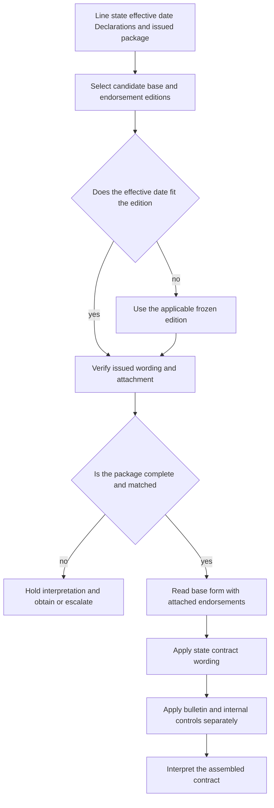

# Editions, Endorsements, and State Attachments

Policy assembly is a routing and evidence task before it is a coverage-interpretation task. Identify the **line, state, policy-effective date, Declarations, base form, complete issued package, schedules, referenced pages, and state amendatory form**. The effective date selects a candidate edition; the issued package determines whether an endorsement was actually made part of the policy. A title, system label, schedule entry, memorandum, training page, bulletin, or internal manual cannot supply coverage wording that the attached form does not state ([Choosing the Governing Edition](repo://training/choosing-the-governing-edition.md#L69-L79), [Attaching Endorsements Correctly](repo://training/attaching-endorsements.md#L65-L87)).

## Authority and relationship vocabulary

| Layer | What it does |
| --- | --- |
| Base policy form | Supplies the line’s grants, definitions, limits, exclusions, conditions, and settlement rules. |
| Attached endorsement | **Modifies** the base form only within its stated terms and only when actually attached; unmodified policy terms are preserved ([HO 04 90 2026-01](repo://forms/HO/MS/HO-04-90/2026-01.md#L1-L4), [HO 04 90 2010-10](repo://forms/HO/MS/HO-04-90/2010-10.md#L13-L33)). |
| State amendatory form | **Implements** state-specific contract wording and any stated precedence rule. It is not the bulletin that prompted or relates to it ([HO 01 45 2022-01](repo://forms/HO/TX/HO-01-45/2022-01.md#L13-L23), [B-2021-08](repo://bulletins/TX/b-2021-08-windstorm-deductibles.md#L13-L27)). |
| Regulator bulletin | **Constrains** issuance, disclosure, filing, rating, underwriting, or administration. It does not create a deductible or coverage term absent from the policy ([B-2021-08](repo://bulletins/TX/b-2021-08-windstorm-deductibles.md#L19-L27), [B-2021-08](repo://bulletins/TX/b-2021-08-windstorm-deductibles.md#L63-L89)). |
| Memorandum and training | Explain or teach. They do not replace the filed or issued form ([HO 04 90 memorandum](repo://memoranda/HO-04-90-2027-01.md#L13-L31), [Choosing the Governing Edition](repo://training/choosing-the-governing-edition.md#L101-L107)). |
| Internal manual and appetite guide | **Constrain** eligibility, authority, referral, documentation, and attachment operations; they do not modify contract coverage ([manual](repo://manuals/underwriting/manual.md#L21-L43), [Texas appetite guide](repo://guidelines/appetite/tx-homeowners.md#L13-L35)). |

When a proposition connects two documents, name the acting document and use only the directional relationship that the documents support: **supersedes, writes back, preserves, modifies, implements, or constrains**. Do not infer a broader relationship from a title or memorandum.

## Entry gate: route before interpreting

1. Record the line and state, policy-effective date, named insured, locations, Declarations, base-form label, endorsement labels, schedules, and all referenced pages.
2. Retrieve the complete issued package. A listed-but-missing endorsement needs the actual issued wording or correction; an attached-but-unlisted form must be reconciled to the policy record ([Attaching Endorsements Correctly](repo://training/attaching-endorsements.md#L65-L107), [Attaching Endorsements Correctly](repo://training/attaching-endorsements.md#L193-L227)).
3. Match each attachment to the insured, policy term, location, and property. If labels conflict, a schedule is incomplete, or the wording cannot be tied to the policy, record the uncertainty and escalate rather than choosing the result that appears preferable ([Choosing the Governing Edition](repo://training/choosing-the-governing-edition.md#L109-L119), [Attaching Endorsements Correctly](repo://training/attaching-endorsements.md#L193-L215)).
4. Read the selected base form, attached endorsements, Declarations, and applicable state form together. Only then interpret the loss.

*This flow shows date selection, attachment verification, package failure handling, contract composition, and the separate regulatory and internal-control layers.*

## Selecting HO 04 90

The policy-effective date selects the candidate endorsement interval; it does not prove attachment. HO 04 90 **2026-01 replaces** edition 2010-10 for policies written on or after 2026-01-01 ([HO 04 90 2026-01](repo://forms/HO/MS/HO-04-90/2026-01.md#L1-L4), [HO 04 90 2010-10](repo://forms/HO/MS/HO-04-90/2010-10.md#L1-L9)). HO 04 90 **2027-01 supersedes** 2010-10 for policies effective on or after 2027-01-01, so 2027-01 is not a reason to backdate either its wording or its amounts to an earlier policy ([HO 04 90 2027-01](repo://forms/HO/MS/HO-04-90/2027-01.md#L1-L7), [HO 04 90 2010-10](repo://forms/HO/MS/HO-04-90/2010-10.md#L1-L9)). Where the repository contains both 2026-01 and 2027-01, use the policy’s effective interval and issued form label; do not select 2027-01 merely because it is the newest file ([HO 04 90 2026-01](repo://forms/HO/MS/HO-04-90/2026-01.md#L1-L4), [HO 04 90 2027-01](repo://forms/HO/MS/HO-04-90/2027-01.md#L1-L7)).

### Contract effect by edition

- **2010-10:** The endorsement forms part of the policy, changes policy provisions only as expressly stated, and preserves other exclusions. It provides a $5,000 water-backup limit and a $500 deductible ([HO 04 90 2010-10](repo://forms/HO/MS/HO-04-90/2010-10.md#L13-L33), [HO 04 90 2010-10](repo://forms/HO/MS/HO-04-90/2010-10.md#L107-L113), [HO 04 90 2010-10](repo://forms/HO/MS/HO-04-90/2010-10.md#L157-L167)).
- **2026-01:** The endorsement covers direct physical loss to property described in Coverages A, B, and C from sewer or drain backup or sump discharge or overflow, with a $10,000 limit unless a higher Declarations limit applies. It imposes a separate $1,000 deductible and retains the policy’s Section I deductible distinction ([HO 04 90 2026-01](repo://forms/HO/MS/HO-04-90/2026-01.md#L6-L23)). It preserves flood, surface-water, and subsurface-water exclusions and adds a maintenance condition plus a backflow-prevention requirement for finished below-grade areas ([HO 04 90 2026-01](repo://forms/HO/MS/HO-04-90/2026-01.md#L25-L47)).
- **2027-01:** The endorsement applies only when attached, controls a conflicting policy provision, preserves unmodified policy terms, and does not create a separate contract. It provides a $10,000 limit and $1,000 deductible under its stated provisions ([HO 04 90 2027-01](repo://forms/HO/MS/HO-04-90/2027-01.md#L14-L36), [HO 04 90 2027-01](repo://forms/HO/MS/HO-04-90/2027-01.md#L254-L282), [HO 04 90 2027-01](repo://forms/HO/MS/HO-04-90/2027-01.md#L391-L407)).

The 2026 and 2027 editions therefore share the headline $10,000 limit and $1,000 deductible, but they are not interchangeable. The 2026 form expressly makes the backflow-prevention requirement new relative to 2010-10, while the 2027 form uses different operative wording and additional conditions. Compare the actual edition attached to the policy rather than carrying a later interpretation backward ([HO 04 90 2026-01](repo://forms/HO/MS/HO-04-90/2026-01.md#L35-L47), [HO 04 90 2010-10](repo://forms/HO/MS/HO-04-90/2010-10.md#L211-L239), [HO 04 90 2027-01](repo://forms/HO/MS/HO-04-90/2027-01.md#L140-L187)).

## Composing with the base and state form

An attached endorsement **modifies** the base policy only within its stated scope and **preserves** provisions it does not change. The 2026 form’s “all other provisions” clause and its express retained exclusions must be read with the applicable HO-3 wording; the endorsement is not a free-standing coverage grant ([HO 04 90 2026-01](repo://forms/HO/MS/HO-04-90/2026-01.md#L25-L56), [HO-3 2024-03](repo://forms/HO/MS/HO-3/2024-03.md#L593-L597)). For a policy using HO-3 2024-03, do not treat HO 04 90 2026-01 or 2027-01 as eliminating flood or surface-water exclusions merely because both address water backup ([HO 04 90 2026-01](repo://forms/HO/MS/HO-04-90/2026-01.md#L25-L33), [HO 04 90 2027-01](repo://forms/HO/MS/HO-04-90/2027-01.md#L119-L138)).

A state amendatory form **implements** state contract wording, while a bulletin **constrains** administration. In Texas, HO 01 45 gives its conflicting terms precedence, preserves compatible terms, and does not provide coverage unless expressly stated; its windstorm-and-hail deductible is a contractual term shown through the policy and Declarations ([HO 01 45](repo://forms/HO/TX/HO-01-45/2022-01.md#L13-L23), [HO 01 45](repo://forms/HO/TX/HO-01-45/2022-01.md#L59-L91)). B-2021-08 constrains disclosure, records, policy-consistent application, and notice before an increase; it does not replace the attached form’s contractual deductible wording ([B-2021-08](repo://bulletins/TX/b-2021-08-windstorm-deductibles.md#L19-L27), [B-2021-08](repo://bulletins/TX/b-2021-08-windstorm-deductibles.md#L153-L171)).

## Memoranda and guidance are not authority for coverage

The HO 04 90 2027-01 memorandum describes revision rationale such as organization, terminology, conditions, and claim-handling clarity. It does not replace the endorsement’s coverage, limit, deductible, exclusions, or conditions ([HO 04 90 memorandum](repo://memoranda/HO-04-90-2027-01.md#L13-L31), [HO 04 90 2027-01](repo://forms/HO/MS/HO-04-90/2027-01.md#L1-L4)). Training **constrains** the review method—check the insured, location, term, schedules, completed details, and complete package—but it does not create a live policy term ([Attaching Endorsements Correctly](repo://training/attaching-endorsements.md#L65-L107), [Choosing the Governing Edition](repo://training/choosing-the-governing-edition.md#L101-L119)). Internal underwriting rules likewise constrain whether a requested endorsement may be issued or requires referral; they do not modify the attached form ([manual](repo://manuals/underwriting/manual.md#L5089-L5129), [HO 04 90 2026-01](repo://forms/HO/MS/HO-04-90/2026-01.md#L1-L4)).

## Worked selection examples

**Policy effective 2025-06-01.** Select HO 04 90 2010-10 if that is the issued endorsement; do not import the 2026 $10,000 limit, $1,000 deductible, or new maintenance and backflow wording. The 2010-10 terms remain the applicable contract for that earlier interval ([HO 04 90 2010-10](repo://forms/HO/MS/HO-04-90/2010-10.md#L1-L9), [HO 04 90 2026-01](repo://forms/HO/MS/HO-04-90/2026-01.md#L1-L4)).

**Policy effective 2026-06-01.** Select HO 04 90 2026-01 as the candidate edition, then confirm that the complete issued package actually attaches it. If attached, apply its $10,000-or-Declarations limit, $1,000 deductible, retained exclusions, maintenance condition, and below-grade backflow-prevention requirement; if it is only listed or requested, hold the coverage conclusion ([HO 04 90 2026-01](repo://forms/HO/MS/HO-04-90/2026-01.md#L6-L47), [Attaching Endorsements Correctly](repo://training/attaching-endorsements.md#L81-L87)).

**Policy effective 2027-02-01.** Select HO 04 90 2027-01 only when that edition is the issued and attached form. Do not substitute 2026-01 because its headline limit and deductible match, and do not use a memorandum to fill wording differences ([HO 04 90 2027-01](repo://forms/HO/MS/HO-04-90/2027-01.md#L1-L7), [HO 04 90 2026-01](repo://forms/HO/MS/HO-04-90/2026-01.md#L13-L47), [HO 04 90 memorandum](repo://memoranda/HO-04-90-2027-01.md#L13-L31)).

## Failure checks

- **Wrong edition:** reselect by policy-effective date and issued form label; never use the newest repository file as a backdated replacement ([HO 04 90 2026-01](repo://forms/HO/MS/HO-04-90/2026-01.md#L1-L4), [HO 04 90 2027-01](repo://forms/HO/MS/HO-04-90/2027-01.md#L1-L7)).
- **Unattached endorsement:** obtain the complete package or reliable issued copy; a schedule or system label is not the operative wording ([Attaching Endorsements Correctly](repo://training/attaching-endorsements.md#L81-L87), [HO 04 90 2027-01](repo://forms/HO/MS/HO-04-90/2027-01.md#L14-L20)).
- **Authority inversion:** return from a bulletin, memorandum, training page, or manual to the applicable attached form for the contract conclusion ([HO 04 90 memorandum](repo://memoranda/HO-04-90-2027-01.md#L13-L31), [HO 04 90 2026-01](repo://forms/HO/MS/HO-04-90/2026-01.md#L6-L47)).
- **Unreconciled package:** compare all operative grants, exclusions, limits, deductibles, schedules, and effective dates, then escalate a conflict instead of selecting the broader wording ([Attaching Endorsements Correctly](repo://training/attaching-endorsements.md#L173-L215), [manual Rule 400](repo://manuals/underwriting/manual.md#L5241-L5257)).
