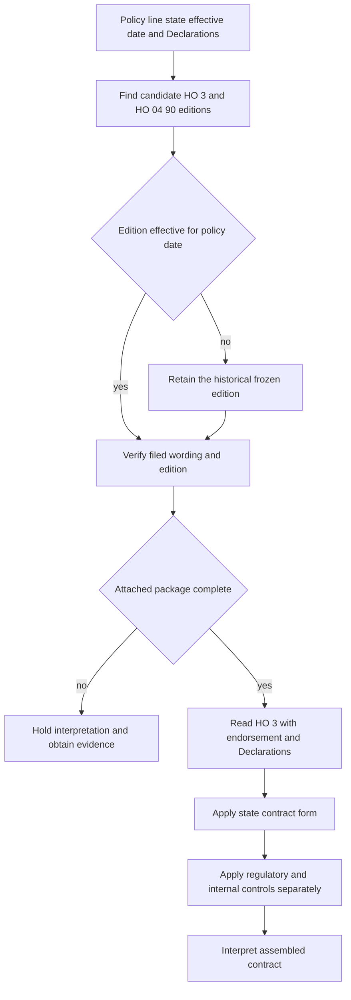

# Policy Editions and State Attachments

Policy assembly answers two different questions: **which wording governs**, and **which documents were actually issued**. Select the HO-3 base form and HO 04 90 edition by the policy effective date, then confirm the endorsement, completed Declarations, and any state amendatory form are in the issued package. A form label or system schedule is an index, not proof that the endorsement attached.

## Authority and document order

The issued policy package is contract authority: the applicable HO-3, Declarations, attached endorsements, and applicable state amendatory form. The endorsement **modifies** the base policy only within its stated terms; unchanged policy terms remain applicable. A state amendatory form **modifies** the policy only on matters it addresses and normally preserves compatible terms. Regulatory bulletins **constrain** issuance, disclosure, and administration; they do not create a coverage grant. Manuals, appetite rules, memoranda, and training **constrain** internal action or explain wording, but do not alter contract coverage.

Always identify the acting document first and use a directional relationship: `supersedes`, `modifies`, `writes back`, `preserves`, `implements`, or `constrains`. Cite both provisions when describing an interaction. This prevents an Illinois disclosure rule or underwriting referral from being mistaken for the water-backup grant.

## Edition selection by effective date

The repository records HO 04 90 2010-10 as effective 2010-10-01 and superseded for policies effective on or after 2027-01-01. HO 04 90 2026-01 says it replaces 2010-10 for policies written on or after 2026-01-01. HO 04 90 2027-01 is effective 2027-01-01. These statements create an important overlap in the source set: **do not infer a 2027 transition rule from the 2010-10 supersession banner alone**. For a policy effective in 2026, use the 2026-01 edition when it was the filed and issued edition; for a policy effective on or after 2027-01-01, verify whether 2027-01 governs. Preserve the older edition for policies written under it rather than rewriting historical policies.

The effective date selects a candidate; it does not establish attachment. For each transaction, record:

1. line and state;
2. policy effective date and term;
3. HO-3 edition;
4. HO 04 90 edition and completed Declarations limit;
5. all schedules, referenced pages, and state forms; and
6. the complete issued package tied to the insured, location, and property.

If the package is incomplete, labels conflict, or a schedule is blank, hold the coverage conclusion and obtain the issued copy or escalate. Do not choose the edition or interpretation that produces the preferred result.

*This flow shows date routing, historical preservation, attachment verification, contract composition, and the separation of state and internal controls.*

## How HO 04 90 composes with HO-3

<!-- openwiki: broken internal link [../../forms/HO/MS/HO-3/2024-03.md#L593-L601] heading anchor "L593-L601" does not exist in "../../forms/HO/MS/HO-3/2024-03.md". Fix the href or restore the target, then delete this comment. -->
HO-3 2024-03 excludes water damage from flood and surface water in X.7 and excludes sewer, drain, and sump backup in X.8-X.9. Its X.8 cross-reference recognizes an attached water-backup endorsement; the exclusion is not itself a grant ([HO-3 2024-03](../../forms/HO/MS/HO-3/2024-03.md#L593-L601)).

<!-- openwiki: broken internal link [../../forms/HO/MS/HO-04-90/2026-01.md#L1-L23] heading anchor "L1-L23" does not exist in "../../forms/HO/MS/HO-04-90/2026-01.md". Fix the href or restore the target, then delete this comment. -->
**HO 04 90 2026-01 modifies HO-3 Section I Exclusions A.3** and covers direct physical loss to Coverage A, B, and C property caused by sewer or drain backup or sump, sump-pump, or related-equipment overflow or discharge, including mechanical breakdown. Its $10,000 limit is per policy period, is part of—not additional to—the Coverage A, B, and C limits, and may be higher only when the Declarations show a higher limit. A separate $1,000 deductible applies to each loss; the Section I deductible does not apply ([HO 04 90 2026-01](../../forms/HO/MS/HO-04-90/2026-01.md#L1-L23)).

<!-- openwiki: broken internal link [../../forms/HO/MS/HO-04-90/2026-01.md#L25-L47] heading anchor "L25-L47" does not exist in "../../forms/HO/MS/HO-04-90/2026-01.md". Fix the href or restore the target, then delete this comment. -->
<!-- openwiki: broken internal link [../../forms/HO/MS/HO-04-90/2026-01.md#L49-L56] heading anchor "L49-L56" does not exist in "../../forms/HO/MS/HO-04-90/2026-01.md". Fix the href or restore the target, then delete this comment. -->
The 2026 endorsement **preserves** its exclusions for flood, surface water, waves, tidal water, storm surge, body-of-water overflow, and below-surface water; HO-3 A.1 and A.2 continue in full. It adds a known-and-unremedied maintenance condition and, for a finished below-grade area, requires an installed and operable backwater valve or equivalent device at the time of loss. The latter requirement is new in 2026 and did not appear in 2010-10 ([HO 04 90 2026-01](../../forms/HO/MS/HO-04-90/2026-01.md#L25-L47)). Coverage A and B loss follows the attached policy’s settlement basis; Coverage C is actual cash value unless the endorsement Declarations say otherwise ([HO 04 90 2026-01](../../forms/HO/MS/HO-04-90/2026-01.md#L49-L56)).

<!-- openwiki: broken internal link [../../forms/HO/MS/HO-04-90/2010-10.md#L13-L33] heading anchor "L13-L33" does not exist in "../../forms/HO/MS/HO-04-90/2010-10.md". Fix the href or restore the target, then delete this comment. -->
<!-- openwiki: broken internal link [../../forms/HO/MS/HO-04-90/2010-10.md#L107-L113] heading anchor "L107-L113" does not exist in "../../forms/HO/MS/HO-04-90/2010-10.md". Fix the href or restore the target, then delete this comment. -->
<!-- openwiki: broken internal link [../../forms/HO/MS/HO-04-90/2010-10.md#L157-L167] heading anchor "L157-L167" does not exist in "../../forms/HO/MS/HO-04-90/2010-10.md". Fix the href or restore the target, then delete this comment. -->
For comparison, HO 04 90 2010-10 provides a $5,000 water-backup limit and $500 deductible and states that attachment forms part of the policy while preserving unmodified exclusions ([HO 04 90 2010-10](../../forms/HO/MS/HO-04-90/2010-10.md#L13-L33), [HO 04 90 2010-10](../../forms/HO/MS/HO-04-90/2010-10.md#L107-L113), [HO 04 90 2010-10](../../forms/HO/MS/HO-04-90/2010-10.md#L157-L167)). Do not carry the 2026 amounts, below-grade device condition, or Coverage C settlement rule backward into a 2010-10 policy. Likewise, do not carry 2027-01 wording into a 2026 policy merely because 2027 is the repository’s later edition.

<!-- openwiki: broken internal link [../../forms/HO/MS/HO-04-90/2027-01.md#L14-L36] heading anchor "L14-L36" does not exist in "../../forms/HO/MS/HO-04-90/2027-01.md". Fix the href or restore the target, then delete this comment. -->
<!-- openwiki: broken internal link [../../forms/HO/MS/HO-3/2024-03.md#L593-L601] heading anchor "L593-L601" does not exist in "../../forms/HO/MS/HO-3/2024-03.md". Fix the href or restore the target, then delete this comment. -->
HO 04 90 2027-01 **modifies** the applicable HO-3 when attached and controls conflicts while leaving unmodified policy provisions unchanged. It supplies its own water-backup scope, limit, deductible, and exclusions; therefore it must be read with the HO-3 exclusion it writes back, not substituted for the base policy ([HO 04 90 2027-01](../../forms/HO/MS/HO-04-90/2027-01.md#L14-L36), [HO-3 2024-03](../../forms/HO/MS/HO-3/2024-03.md#L593-L601)).

## State attachments and Illinois water-backup disclosures

<!-- openwiki: broken internal link [../state-overlays/illinois.md#L37-L41] heading anchor "L37-L41" does not exist in "../state-overlays/illinois.md". Fix the href or restore the target, then delete this comment. -->
For Illinois, the HO 01 12 amendatory endorsement is contract wording when attached. It controls an expressly changed provision and preserves an unaddressed provision; it does not provide coverage beyond an express grant or remove an exclusion without saying so ([Illinois overlay](../state-overlays/illinois.md#L37-L41)). Assemble HO-3, HO 04 90, HO 01 12, and the Declarations together. Do not treat the Illinois form’s water-backup disclosure language as a substitute for the attached HO 04 90 grant.

<!-- openwiki: broken internal link [../state-overlays/illinois.md#L67-L81] heading anchor "L67-L81" does not exist in "../state-overlays/illinois.md". Fix the href or restore the target, then delete this comment. -->
<!-- openwiki: broken internal link [../state-overlays/illinois.md#L111-L115] heading anchor "L111-L115" does not exist in "../state-overlays/illinois.md". Fix the href or restore the target, then delete this comment. -->
IDOI-2017-10 **constrains** Illinois disclosure and claims administration for applicable policies issued or renewed on or after 2017-10-02 and transactions that change water-backup treatment. The disclosure must accurately state whether coverage is included, limited, excluded, or available by endorsement, including material exclusions, conditions, limit, and separate deductible. Its $5,000 figure is a disclosure requirement in that bulletin, not a universal replacement for the limit in the attached contract ([Illinois overlay](../state-overlays/illinois.md#L67-L81)). On a claim, the bulletin requires policy-specific investigation and a written explanation of any denial, limitation, exclusion, condition, deductible, or reduction; those duties do not expand coverage ([Illinois overlay](../state-overlays/illinois.md#L111-L115)).

## Contract versus internal controls

<!-- openwiki: broken internal link [../state-overlays/illinois.md#L117-L121] heading anchor "L117-L121" does not exist in "../state-overlays/illinois.md". Fix the href or restore the target, then delete this comment. -->
The underwriting manual **constrains** eligibility, referral, authority, documentation, and attachment before binding. Illinois Rule 570 requires referral when the requested water-backup limit exceeds $15,000 and flags recurring intrusion, defective plumbing, unreliable sump systems, and related risks. These are acceptance controls, not hidden policy limits ([Illinois overlay](../state-overlays/illinois.md#L117-L121)). Similarly, a memorandum may explain why an edition changed, but the filed endorsement supplies the operative limit, deductible, conditions, and exclusions.

## Failure checks

- **Wrong edition:** reselect by policy effective date and preserve the historical form.
- **Assumed attachment:** obtain the complete issued package; a schedule or system label alone is insufficient.
- **Backdated 2026 terms:** do not apply the $10,000 limit, $1,000 deductible, backwater-valve condition, or Coverage C actual-cash-value rule to 2010-10 unless the issued policy actually contains the applicable edition.
- **Disclosure as coverage:** use the filed endorsement and Declarations to determine coverage; use IDOI-2017-10 for disclosure and claims duties.
- **State or manual overreach:** apply HO 01 12 only within its contract wording and keep Rule 570 and other internal guidance separate from the coverage conclusion.

For the base form, see [HO-3 forms](../coverage/forms/ho-3.md). For the Illinois contract and regulatory overlay, see [Illinois State Overlay](../state-overlays/illinois.md). For internal attachment and deductible controls, see [Endorsements and Deductibles](../underwriting/manual/endorsements-and-deductibles.md).
