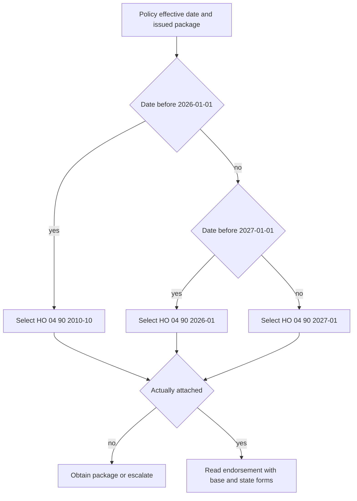

# Policy Editions and State Attachments

A coverage conclusion starts with the issued policy package, not the newest repository file. Identify the line, state, policy-effective date, Declarations, base form, complete endorsement package, schedules, and applicable state amendatory form. Contract authority comes from the issued base form, attached endorsements, Declarations, and state forms. Bulletins constrain carrier operations; memoranda and training explain; underwriting guidance controls eligibility and attachment. None of those latter documents changes the contract ([README authority model](repo://README.md#L13-L41), [Guidance Versus Contract](repo://training/guidance-versus-contract.md#L15-L23)).

## Governing HO 04 90 edition

Use the policy-effective date as the edition boundary, then independently confirm issuance and attachment:

| Policy-effective date | HO 04 90 edition | What it means |
| --- | --- | --- |
| Before 2026-01-01 | 2010-10 | The 2010-10 wording remains live for policies written under it. It provides a $5,000 limit and $500 deductible ([2010-10 metadata and attachment](repo://forms/HO/MS/HO-04-90/2010-10.md#L1-L33), [2010-10 limit](repo://forms/HO/MS/HO-04-90/2010-10.md#L107-L113), [2010-10 deductible](repo://forms/HO/MS/HO-04-90/2010-10.md#L157-L167)). |
| 2026-01-01 through 2026-12-31 | 2026-01 | The 2026-01 form replaces 2010-10 for policies written on or after 2026-01-01. It provides a $10,000 default sublimit, a $1,000 separate deductible, and a new backflow-prevention requirement for finished below-grade areas ([2026-01](repo://forms/HO/MS/HO-04-90/2026-01.md#L1-L4), [2026-01 limit and deductible](repo://forms/HO/MS/HO-04-90/2026-01.md#L13-L23), [2026-01 condition](repo://forms/HO/MS/HO-04-90/2026-01.md#L35-L47)). |
| 2027-01-01 and later | 2027-01 | The 2027-01 edition is effective 2027-01-01 and has a $10,000 limit and $1,000 deductible, subject to its own detailed terms ([2027-01 metadata](repo://forms/HO/MS/HO-04-90/2027-01.md#L1-L7), [2027-01 limit](repo://forms/HO/MS/HO-04-90/2027-01.md#L254-L282), [2027-01 deductible](repo://forms/HO/MS/HO-04-90/2027-01.md#L391-L412)). |

The 2026-01 boundary is substantive, not merely a label change. Compared with 2010-10, it changes the default limit and deductible and adds the backflow-prevention condition. The 2027-01 wording also reorganizes and expands the endorsement, but its $10,000 limit and $1,000 deductible must not be backdated to a 2010-10 or 2026-01 policy. Supersession selects the later interval; it does not rewrite an earlier policy. Read the edition effective for the transaction ([2010-10](repo://forms/HO/MS/HO-04-90/2010-10.md#L1-L9), [2026-01](repo://forms/HO/MS/HO-04-90/2026-01.md#L1-L4), [2027-01](repo://forms/HO/MS/HO-04-90/2027-01.md#L1-L7)).

*This flow shows date selection followed by the separate attachment gate.*

## Attachment is separate from coverage meaning

An endorsement has no operative contract role merely because a system label, quote, or schedule names it. Match the form to the named insured, term, location, and property; confirm the complete issued copy, completed schedule, and referenced pages. If an attachment is listed but missing, obtain the issued copy or escalate. If it is attached but unlisted, reconcile it to the policy record ([Attaching Endorsements Correctly](repo://training/attaching-endorsements.md#L65-L107), [attachment evidence](repo://training/attaching-endorsements.md#L193-L227)).

The attachment rule and the coverage rule are distinct. **HO 04 90 2027-01 modifies the policy** only when attached, and its conflict provision controls only within its stated scope; unchanged policy terms remain applicable and the endorsement does not create a separate contract ([2027-01 attachment and composition](repo://forms/HO/MS/HO-04-90/2027-01.md#L14-L60)). Once attachment is established, interpret that edition’s grants, limits, exclusions, conditions, valuation, and deductible with the applicable HO-3. Do not use an unattached endorsement’s favorable terms merely because they describe the loss.

## Composition with the base form

The HO-3 supplies the baseline exclusions and policy machinery. For HO-3 2024-03, X.7-X.9 exclude specified water losses while recognizing an attached water-backup endorsement as an exception ([HO-3 2024-03](repo://forms/HO/MS/HO-3/2024-03.md#L591-L601)). **HO 04 90 2027-01 writes back HO-3 2024-03 X.8-X.9** only for its covered water-backup and sump-discharge events, subject to its $10,000 limit, $1,000 deductible, exclusions, and conditions; it **preserves HO-3 2024-03 terms** outside that modification ([2027-01 coverage](repo://forms/HO/MS/HO-04-90/2027-01.md#L254-L282), [2027-01 deductible](repo://forms/HO/MS/HO-04-90/2027-01.md#L391-L412)). The same assembly discipline applies to 2010-10 and 2026-01: select the date-correct endorsement and apply only the wording that edition actually contains.

Do not treat equal dollar amounts as identical coverage. The 2026-01 form expressly makes the sublimit part of, rather than additional to, Coverage A, B, and C limits and requires a backwater valve or equivalent device for finished below-grade areas ([2026-01 limit](repo://forms/HO/MS/HO-04-90/2026-01.md#L13-L18), [2026-01 condition](repo://forms/HO/MS/HO-04-90/2026-01.md#L35-L47)). The 2027-01 form instead states its limit and deductible through its detailed provisions and retains policy conditions unless modified ([2027-01 composition](repo://forms/HO/MS/HO-04-90/2027-01.md#L251-L282), [2027-01 deductible](repo://forms/HO/MS/HO-04-90/2027-01.md#L391-L412)).

## State forms and regulatory overlays

A state amendatory form is contract wording; a regulator bulletin is an operational constraint. **HO 01 45 2022-01 modifies the applicable HO-3 contract** only within the matters it addresses: conflicting terms in its section control, compatible terms remain applicable, and it does not provide coverage unless expressly stated ([HO 01 45](repo://forms/HO/TX/HO-01-45/2022-01.md#L13-L23)). **HO 01 45 2022-01 implements Texas Bulletin B-2021-08** through its contractual windstorm-and-hail deductible, while **B-2021-08 constrains HO 01 45 and policy administration** through disclosure, records, claim application, and notice requirements ([HO 01 45 deductible](repo://forms/HO/TX/HO-01-45/2022-01.md#L59-L91), [B-2021-08](repo://bulletins/TX/b-2021-08-windstorm-deductibles.md#L19-L27), [B-2021-08 administration](repo://bulletins/TX/b-2021-08-windstorm-deductibles.md#L153-L171)). The bulletin cannot supply a deductible or coverage term absent from the issued contract.

Internal manuals and appetite guides constrain whether an endorsement may be bound or attached; they do not alter the selected edition’s coverage. Rule 400 requires supported, eligible, correctly matched, complete requests and referral for conflicts ([manual Rule 400](repo://manuals/underwriting/manual.md#L5089-L5129)). Training and filing memoranda are review aids, not contract authority ([Choosing the Governing Edition](repo://training/choosing-the-governing-edition.md#L101-L119), [HO 04 90 memorandum](repo://memoranda/HO-04-90-2027-01.md#L13-L31)).

## Review checklist and failure modes

1. Record line, state, policy-effective date, Declarations, base edition, and every issued attachment.
2. Select 2010-10, 2026-01, or 2027-01 by the boundaries above; never substitute the current file for an older frozen policy.
3. Verify the endorsement is actually attached and its schedule and pages are complete.
4. Read the attached edition with the base form and applicable state form; separately identify limit, deductible, exclusions, and conditions.
5. Apply bulletins and internal rules to administration, disclosure, eligibility, and referral—not to invent contract coverage.

Escalate an incomplete package, conflicting labels, missing schedule, unsupported attachment, or irreconcilable provisions. The principal failures are using 2027 terms on a pre-2027 policy, treating 2026 as identical to 2010-10, applying a listed-but-unattached write-back, or using a bulletin or manual as though it were policy language ([Choosing the Governing Edition](repo://training/choosing-the-governing-edition.md#L109-L119), [Attaching Endorsements Correctly](repo://training/attaching-endorsements.md#L193-L215)).

See [HO-3 forms](../coverage/forms/ho-3.md) for base-form editions and [water backup](../coverage/perils/water-backup.md) for the peril-specific assembly.
