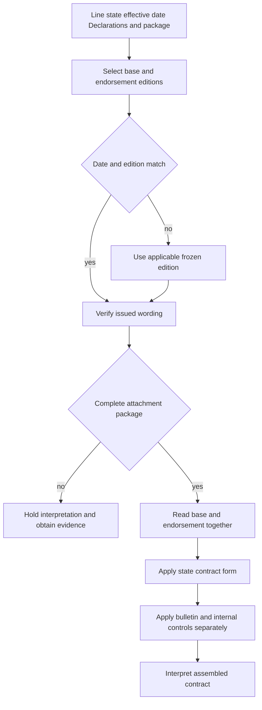

# Editions, Endorsements, and State Attachments

<!-- openwiki: broken internal link [../README.md#L15-L21] file "../README.md" does not exist. Fix the href or restore the target, then delete this comment. -->
<!-- openwiki: broken internal link [../../training/guidance-versus-contract.md#L15-L23] heading anchor "L15-L23" does not exist in "../../training/guidance-versus-contract.md". Fix the href or restore the target, then delete this comment. -->
Policy analysis begins with assembly, not interpretation. Identify the line, state, policy-effective date, Declarations, base form, complete issued package, attached endorsements, schedules, referenced pages, and applicable state form. The issued contract documents supply coverage authority; bulletins constrain carrier operations; memoranda and training explain; underwriting manuals and appetite guides constrain internal action without changing coverage ([README](../README.md#L15-L21), [Guidance Versus Contract](../../training/guidance-versus-contract.md#L15-L23)).

## Governing layers

| Layer | Function | Boundary |
| --- | --- | --- |
| Base form | Grants, definitions, exclusions, conditions, limits, and settlement rules. | Use the edition applicable to the policy-effective date. |
| Attached endorsement | Changes the base policy only within its stated terms. | It must be attached and remains subject to unmodified policy terms. |
| State amendatory form | Adds jurisdiction-specific contract wording and precedence. | It is contract language, not the bulletin that prompted it. |
| Regulator bulletin | Controls disclosure, filing, rating, underwriting, or administration. | It does not create a policy term absent from the issued contract. |
| Manual, appetite guide, training, memorandum | Controls internal action or explains wording. | None replaces the issued policy or changes its coverage conclusion. |

<!-- openwiki: broken internal link [../../training/attaching-endorsements.md#L65-L87] heading anchor "L65-L87" does not exist in "../../training/attaching-endorsements.md". Fix the href or restore the target, then delete this comment. -->
<!-- openwiki: broken internal link [../../training/choosing-the-governing-edition.md#L109-L119] heading anchor "L109-L119" does not exist in "../../training/choosing-the-governing-edition.md". Fix the href or restore the target, then delete this comment. -->
A schedule or system label is an index, not the endorsement language. If a listed form is missing, obtain the complete package or reliable issued copy; if an attached form is unlisted, reconcile it to the policy record ([Attaching Endorsements](../../training/attaching-endorsements.md#L65-L87)). Do not interpret coverage while the package, labels, or attachment identity remains materially uncertain ([Choosing the Governing Edition](../../training/choosing-the-governing-edition.md#L109-L119)).

## Date selection and attachment gate

Select the base and endorsement editions using the policy-effective date, then verify that the wording was actually issued. A later edition does not rewrite an earlier policy.

- HO-3 2018-09 applies before the 2024-03 boundary; HO-3 2024-03 supersedes it for policies effective on or after 2024-03-01 ([HO-3 2018-09](repo://forms/HO/MS/HO-3/2018-09.md#L1-L9), [HO-3 2024-03](repo://forms/HO/MS/HO-3/2024-03.md#L1-L7)).
<!-- openwiki: broken internal link [../../training/choosing-the-governing-edition.md#L251-L265] heading anchor "L251-L265" does not exist in "../../training/choosing-the-governing-edition.md". Fix the href or restore the target, then delete this comment. -->
- **HO 04 90 2026-01 replaces and supersedes HO 04 90 2010-10 for policies written on or after 2026-01-01.** Do not use HO 04 90 2027-01 as the governing edition for a 2026-01 policy; 2027-01 is a later edition and cannot be backdated ([HO 04 90 2026-01](repo://forms/HO/MS/HO-04-90/2026-01.md#L1-L4), [HO 04 90 2010-10](repo://forms/HO/MS/HO-04-90/2010-10.md#L8-L10), [Choosing the Governing Edition](../../training/choosing-the-governing-edition.md#L251-L265)).

<!-- openwiki: broken internal link [../../training/attaching-endorsements.md#L173-L215] heading anchor "L173-L215" does not exist in "../../training/attaching-endorsements.md". Fix the href or restore the target, then delete this comment. -->
The date rule does not establish attachment. An endorsement must be part of the complete issued package before its contract language can be applied. Confirm the named insured, term, location, schedule, and declarations entry; otherwise document uncertainty and escalate ([Attaching Endorsements](../../training/attaching-endorsements.md#L173-L215)).

*This flow shows date selection, package verification, contract composition, and the separation of regulatory and internal controls from coverage interpretation.*

## HO 04 90 2026-01 with an HO-3 base

The base form supplies the exclusion being modified. HO-3 2024-03 excludes sewer, drain, and sump water in Section I—Exclusions X.8-X.9 and identifies an attached water-backup endorsement as the exception ([HO-3 2024-03](repo://forms/HO/MS/HO-3/2024-03.md#L591-L597)). **HO 04 90 2026-01 writes back that base exclusion only for its stated water-backup and sump discharge or overflow coverage**, subject to the endorsement’s terms. It provides direct physical loss coverage for property under Coverages A, B, and C ([HO 04 90 2026-01](repo://forms/HO/MS/HO-04-90/2026-01.md#L6-L11)).

The 2026 endorsement supplies a $10,000 maximum for one policy period unless a higher Declarations limit applies, and the sublimit is part of—not in addition to—the Coverage A, B, and C limits. It also supplies a separate $1,000 deductible instead of the Section I deductible ([HO 04 90 2026-01](repo://forms/HO/MS/HO-04-90/2026-01.md#L13-L23)). Those terms must be read with the base form: the endorsement **preserves HO-3 terms it does not change**, including the base exclusions it expressly leaves in force.

The 2026 edition adds two material conditions: no coverage where a known, unreasonable failure to maintain the relevant system caused the loss, and—where the residence has finished below-grade area—coverage only if an operable backwater valve or equivalent device was installed at loss ([HO 04 90 2026-01](repo://forms/HO/MS/HO-04-90/2026-01.md#L25-L47)). It also preserves the base policy’s settlement rules for A and B while setting actual-cash-value settlement for C unless the endorsement Declarations say otherwise ([HO 04 90 2026-01](repo://forms/HO/MS/HO-04-90/2026-01.md#L49-L56)).

Comparison with 2010-10 must not be treated as backdating. HO 04 90 2010-10 has a $5,000 limit and $500 deductible, and its own attachment language says other policy provisions continue unless expressly modified ([HO 04 90 2010-10](repo://forms/HO/MS/HO-04-90/2010-10.md#L13-L33), [HO 04 90 2010-10](repo://forms/HO/MS/HO-04-90/2010-10.md#L107-L113), [HO 04 90 2010-10](repo://forms/HO/MS/HO-04-90/2010-10.md#L157-L167)). A policy written before 2026-01-01 uses 2010-10 when that edition was issued and attached; a 2026-01 policy uses 2026-01 when issued and attached. The later 2027-01 memorandum may explain that later filing, but it is not authority for a 2026 policy ([HO 04 90 memorandum](repo://memoranda/HO-04-90-2027-01.md#L13-L31)).

## Conflicts and state attachments

<!-- openwiki: broken internal link [../../training/attaching-endorsements.md#L173-L215] heading anchor "L173-L215" does not exist in "../../training/attaching-endorsements.md". Fix the href or restore the target, then delete this comment. -->
Read an endorsement and the base provision together whenever stating a write-back, preservation, or modification. Give the endorsement precedence only within its operative scope; preserve compatible base terms outside that scope. Do not stack competing endorsements or choose the broader result. If the package cannot be reconciled, escalate before a coverage conclusion ([Attaching Endorsements](../../training/attaching-endorsements.md#L173-L215)).

A state amendatory form is another contract layer. For Texas, HO 01 45 2022-01 gives its conflicting terms precedence, preserves compatible terms, and does not itself provide coverage unless expressly stated ([HO 01 45](repo://forms/HO/TX/HO-01-45/2022-01.md#L13-L23)). Read it with the applicable HO-3 and attached endorsements; it does not replace the whole policy. A bulletin may require disclosure and administration, but it cannot silently substitute for contractual wording ([B-2021-08](repo://bulletins/TX/b-2021-08-windstorm-deductibles.md#L19-L27)).

Keep contract assembly distinct from internal underwriting. Manuals and appetite guides may require referral, documentation, eligibility checks, or supported attachment requests, but they do not alter the issued HO-3 or HO 04 90 terms ([manual Rule 400](repo://manuals/underwriting/manual.md#L5089-L5129), [Texas appetite](repo://guidelines/appetite/tx-homeowners.md#L13-L35)).

## Worked selections

### HO-3 policy effective 2025-06-01

Use HO-3 2024-03, but use HO 04 90 2010-10 if that is the endorsement issued and attached: 2026-01 has not yet replaced it. Apply the 2010-10 $5,000 limit and $500 deductible with the base form; do not import 2026-01 terms ([HO 04 90 2010-10](repo://forms/HO/MS/HO-04-90/2010-10.md#L107-L113), [HO 04 90 2010-10](repo://forms/HO/MS/HO-04-90/2010-10.md#L157-L167)).

### HO-3 policy effective 2026-02-01

Use HO-3 2024-03 and HO 04 90 2026-01, but only if the endorsement is attached. Read the 2026 write-back with HO-3 X.8-X.9, apply the $10,000 sublimit (unless Declarations show higher) and $1,000 deductible, and apply its maintenance and backflow conditions ([HO-3 2024-03](repo://forms/HO/MS/HO-3/2024-03.md#L591-L597), [HO 04 90 2026-01](repo://forms/HO/MS/HO-04-90/2026-01.md#L13-L47)). Do not use 2027-01.

## Failure checks

- **Wrong edition:** a 2026-01 policy is analyzed with 2010-10 or 2027-01. Re-select by policy-effective date.
- **Unattached write-back:** a schedule or system entry is treated as coverage without the complete issued endorsement. Obtain the package.
- **Incomplete package:** missing Declarations, schedules, or state forms prevent reliable assembly; hold and escalate.
- **Authority inversion:** a bulletin, memorandum, training page, or manual is treated as contract language. Return to the issued forms.
- **Conflict stacking:** overlapping endorsements are combined without reading operative precedence and preserved terms.

For line-specific forms, see [HO-3 forms](../coverage/forms/ho-3.md). For internal attachment and referral decisions, see [endorsements and deductibles](../underwriting/manual/endorsements-and-deductibles.md).
