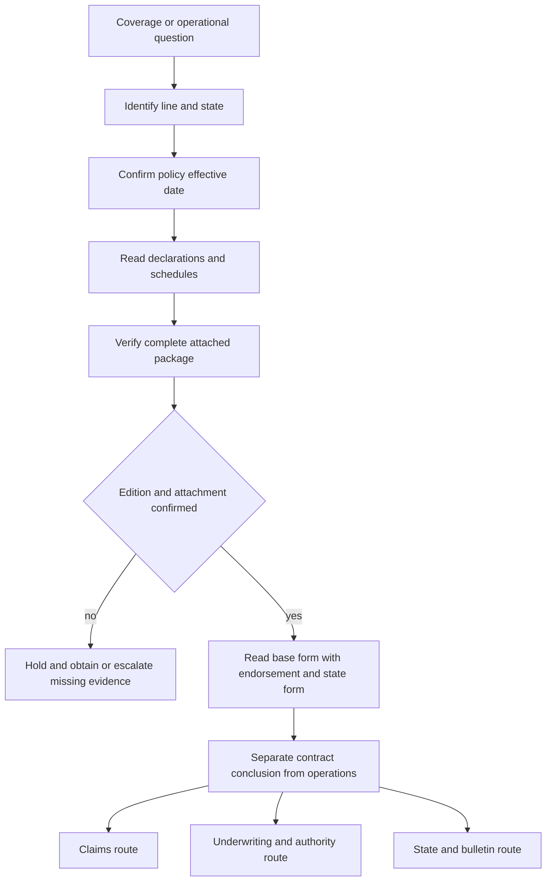

# Coverage Wiki Quickstart

This is a routing map, not a substitute for issued contract language, a regulator bulletin, internal guidance, or training interpretation. The corpus spans HO-3, HO-4, HO-5, HO-6, and DP-3, with state variants; a concept must not be treated as universal from one line, edition, or state ([repository layout and lines](repo://README.md#L13-L31), [wiki scope](repo://openwiki/INSTRUCTIONS.md#L16-L27)).

## Start here: assemble the right policy

*Caption: Route by policy facts and package completeness before interpreting coverage or branching to operational controls.*

1. Identify the governing line, state, policy-effective date, declarations, schedules, and damaged interest.
2. Select the base form edition whose effective interval contains the policy date. Frozen forms and bulletins remain unchanged, and an older edition continues to govern policies written under it ([frozen authority](repo://README.md#L33-L41)).
3. Confirm every endorsement is actually attached, complete, and matched to the insured, location, property, and policy term. A title or system schedule is an index, not a substitute for the issued wording ([assembly entry gate](repo://openwiki/policy-assembly/editions-and-state-attachments.md#L61-L76)).
4. Read the base form, attached endorsement, declarations, and applicable state amendatory form together. If the package or labels conflict, preserve the uncertainty and escalate rather than choosing the broader or preferred wording ([selection procedure](repo://openwiki/policy-assembly/editions-and-state-attachments.md#L96-L111)).

## HO 04 90 water-backup edition map

The 2010-10, 2026-01, and 2027-01 files are not interchangeable. Use the edition issued for the policy’s governing interval and verify attachment.

| Edition | Governing interval and scope | Routing facts to verify |
| --- | --- | --- |
| **2010-10** | Effective 2010-10-01; remains in force for policies written under it, although superseded by 2027-01 for policies effective on or after 2027-01-01 ([edition marker](repo://forms/HO/MS/HO-04-90/2010-10.md#L1-L9)). | Attached endorsement provides water-backup and sump-discharge coverage; its limit is $5,000 and deductible is $500 ([attachment and scope](repo://forms/HO/MS/HO-04-90/2010-10.md#L13-L33), [limit](repo://forms/HO/MS/HO-04-90/2010-10.md#L107-L113), [deductible](repo://forms/HO/MS/HO-04-90/2010-10.md#L157-L167)). |
| **2026-01** | Multistate HO-3 endorsement replacing 2010-10 for policies written on or after 2026-01-01 ([edition statement](repo://forms/HO/MS/HO-04-90/2026-01.md#L1-L4)). | Covers direct physical loss to Coverage A, B, and C property from sewer or drain backup or sump discharge or overflow, including mechanical breakdown; the limit is $10,000 unless a higher declarations limit applies, and the separate deductible is $1,000 ([coverage](repo://forms/HO/MS/HO-04-90/2026-01.md#L6-L11), [sublimit](repo://forms/HO/MS/HO-04-90/2026-01.md#L13-L18), [deductible](repo://forms/HO/MS/HO-04-90/2026-01.md#L20-L23)). It preserves the flood, surface-water, and below-surface-water exclusions stated in W.4 ([remaining exclusions](repo://forms/HO/MS/HO-04-90/2026-01.md#L25-L33)) and adds a finished-below-grade backflow-device requirement ([new condition](repo://forms/HO/MS/HO-04-90/2026-01.md#L42-L47)). |
| **2027-01** | Effective 2027-01-01; supersedes 2010-10 for policies effective on or after that date ([edition and attachment](repo://forms/HO/MS/HO-04-90/2027-01.md#L13-L32)). | Attached endorsement writes back the applicable HO-3 water-backup exclusion only within its terms, with $10,000 limit and $1,000 deductible; it preserves unmodified policy terms ([contract relationship](repo://forms/HO/MS/HO-04-90/2027-01.md#L16-L36), [coverage](repo://forms/HO/MS/HO-04-90/2027-01.md#L69-L103), [limit](repo://forms/HO/MS/HO-04-90/2027-01.md#L256-L265), [deductible](repo://forms/HO/MS/HO-04-90/2027-01.md#L391-L407)). It excludes flood and certain surface or below-ground water, subject to its stated exceptions ([exclusions](repo://forms/HO/MS/HO-04-90/2027-01.md#L119-L142)). |

For the 2026-01 and 2027-01 editions, do not infer that a limit, deductible, condition, or settlement basis from one edition applies to the other. In particular, the 2026-01 text states Coverage C is ACV unless the declarations say otherwise, while Coverage A and B follow the attached policy’s settlement basis ([2026 settlement](repo://forms/HO/MS/HO-04-90/2026-01.md#L49-L56)); check the 2027 issued wording and declarations separately.

## Route by subject

- **Base form and coverage parts:** [HO-3 form editions](coverage/forms/ho-3.md). For HO-4, HO-5, HO-6, or DP-3, use that line’s form page; do not carry an HO-3 result into another line.
- **Water causation and exclusions:** [Water damage](coverage/perils/water-damage.md), then compare plumbing, appliance, weather, drain, outside-water, seepage, and resulting-damage facts with the applicable form and endorsement.
- **Water-backup claims:** [Water loss handling](claims/guidelines/water-loss-handling.md) for investigation, mitigation, evidence, consultation, and escalation after the contract route is established.
- **Roof cause and valuation:** [Roof settlement](coverage/settlement/roof-settlement.md), then the related claim-handling route. An underwriting inspection rule is not a coverage determination.
- **State contract and regulatory requirements:** [Florida state overlay](state-overlays/florida.md) or the applicable state page. An amendatory form implements the relevant bulletin; the bulletin constrains carrier conduct and is not a substitute for the form ([authority layers](repo://openwiki/policy-assembly/editions-and-state-attachments.md#L48-L57)).
- **Endorsement attachment and deductible controls:** [Endorsements and deductibles](underwriting/manual/endorsements-and-deductibles.md). This is internal guidance: it constrains binding, attachment, referral, and evidence; it cannot establish a policy limit or deductible ([underwriting boundary](repo://openwiki/policy-assembly/editions-and-state-attachments.md#L125-L129)).
- **Edition assembly:** [Editions, Endorsements, and State Attachments](policy-assembly/editions-and-state-attachments.md).

## Keep the authority boundary explicit

Use forms and attached state forms for contract wording. Use regulator bulletins for regulatory constraints. Use claims guidelines and underwriting manuals for internal operations. Use memoranda and training for interpretation or review method. A memorandum or training page cannot establish a contract limit, deductible, period, percentage, or coverage result ([document families](repo://README.md#L15-L27), [authority boundary](repo://openwiki/policy-assembly/editions-and-state-attachments.md#L46-L57)).

When documents compose, name the acting document first and use the repository vocabulary exactly: an edition **supersedes** an earlier edition at its effective boundary; an endorsement **writes back** an exclusion only where coverage is restored; it **preserves** unmodified terms; an endorsement **modifies** limits, deductibles, conditions, or settlement; a state form **implements** a bulletin; and a bulletin or internal rule **constrains** carrier operations. Cite both provisions whenever stating the relationship ([relationship rules](repo://openwiki/INSTRUCTIONS.md#L68-L103)).

## Final check

Before publishing a position, confirm: line; state; policy-effective date; base and endorsement editions; declarations and schedules; complete attachment package; coverage part and damaged interest; cause facts; applicable state form and bulletin; and the separate claims or underwriting route. If attachment, causation, valuation, regulatory, or authority evidence is incomplete, hold and escalate. The issued policy package controls the contract conclusion; this map only helps find it.
