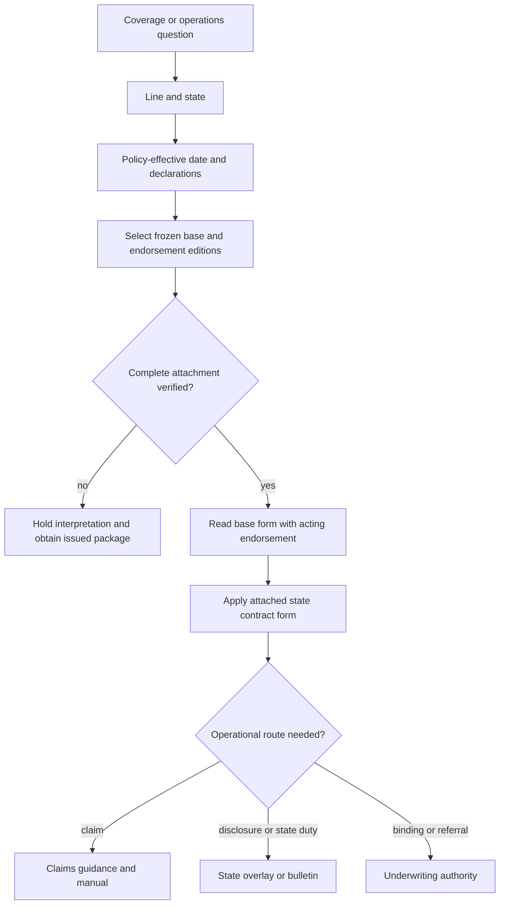

# Coverage Wiki Quickstart

This is a compact routing map, not a substitute for the issued policy, endorsement, declarations, state form, bulletin, or internal procedure. Forms and bulletins are frozen authority; manuals and guidelines are living operational guidance; memoranda and training explain or organize review but do not create coverage ([source roles](repo://README.md#L13-L41)).

## Start with the issued package

Before interpreting a loss, record the line, state, policy-effective date, declarations, base-form edition, attached endorsements, schedules, state form, and damaged property. The repository path carries line, state, form, and edition context, so do not replace the issued wording with the newest repository file or a familiar form title ([repository model](repo://README.md#L26-L31)).

*Caption: Date and attachment select the contract; state and operational materials are applied separately.*

<!-- openwiki: broken internal link [policy-assembly/editions-and-state-attachments.md#L15-L24] heading anchor "L15-L24" does not exist in "policy-assembly/editions-and-state-attachments.md". Fix the href or restore the target, then delete this comment. -->
Use [Policy Editions, Endorsements, and State Attachments](policy-assembly/editions-and-state-attachments.md) for the assembly record and failure controls. A state amendatory form supplies contract wording when attached; a bulletin constrains disclosure or administration; internal guidance constrains carrier action. None silently changes the issued contract ([authority boundaries](policy-assembly/editions-and-state-attachments.md#L15-L24)).

## Choose the HO 04 90 edition

<!-- openwiki: broken internal link [../forms/HO/MS/HO-04-90/2026-01.md#L1-L4] heading anchor "L1-L4" does not exist in "../forms/HO/MS/HO-04-90/2026-01.md". Fix the href or restore the target, then delete this comment. -->
<!-- openwiki: broken internal link [README.md#L33-L37] file "README.md" does not exist. Fix the href or restore the target, then delete this comment. -->
The **HO 04 90 2026-01 endorsement replaces HO 04 90 2010-10 for policies written on or after 2026-01-01**. The earlier frozen edition remains applicable to policies written under it; do not import the 2026 deductible, sublimit, conditions, or settlement rule into an earlier policy ([2026-01](../forms/HO/MS/HO-04-90/2026-01.md#L1-L4); [edition lifecycle](README.md#L33-L37)). A later edition is not retroactive: select the edition whose effective interval and issued package govern.

<!-- openwiki: broken internal link [../forms/HO/MS/HO-3/2024-03.md#L593-L601] heading anchor "L593-L601" does not exist in "../forms/HO/MS/HO-3/2024-03.md". Fix the href or restore the target, then delete this comment. -->
<!-- openwiki: broken internal link [../forms/HO/MS/HO-04-90/2026-01.md#L1-L11] heading anchor "L1-L11" does not exist in "../forms/HO/MS/HO-04-90/2026-01.md". Fix the href or restore the target, then delete this comment. -->
For HO-3 water-backup questions, the base form excludes sewer/drain backup and sump discharge unless the applicable endorsement is attached. **HO 04 90 2026-01 modifies HO-3 2024-03** by writing back direct physical loss to Coverage A, B, and C property from sewer/drain backup or sump discharge/overflow, including where mechanical breakdown caused the event ([HO-3 exclusion](../forms/HO/MS/HO-3/2024-03.md#L593-L601); [2026-01 grant](../forms/HO/MS/HO-04-90/2026-01.md#L1-L11)).

<!-- openwiki: broken internal link [../forms/HO/MS/HO-04-90/2026-01.md#L13-L23] heading anchor "L13-L23" does not exist in "../forms/HO/MS/HO-04-90/2026-01.md". Fix the href or restore the target, then delete this comment. -->
<!-- openwiki: broken internal link [../forms/HO/MS/HO-04-90/2026-01.md#L25-L56] heading anchor "L25-L56" does not exist in "../forms/HO/MS/HO-04-90/2026-01.md". Fix the href or restore the target, then delete this comment. -->
The 2026-01 endorsement provides a shared **$10,000 per-policy-period sublimit**, unless the Declarations show more, and a separate **$1,000 deductible per endorsement loss**; the sublimit is part of the Coverage A/B/C limits and the Section I deductible does not apply ([2026-01 limits](../forms/HO/MS/HO-04-90/2026-01.md#L13-L23)). It **preserves** flood, surface-water, and below-surface-water exclusions, **conditions** coverage on a known, remediable maintenance failure not causing the loss, and requires an installed and operable backwater valve or equivalent for a finished below-grade area. Coverage A/B use the policy settlement basis; Coverage C is ACV unless the Declarations say otherwise ([2026-01 exclusions and conditions](../forms/HO/MS/HO-04-90/2026-01.md#L25-L56)).

<!-- openwiki: broken internal link [policy-assembly/editions-and-state-attachments.md#L26-L49] heading anchor "L26-L49" does not exist in "policy-assembly/editions-and-state-attachments.md". Fix the href or restore the target, then delete this comment. -->
Verify that the complete endorsement is actually attached and matched to the insured, location, subject, and policy term. A schedule label alone is not the operative endorsement. If the package is incomplete or conflicting, hold interpretation and obtain the issued copy or escalate ([attachment workflow](policy-assembly/editions-and-state-attachments.md#L26-L49)).

## Follow a water-backup issue

Open [Water Backup and Sump Discharge Coverage](coverage/perils/water-backup.md) to establish the water path, covered property, base exclusion, acting endorsement, edition-specific limit, deductible, conditions, and settlement. Do not treat a visible stain, water near a drain, or a limit reference in the base form as proof of backup coverage.

<!-- openwiki: broken internal link [claims/guidelines/water-loss-handling.md#L34-L46] heading anchor "L34-L46" does not exist in "claims/guidelines/water-loss-handling.md". Fix the href or restore the target, then delete this comment. -->
Then open [Water Loss Handling](claims/guidelines/water-loss-handling.md) for the operational sequence: safe mitigation, evidence preservation, source/path/duration investigation, exact policy consultation, separate scope and valuation, authority review, payment, recovery, and closure. Claims guidance does not create coverage; the attached policy, endorsement, declarations, and applicable law control ([claims boundary](claims/guidelines/water-loss-handling.md#L34-L46)).

For a claim, keep these questions separate:

- **Cause and path:** sewer/drain reverse flow, sump discharge, plumbing discharge, flood, surface water, or subsurface water.
- **Contract:** covered property, grant, exclusion, condition, limit, deductible, and settlement basis in the governing edition.
- **Operations:** mitigation, evidence, notice, escalation, payment, recovery, and closure under claims guidance.
- **State control:** disclosure, claims, filing, or other duties under the applicable overlay or bulletin.

## State and operational routes

<!-- openwiki: broken internal link [policy-assembly/editions-and-state-attachments.md#L67-L73] heading anchor "L67-L73" does not exist in "policy-assembly/editions-and-state-attachments.md". Fix the href or restore the target, then delete this comment. -->
Return to [Policy Editions, Endorsements, and State Attachments](policy-assembly/editions-and-state-attachments.md) when the answer involves a state attachment or edition conflict. For Illinois, use [Illinois State Overlay](state-overlays/illinois.md): the bulletin constrains disclosure and claims handling, while the attached state form modifies the contract only within its terms. A disclosure amount or claims rule is not a universal policy limit or coverage grant ([Illinois boundary](policy-assembly/editions-and-state-attachments.md#L67-L73)).

Use the claims, underwriting, and rating pages only after the contract route is established. Internal authority or referral thresholds govern who may act; they are not policy limits. If attachment, causation, edition, valuation, authority, or regulatory facts remain unresolved, document the gap and escalate rather than guess.

## Final routing checklist

1. Identify line, state, effective date, declarations, and damaged interest.
2. Select the governing frozen base and endorsement editions.
3. Verify the complete attachment and reconcile schedules with the issued package.
4. Read the acting endorsement with the base form; name the acting document and use precise relationships such as `modifies`, `preserves`, or `writes back`.
5. Apply state contract forms, bulletins, claims guidance, underwriting guidance, and rating controls in their separate roles.
6. Record the exact evidence and escalate unresolved issues.
