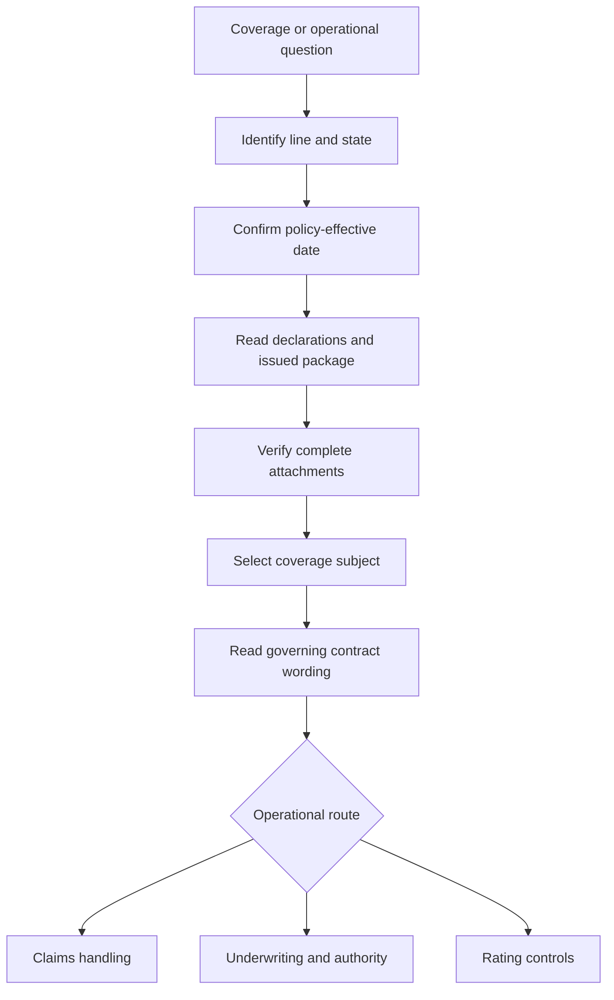

# Coverage Wiki Quickstart

<!-- openwiki: broken internal link [../README.md#L13-L27] heading anchor "L13-L27" does not exist in "../README.md". Fix the href or restore the target, then delete this comment. -->
This is a routing map, not a substitute for the issued policy, endorsement, state form, bulletin, claims procedure, underwriting rule, or rating procedure. The repository deliberately separates frozen contract and regulator authority from living internal guidance and interpretive material ([document families](../README.md#L13-L27)).

## Route every question

*Caption: establish the issued contract route first, then branch to the applicable operational control.*

1. Identify the line, state, location, insured, and coverage subject.
2. Confirm the policy-effective date, declarations, base-form edition, and complete issued package.
3. Verify every endorsement is actually attached, complete, legible, and matched to the policy term and subject.
4. Read the date-correct base form, endorsement, declarations, and state form together.
5. Separate coverage, causation, scope, valuation, payment authority, eligibility, and rating questions.
6. Use claims, underwriting, rating, bulletin, memorandum, and training material only for their proper operational or interpretive roles.

<!-- openwiki: broken internal link [../README.md#L26-L31] heading anchor "L26-L31" does not exist in "../README.md". Fix the href or restore the target, then delete this comment. -->
<!-- openwiki: broken internal link [../README.md#L33-L41] heading anchor "L33-L41" does not exist in "../README.md". Fix the href or restore the target, then delete this comment. -->
The evidence path carries line, state, form, and edition context; the repository claims themselves do not ([repository path model](../README.md#L26-L31)). Frozen forms remain operative for policies written under them, while living guidance is revised in place ([source lifecycle](../README.md#L33-L41)).

## Major entrypoints

| Question | Start here | Then verify |
| --- | --- | --- |
| Homeowners dwelling contract | [HO-3 form editions](coverage/forms/ho-3.md) | Coverage part, peril, settlement, and attachments |
| Sewer, drain, or sump backup | [Water Backup and Sump Discharge](coverage/perils/water-backup.md) | Attached HO 04 90 edition, grant, exclusions, limit, deductible, and conditions |
| Edition selection or attachment package | [Policy Editions and State Attachments](policy-assembly/editions-and-state-attachments.md) | Policy-effective date, declarations, issued copy, state form, and attachment status |
| State-specific contract or administration | State overlay pages | Amendatory form and applicable bulletin, keeping contract and administration separate |
| Claim investigation and handling | Claims manual and [water-loss handling](claims/guidelines/water-loss-handling.md) | Governing policy, cause, evidence, scope, valuation, and authority |
| Eligibility, binding, or referral | Underwriting manual and authority guides | Internal controls, evidence, and escalation; never coverage wording |
| Rating inputs or adjustments | [Rating Inputs and Adjustments](underwriting/rating/inputs-and-adjustments.md) | Complete submission, approved calculation, deductible, and state controls |

## HO 04 90 edition route

<!-- openwiki: broken internal link [../forms/HO/MS/HO-04-90/2026-01.md#L1-L4] heading anchor "L1-L4" does not exist in "../forms/HO/MS/HO-04-90/2026-01.md". Fix the href or restore the target, then delete this comment. -->
Treat **HO 04 90 (2026-01)** as a distinct multistate endorsement edition. The endorsement replaces 2010-10 for policies written on or after 2026-01-01 ([2026-01 identification](../forms/HO/MS/HO-04-90/2026-01.md#L1-L4)). Select the edition by policy-effective date, then independently confirm that the endorsement is attached:

| Policy-effective date | Edition to inspect | Routing boundary |
| --- | --- | --- |
| Before 2026-01-01 | HO 04 90 2010-10 | Keep its legacy terms; do not import 2026-01 or 2027-01 values. |
| 2026-01-01 through 2026-12-31 | HO 04 90 2026-01 | Inspect its own grant, $10,000 default policy-period sublimit, separate $1,000 deductible, exclusions, and conditions. |
| 2027-01-01 and later | HO 04 90 2027-01 | Inspect the later edition's own wording; do not backdate it to either earlier interval. |

<!-- openwiki: broken internal link [../forms/HO/MS/HO-3/2024-03.md#L593-L601] heading anchor "L593-L601" does not exist in "../forms/HO/MS/HO-3/2024-03.md". Fix the href or restore the target, then delete this comment. -->
<!-- openwiki: broken internal link [../forms/HO/MS/HO-04-90/2026-01.md#L6-L11] heading anchor "L6-L11" does not exist in "../forms/HO/MS/HO-04-90/2026-01.md". Fix the href or restore the target, then delete this comment. -->
<!-- openwiki: broken internal link [../forms/HO/MS/HO-04-90/2026-01.md#L13-L23] heading anchor "L13-L23" does not exist in "../forms/HO/MS/HO-04-90/2026-01.md". Fix the href or restore the target, then delete this comment. -->
<!-- openwiki: broken internal link [../forms/HO/MS/HO-04-90/2026-01.md#L25-L47] heading anchor "L25-L47" does not exist in "../forms/HO/MS/HO-04-90/2026-01.md". Fix the href or restore the target, then delete this comment. -->
The 2026-01 endorsement writes back the HO-3 water-backup and sump-discharge exclusion for direct physical loss to Coverage A, B, and C property, including events involving mechanical breakdown ([base exclusion](../forms/HO/MS/HO-3/2024-03.md#L593-L601), [2026-01 grant](../forms/HO/MS/HO-04-90/2026-01.md#L6-L11)). Its default $10,000 limit applies to all endorsement loss in one policy period, is part of—not additional to—the Coverage A, B, and C limits, and uses a separate $1,000 deductible per loss ([2026-01 limit and deductible](../forms/HO/MS/HO-04-90/2026-01.md#L13-L23)). It preserves flood, surface-water, storm-surge, body-of-water overflow, and below-ground-water exclusions, and imposes known-maintenance and finished-below-grade backflow-prevention conditions ([2026-01 conditions](../forms/HO/MS/HO-04-90/2026-01.md#L25-L47)).

Do not infer those terms from the endorsement title, a training page, or the 2027-01 file. Confirm the actual issued attachment and declarations; an unattached endorsement does not modify the policy. For the detailed comparison and assembly implications, follow [Water Backup and Sump Discharge](coverage/perils/water-backup.md) and [Policy Editions and State Attachments](policy-assembly/editions-and-state-attachments.md).

## Contract versus guidance

<!-- openwiki: broken internal link [INSTRUCTIONS.md#L68-L103] heading anchor "L68-L103" does not exist in "INSTRUCTIONS.md". Fix the href or restore the target, then delete this comment. -->
Name the acting document first when composing an answer: an endorsement **writes back** a base-form exclusion; a later edition **supersedes** an earlier edition for its stated policy interval; a state form **implements** a bulletin; and a bulletin, manual, appetite guide, memorandum, or training page **constrains** or explains operations rather than creating coverage. Cite both documents when asserting such a relationship ([relationship vocabulary](INSTRUCTIONS.md#L68-L103)).

<!-- openwiki: broken internal link [../training/guidance-versus-contract.md#L15-L23] heading anchor "L15-L23" does not exist in "../training/guidance-versus-contract.md". Fix the href or restore the target, then delete this comment. -->
Claims guidance can direct investigation, mitigation, evidence preservation, escalation, and delegated authority, but it cannot expand, restrict, waive, or admit contract coverage. Underwriting guidance can control whether a risk or endorsement is bound, attached, renewed, referred, or declined internally; rating controls calculation and inputs. Neither replaces the issued wording ([guidance boundary](../training/guidance-versus-contract.md#L15-L23)).

Before publishing a position, record the line, state, policy and loss dates, base and endorsement editions, declarations, attachment status, coverage subject, reported cause, relevant facts, and separate operational source. If the package, edition, attachment, or evidence is incomplete or conflicting, stop and escalate rather than borrow terms from another edition.
