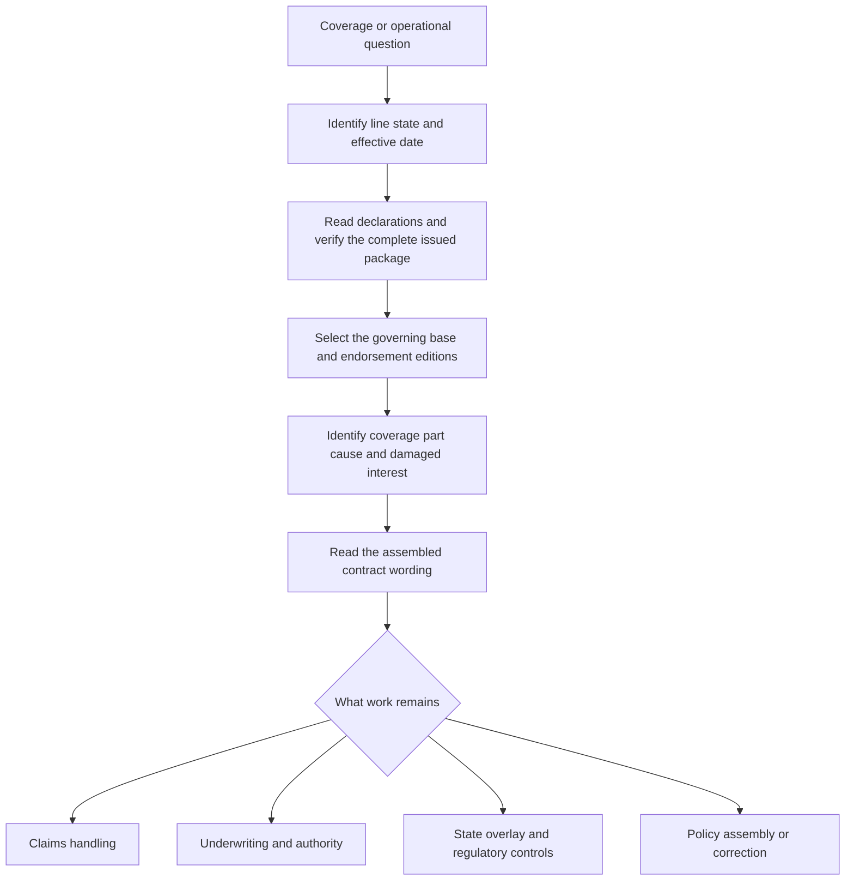

# Coverage Wiki Quickstart

<!-- openwiki: broken internal link [../README.md#L13-L41] heading anchor "L13-L41" does not exist in "../README.md". Fix the href or restore the target, then delete this comment. -->
This is the initialization entry point and a routing map—not a substitute for an issued policy, endorsement, state form, bulletin, claims procedure, underwriting rule, or rating procedure. The repository deliberately cross-wires frozen forms and bulletins with living manuals and guidelines, so follow the document relationship instead of answering from an isolated summary. Frozen authority remains available by edition; a later form does not rewrite an older policy ([repository layout and authority lifecycle](../README.md#L13-L41)).

## The required route

*Caption: Route context and package evidence before interpreting contract wording, then branch to the relevant operational control.*

1. **Identify context.** Record line, state, policy-effective date, insured location, and the damaged interest.
<!-- openwiki: broken internal link [policy-assembly/editions-and-state-attachments.md#L62-L78] heading anchor "L62-L78" does not exist in "policy-assembly/editions-and-state-attachments.md". Fix the href or restore the target, then delete this comment. -->
2. **Verify the package.** Read the declarations, base form, attached endorsements, schedules, referenced pages, and applicable state amendatory form. A title, system label, or limit reference does not prove that an endorsement is attached; incomplete or conflicting evidence should be held and escalated ([assembly entry gate](policy-assembly/editions-and-state-attachments.md#L62-L78)).
<!-- openwiki: broken internal link [policy-assembly/editions-and-state-attachments.md#L68-L78] heading anchor "L68-L78" does not exist in "policy-assembly/editions-and-state-attachments.md". Fix the href or restore the target, then delete this comment. -->
3. **Select by date, then verify issuance.** Use the effective date to choose the candidate edition, but do not replace the issued wording with the newest repository file. The applicable older frozen edition remains operative for policies written under it ([edition selection](policy-assembly/editions-and-state-attachments.md#L68-L78)).
<!-- openwiki: broken internal link [policy-assembly/editions-and-state-attachments.md#L47-L60] heading anchor "L47-L60" does not exist in "policy-assembly/editions-and-state-attachments.md". Fix the href or restore the target, then delete this comment. -->
4. **Separate contract from guidance.** Base forms, attached endorsements, and state amendatory forms provide contract wording. Bulletins constrain carrier conduct; memoranda and training explain; manuals and appetite guidance control internal operations. None silently creates, expands, restricts, or waives coverage ([authority layers](policy-assembly/editions-and-state-attachments.md#L47-L60)).

## Major domain routes

| Question | Open first | What to carry forward |
| --- | --- | --- |
| HO-3 edition, water, roof, or Section II comparison | [HO-3 Form Editions](coverage/forms/ho-3.md) | Base edition, exact wording, declarations, attached endorsements, and state form |
| Sewer, drain, or sump backup | [Water Backup and Sump Overflow](coverage/perils/water-backup.md) | Established water path, covered property, acting endorsement edition, limit, deductible, exclusions, and settlement basis |
| Edition selection, attachment, conflict, or state package | [Editions, Endorsements, and State Attachments](policy-assembly/editions-and-state-attachments.md) | Effective date, complete package, state contract form, bulletin, and unresolved conflicts |
| Water-loss claim intake, causation, mitigation, or payment | [Water Loss Handling](claims/guidelines/water-loss-handling.md) | Source and path, evidence, mitigation, coverage consultation, scope, valuation, authority, and recovery |
| Binding, referral, clearance, or required evidence | [Authority, Referrals, and Clearance](underwriting/manual/authority-referrals-and-clearance.md) | Requested action, trigger, evidence, authority response, conditions, and disposition |
| State-specific contract or administration | State overlay pages | State form and bulletin separately; do not treat a bulletin as policy wording |

## Current HO-3 water-backup waypoint

<!-- openwiki: broken internal link [../forms/HO/MS/HO-04-90/2026-01.md#L1-L56] heading anchor "L1-L56" does not exist in "../forms/HO/MS/HO-04-90/2026-01.md". Fix the href or restore the target, then delete this comment. -->
For an HO-3 policy effective **2026-01-01 through 2026-12-31**, verify that HO 04 90 (2026-01) is actually attached before applying it. It replaces the 2010-10 endorsement for policies written on or after 2026-01-01 and provides direct physical-loss coverage for Coverage A, B, and C property from sewer/drain backup or sump discharge/overflow. Its default policy-period sublimit is **$10,000**, with a separate **$1,000 deductible**; it preserves flood and below-ground-water exclusions, adds a known-maintenance condition, requires an operable backflow device for finished below-grade areas, and settles Coverage C at actual cash value unless the declarations say otherwise ([2026-01 endorsement](../forms/HO/MS/HO-04-90/2026-01.md#L1-L56)).

<!-- openwiki: broken internal link [coverage/forms/ho-3.md#L95-L114] heading anchor "L95-L114" does not exist in "coverage/forms/ho-3.md". Fix the href or restore the target, then delete this comment. -->
<!-- openwiki: broken internal link [coverage/perils/water-backup.md#L102-L126] heading anchor "L102-L126" does not exist in "coverage/perils/water-backup.md". Fix the href or restore the target, then delete this comment. -->
Do not back-project or forward-project that wording. Compare the [HO-3 edition analysis](coverage/forms/ho-3.md#L95-L114) and [water-backup comparison](coverage/perils/water-backup.md#L102-L126): 2010-10 remains relevant to its earlier policy interval, while 2027-01 is a distinct later edition. A base-form reference to a backup limit is not itself a grant, and a date alone is not proof of attachment.

## Operational boundaries and failure checks

<!-- openwiki: broken internal link [claims/guidelines/water-loss-handling.md#L34-L70] heading anchor "L34-L70" does not exist in "claims/guidelines/water-loss-handling.md". Fix the href or restore the target, then delete this comment. -->
- Claims handling establishes source, causation, evidence, mitigation, scope, valuation, payment, and recovery as separate work products. An inspection, estimate, mitigation authorization, reserve, or partial payment is not acceptance of the whole claim ([water-loss lifecycle](claims/guidelines/water-loss-handling.md#L34-L70)).
<!-- openwiki: broken internal link [underwriting/manual/authority-referrals-and-clearance.md#L22-L26] heading anchor "L22-L26" does not exist in "underwriting/manual/authority-referrals-and-clearance.md". Fix the href or restore the target, then delete this comment. -->
<!-- openwiki: broken internal link [underwriting/manual/authority-referrals-and-clearance.md#L28-L45] heading anchor "L28-L45" does not exist in "underwriting/manual/authority-referrals-and-clearance.md". Fix the href or restore the target, then delete this comment. -->
- Underwriting guidance determines eligibility, attachment, delegated authority, referral, and clearance; it does not decide coverage. A pending referral is not approval, and unresolved material facts require a hold or escalation ([authority boundary](underwriting/manual/authority-referrals-and-clearance.md#L22-L26), [referral flow](underwriting/manual/authority-referrals-and-clearance.md#L28-L45)).
<!-- openwiki: broken internal link [policy-assembly/editions-and-state-attachments.md#L51-L58] heading anchor "L51-L58" does not exist in "policy-assembly/editions-and-state-attachments.md". Fix the href or restore the target, then delete this comment. -->
- State forms and bulletins are complementary but different: the state form supplies contract wording within its scope, while the bulletin constrains issuance, disclosure, rating, claims, or administration. Apply both without substituting one for the other ([state authority model](policy-assembly/editions-and-state-attachments.md#L51-L58)).
<!-- openwiki: broken internal link [policy-assembly/editions-and-state-attachments.md#L150-L157] heading anchor "L150-L157" does not exist in "policy-assembly/editions-and-state-attachments.md". Fix the href or restore the target, then delete this comment. -->
- If the package is incomplete, the edition is wrong, an endorsement is listed but missing, or sources conflict, stop the affected interpretation and obtain the issued evidence or authorized direction. Never choose the wording that produces the preferred result ([assembly failure checks](policy-assembly/editions-and-state-attachments.md#L150-L157)).

Return to [Editions, Endorsements, and State Attachments](policy-assembly/editions-and-state-attachments.md) for final assembly. A defensible answer should identify the acting document and relationship—`supersedes`, `writes back`, `preserves`, `modifies`, `implements`, or `constrains`—and cite the exact edition and lines.
