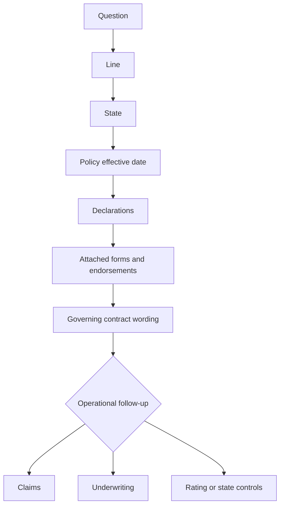

# Coverage Wiki Quickstart

This page is the entry point, not a substitute for an issued policy, endorsement, state form, claims procedure, underwriting rule, or rating procedure. Start with the policy facts, then follow the assembled contract and the separate operational route.

## Required route

1. **Identify the line.** Begin with the applicable [HO-3 form page](coverage/forms/ho-3.md), or the relevant HO-4, HO-5, HO-6, or DP-3 form page when the risk is another line.
2. **Identify the state.** Check the applicable state overlay and attached amendatory form. A state form supplies contract wording only on the subjects it changes; a bulletin constrains issuance, disclosure, or administration and does not itself create coverage.
3. **Confirm the effective date.** Select the base form and endorsement edition by the policy date, then preserve the historical edition that governs an older policy. Do not substitute the newest repository file for the wording actually issued.
4. **Read the Declarations.** Capture selected limits, deductibles, schedules, and any state or endorsement entries.
5. **Verify attachments.** Confirm the complete, legible package is matched to the insured, location, subject, and policy term. A form label, quote, or system schedule is not proof that an endorsement attached.
6. **Read the governing contract.** Identify the coverage part, damaged interest, cause, exclusion, condition, limit, deductible, and settlement basis before branching to operations.

For composed answers, use [Policy Editions and State Attachments](policy-assembly/editions-and-state-attachments.md). Name the acting document and relationship—`supersedes`, `modifies`, `writes back`, `preserves`, `implements`, or `constrains`—and keep contract authority distinct from guidance.

## 2026-01 water-backup route

For a 2026 policy with attached HO 04 90, go from the [HO-3 form page](coverage/forms/ho-3.md) to [Water Backup and Sump Discharge](coverage/perils/water-backup.md), then confirm assembly in [Policy Editions and State Attachments](policy-assembly/editions-and-state-attachments.md).

<!-- openwiki: broken internal link [../forms/HO/MS/HO-04-90/2026-01.md#L1-L23] heading anchor "L1-L23" does not exist in "../forms/HO/MS/HO-04-90/2026-01.md". Fix the href or restore the target, then delete this comment. -->
HO 04 90 (2026-01) attaches to HO-3 and modifies Section I—Exclusions A.3. For policies written on or after 2026-01-01 it replaces the 2010-10 edition. It covers direct physical loss to Coverage A, B, and C property from sewer or drain backup or sump, sump-pump, or related-equipment discharge or overflow, including mechanical breakdown. The default maximum is $10,000 for all endorsement loss in one policy period unless the Declarations show a higher limit; the sublimit is part of, not additional to, the Coverage A–C limits. A separate $1,000 deductible applies to each covered loss, instead of the Section I deductible. ([HO 04 90 2026-01](../forms/HO/MS/HO-04-90/2026-01.md#L1-L23))

<!-- openwiki: broken internal link [../forms/HO/MS/HO-04-90/2026-01.md#L25-L56] heading anchor "L25-L56" does not exist in "../forms/HO/MS/HO-04-90/2026-01.md". Fix the href or restore the target, then delete this comment. -->
The endorsement preserves the HO-3 exclusions for flood, surface water, waves, tidal water, storm surge, body-of-water overflow, and below-ground water, including pressure, seepage, or leakage through a building, foundation, or pool. It also contains a known-maintenance condition and, where the residence has finished area below grade, requires an installed and operable backwater valve or equivalent device on the serving sewer line at the time of loss. Coverage A and B follow the attached policy’s settlement basis; Coverage C is actual cash value unless the endorsement Declarations say otherwise. ([HO 04 90 2026-01](../forms/HO/MS/HO-04-90/2026-01.md#L25-L56))

Do not apply those 2026 terms to 2010-10 or import 2027-01 wording into a 2026 policy. Confirm the edition and attachment in the issued package before applying the water-backup limit, deductible, device condition, or settlement rule.

## Choose the operational route

| Need | Route |
| --- | --- |
| Water-loss investigation, source, mitigation, evidence, coverage consultation, limits, or escalation | [Water Loss Claims Handling](claims/guidelines/water-loss-handling.md) |
| Water-peril classification or preserved flood and groundwater exclusions | [Claims Property Perils and Loss Types](claims/manual/property-perils-and-loss-types.md) |
| Attaching the endorsement, declared limit, deductible, device condition, or edition transition | [Endorsements and Deductibles](underwriting/manual/endorsements-and-deductibles.md) |
| Edition selection, complete package, Declarations, or state attachment | [Policy Editions and State Attachments](policy-assembly/editions-and-state-attachments.md) |

Claims guidance controls investigation and file handling; underwriting guidance controls eligibility, referral, authority, documentation, and attachment; neither creates, expands, restricts, or waives coverage. A bulletin, manual, memorandum, or training page may constrain or explain operations, but the issued HO-3, attached endorsement, Declarations, applicable state form, and law control the coverage result.

## Final check

Before publishing a position, verify line, state, effective date, Declarations, base edition, attached endorsement edition, state form, coverage part, damaged interest, cause, and evidence. Keep coverage, causation, scope and valuation, payment authority, eligibility, rating, and regulatory duties as separate work products. If the package, edition, attachment, cause, device evidence, or authority is incomplete or conflicting, hold the conclusion and obtain the missing record rather than guessing.

<!-- openwiki: broken internal link [../README.md#L13-L41] heading anchor "L13-L41" does not exist in "../README.md". Fix the href or restore the target, then delete this comment. -->
<!-- openwiki: broken internal link [../README.md#L92-L95] heading anchor "L92-L95" does not exist in "../README.md". Fix the href or restore the target, then delete this comment. -->
The repository is synthetic: forms and bulletins are frozen authority, while manuals and guidelines are living internal guidance. The evidence path preserves line, state, form, and edition context, so use canonical repository citations when documenting the conclusion. ([repository layout and lifecycle](../README.md#L13-L41), [document relationships](../README.md#L92-L95))
