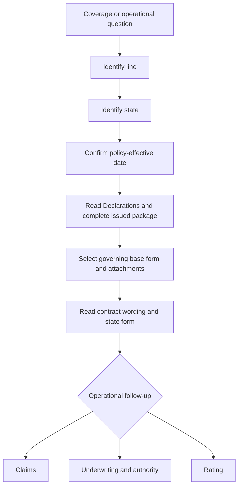

# Coverage Wiki Quickstart

Use this page to route a question; do not treat it as a substitute for the issued policy, attached endorsements, applicable state form, law, or operating manual. The repository separates frozen forms and bulletins from living manuals and guidelines, while memoranda and training explain rather than replace operative wording ([document families](repo://README.md#L15-L27)).

## The shortest safe route

1. Record the **line, state, policy-effective date, Declarations, coverage part, damaged interest, and reported cause**.
2. Select the base-form edition whose effective interval contains the policy date. Older frozen editions remain relevant to policies written under them; do not substitute the newest repository file ([frozen authority](repo://README.md#L33-L41)).
3. Verify every referenced page, schedule, endorsement, and state amendatory form is actually attached and matched to the insured, location, property, and term. If the package is incomplete or labels conflict, hold the conclusion and obtain the issued wording ([attachment workflow](repo://training/attaching-endorsements.md#L65-L87)).
4. Read the assembled contract first, then branch to claims, underwriting, rating, or state operations. A bulletin, memorandum, training page, manual, or appetite guide cannot silently create, restrict, or waive coverage ([guidance boundary](repo://training/guidance-versus-contract.md#L61-L83)).

## Route by domain

| Need | Start here | Then verify |
| --- | --- | --- |
| Homeowners dwelling, property, liability, or form edition | [HO-3 Homeowners Form Editions](coverage/forms/ho-3.md) | Exact base edition, Coverage A–F, exclusions, conditions, and attachments |
| Sewer, drain, or sump backup | [Water Backup and Sump Discharge Coverage](coverage/perils/water-backup.md) | Attached HO 04 90 edition, water path, exclusions, limit, deductible, and maintenance facts |
| Composing forms and state attachments | [Policy Editions, Endorsements, and State Attachments](policy-assembly/editions-and-state-attachments.md) | Effective date, Declarations, complete package, precedence, and state form |
| Claim intake, investigation, mitigation, or closure | [Intake, Investigation, and Mitigation](claims/manual/intake-investigation-and-mitigation.md) | Contract route first; then cause, scope, evidence, authority, and applicable state procedure |
| Underwriting endorsements or deductibles | [Endorsements and Deductibles](underwriting/manual/endorsements-and-deductibles.md) | Internal eligibility, referral, evidence, and attachment controls—not coverage terms |
| State-specific contract and operations | [Texas State Overlay](state-overlays/texas.md) or the relevant [state-overlay directory](state-overlays/) | State amendatory form as contract wording; bulletin as regulatory constraint |
| Rating inputs and adjustments | [Rating Inputs and Adjustments](underwriting/rating/inputs-and-adjustments.md) | Complete submission, approved calculation, evidence, and state exceptions |

## Important current routes

### HO-3 and water backup

For a policy written on or after **2026-01-01**, use HO 04 90 2026-01 only when it is attached; it replaces the 2010-10 endorsement for that policy population. The endorsement provides a default **$10,000 policy-period sublimit** and a separate **$1,000 deductible per loss**, while preserving the HO-3 flood, surface-water, and subsurface-water exclusions and imposing its stated maintenance and below-grade backflow-prevention conditions ([2026-01 endorsement](repo://forms/HO/MS/HO-04-90/2026-01.md#L1-L47)). Do not carry those terms into a policy governed by HO 04 90 2010-10, and do not infer attachment from a system label alone.

The HO-3 base edition remains date-sensitive: 2011-05 applies before 2018-09-01, 2018-09 applies from 2018-09-01 through 2024-02-29, and 2024-03 applies from 2024-03-01 onward, subject to the issued policy record ([HO-3 edition headers](repo://forms/HO/MS/HO-3/2011-05.md#L2-L9), [HO-3 2018-09](repo://forms/HO/MS/HO-3/2018-09.md#L2-L9), [HO-3 2024-03](repo://forms/HO/MS/HO-3/2024-03.md#L2-L8)).

### State, claims, and underwriting boundaries

A state amendatory form is contract language; a regulator bulletin constrains issuance, disclosure, rating, claims, or administration. For example, Texas HO 01 45 implements the state deductible mechanism, while Bulletin B-2021-08 governs disclosure and administration; neither should be substituted for the other ([Texas form](repo://forms/HO/TX/HO-01-45/2022-01.md#L13-L23), [Texas bulletin](repo://bulletins/TX/b-2021-08-windstorm-deductibles.md#L47-L73)).

Claims guidance controls file handling, evidence, investigation, mitigation, payment, and closure after the contract route is established. Underwriting guidance controls eligibility, referrals, authority, and whether an endorsement may attach. Keep coverage, causation, scope, valuation, payment authority, eligibility, and rating as separate work products ([claims manual](repo://manuals/claims/manual.md#L13-L19), [underwriting manual](repo://manuals/underwriting/manual.md#L21-L43)).

## Final check

Before publishing a position, confirm the governing edition and attachment package, read the applicable state wording, cite the operative form and narrow evidence lines, and escalate unresolved attachment, causation, valuation, authority, or regulatory conflicts. Use memoranda to understand edition changes, not to rewrite the filed form ([citation conventions](repo://README.md#L53-L60)).
