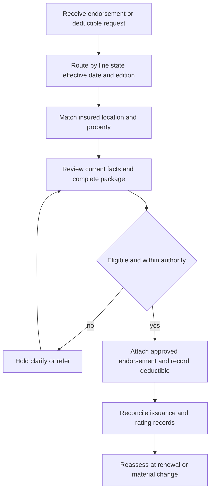

# Endorsement Attachment and Deductible Controls

## Governing boundary

Rules 400 and 410 are internal underwriting guidance. They constrain whether an endorsement may attach, which deductible option may be selected, and when authority or referral is required; they do not grant coverage, change a policy deductible, write back an exclusion, or authorize claim payment. The policy form, Declarations, attached endorsement, applicable edition, and state amendatory form remain the contract authority. [Manual Rules 100.B–100.D](repo://manuals/underwriting/manual.md#L21-L37) [Manual Rules 400.A–400.G](repo://manuals/underwriting/manual.md#L5091-L5131) [Manual Rules 410.A–410.I](repo://manuals/underwriting/manual.md#L5459-L5511)

Keep these decisions separate:

- **Internal selection:** eligibility, evidence, authority, referral, and whether the file is complete enough to issue.
- **Contractual term:** what the attached form covers, excludes, limits, and subtracts from a covered loss.

Where guidance depends on an endorsement, it constrains attachment or administration and must not be stated as policy language. Read the exact attached edition for the resulting coverage position.

*This flow describes underwriting administration, not a coverage or claim-payment determination.*

## Rule 400 attachment controls

Before binding or renewal, review every requested endorsement, resolve unclear instructions, and attach only when current risk facts support the requested coverage and the risk is eligible. Match the form to the named insured, location, and insured property; verify ownership, occupancy, use, and location; and refer incomplete, conflicting, stale, or unsupported information. [Rules 400.A–400.J](repo://manuals/underwriting/manual.md#L5091-L5149)

Read the complete endorsement and compare its grant, restrictions, exclusions, conditions, limit, deductible treatment, effective date, and interaction with the existing endorsement set. Do not use an endorsement to cure an ineligible risk, duplicate coverage, create an unintended grant, or implement a departure from normal practice without documented authority. [Rules 400.G–400.H](repo://manuals/underwriting/manual.md#L5127-L5137) [Attaching Endorsements Correctly](repo://training/attaching-endorsements.md#L121-L151)

For water-related attachment, evaluate water sources, drainage, sewer and plumbing condition, prior losses, and protection features. Refer unresolved intrusion, repeated drainage or sewer concerns, deterioration, active leakage, or an unverified backflow device. These are underwriting guidance and referral triggers; they do not decide whether a later loss is covered. [Rules 400.K–400.O](repo://manuals/underwriting/manual.md#L5151-L5179) [Authority Matrix H.4.1–H.4.7](repo://guidelines/authority/referral-matrix.md#L389-L421)

<!-- openwiki: broken internal link [../policy-assembly/editions-and-state-attachments.md#L61-L76] file "../policy-assembly/editions-and-state-attachments.md" does not exist. Fix the href or restore the target, then delete this comment. -->
The endorsement must be attached to the correct policy package. A schedule or system label is not a substitute for the operative form; an attached-but-unlisted form must be reconciled. Use the policy-effective date to select the applicable edition and preserve an earlier edition for an earlier policy. [Editions, Endorsements, and State Attachments](../policy-assembly/editions-and-state-attachments.md#L61-L76) [Attaching Endorsements Correctly](repo://training/attaching-endorsements.md#L65-L87)

## Rule 410 deductible guidance

Rule 410.A sets an internal Section I all-other-perils selection floor of $500. This is guidance for underwriting selection, not a universal contractual deductible. Verify the insured-specific amount in the Declarations and attached forms. [Rule 410.A–410.B](repo://manuals/underwriting/manual.md#L5459-L5469)

Select only an available option for the applicable coverage part. Do not infer, combine, manuscript, or retain an unavailable legacy option. Confirm consistency across the submission, rating record, issuance instructions, location, occupancy, construction, protection, and intended cause-of-loss treatment. Refer ambiguous, conflicting, exceptional, or unsuitable selections. [Rules 410.C–410.P](repo://manuals/underwriting/manual.md#L5471-L5553)

Do not change a deductible to cure an unrelated property condition or satisfy premium preference. A deductible is not a substitute for required risk controls. Changes require current information, documented authority where applicable, the applicant’s final selection before binding, and post-processing reconciliation. Do not make retroactive or post-loss revisions based only on claim information. [Rules 410.J, 410.Q, 410.X–410.Y, and 410.AT–410.BI](repo://manuals/underwriting/manual.md#L5513-L5517) [repo://manuals/underwriting/manual.md#L5555-L5559]

## HO 04 90 2026-01: water backup and sump discharge

HO 04 90 2026-01 is a multistate endorsement for HO-3 policies written on or after **2026-01-01** and replaces edition 2010-10 for that interval. It applies only when attached and forms part of the policy. Do not substitute the later 2027-01 wording for a policy governed by this edition. [HO 04 90 2026-01 metadata](repo://forms/HO/MS/HO-04-90/2026-01.md#L1-L4)

The endorsement covers direct physical loss to Coverage A, B, and C property caused by water backing up through sewers or drains, or overflowing or discharging from a sump, sump pump, or related equipment, including mechanical breakdown. Its **$10,000 sublimit** is the most payable for all loss under the endorsement in one policy period unless a higher limit is shown in the Declarations; it is part of, not in addition to, the Coverage A, B, and C limits. [HO 04 90 2026-01 W.1–W.2](repo://forms/HO/MS/HO-04-90/2026-01.md#L6-L18)

The endorsement imposes a **separate contractual deductible of $1,000 for each loss** under the endorsement. The Section I deductible shown in the Declarations does not apply to loss covered here. This $1,000 is not Rule 410’s internal floor and must not be replaced by it. [HO 04 90 2026-01 W.3](repo://forms/HO/MS/HO-04-90/2026-01.md#L20-L23) [Rule 410.A](repo://manuals/underwriting/manual.md#L5459-L5469)

HO 04 90 2026-01 preserves the policy’s other terms and continues to exclude flood, surface water, waves, tidal water, storm surge, seepage or leakage below ground, and certain known maintenance failures. For finished areas below grade, coverage applies only if the required backwater valve or equivalent device was installed and operable at the time of loss. The backwater-valve review is an attachment and administration control grounded in the exact W.6 provision; it is not a new internal deductible or a claim decision. [HO 04 90 2026-01 W.4–W.6](repo://forms/HO/MS/HO-04-90/2026-01.md#L25-L47) [Rules 400.L, 400.M, and 400.O](repo://manuals/underwriting/manual.md#L5157-L5179)

Accordingly, Rules 400.M–400.O and authority guidance constrain whether the endorsement may attach and whether the file needs referral; they do not change the **$10,000 contractual sublimit** or **$1,000 separate deductible**. A requested water-backup limit above **$25,000** requires authority referral and cannot bind until documented approval. That $25,000 figure is internal authority guidance, not a contractual limit. [Authority Matrix H.4.3–H.4.6](repo://guidelines/authority/referral-matrix.md#L403-L417) [Rules 400.N and 400.BD](repo://manuals/underwriting/manual.md#L5169-L5173) [Rule 410.P](repo://manuals/underwriting/manual.md#L5549-L5553)

## Referral, issuance, and failure checks

Refer a request outside normal authority, an exception to standard deductible handling, an incomplete or conflicting package, or an attachment that appears intended to avoid risk evaluation. Do not bind while referral is pending. Record the requested endorsement and edition, insured and location, coverage intent, risk facts, evidence, proposed limit and deductible, authority decision, conditions, and final disposition. [Rules 400.BD–400.BI](repo://manuals/underwriting/manual.md#L5421-L5455) [Rules 410.P and 410.BG–410.BI](repo://manuals/underwriting/manual.md#L5549-L5553)

Before binding, renewal, or issuance, confirm:

1. policy line, state, effective date, base edition, named insured, location, and property;
2. complete HO 04 90 2026-01 package and attachment status;
3. current water, drainage, plumbing, maintenance, and backflow-device facts;
4. the contractual $10,000 sublimit and $1,000 separate deductible are recorded as form terms, not internal thresholds;
5. any higher requested limit, exception, or unclear selection has documented authority;
6. rating, Declarations, issuance instructions, and final attached forms reconcile after processing.

Common failures are treating the $500 Rule 410 floor as the endorsement deductible, carrying forward 2010-10 or substituting 2027-01, treating the $25,000 referral threshold as a coverage limit, attaching the form without required evidence, or binding before approval. Correct the package through the approved process; do not repair contract language with an informal note or verbal explanation. [Attaching Endorsements Correctly](repo://training/attaching-endorsements.md#L193-L215) [Rules 400.BG–400.BI](repo://manuals/underwriting/manual.md#L5437-L5455)

<!-- openwiki: broken internal link [../policy-assembly/editions-and-state-attachments.md] file "../policy-assembly/editions-and-state-attachments.md" does not exist. Fix the href or restore the target, then delete this comment. -->
Read this page with [Policy Assembly: Editions, Endorsements, and State Overlays](../policy-assembly/editions-and-state-attachments.md), [Water Backup and Sump Discharge](../../coverage/perils/water-backup.md), [Property and Water Risk](./property-and-water-risk.md), and [Referral Authority](../guidelines/referral-authority.md).
